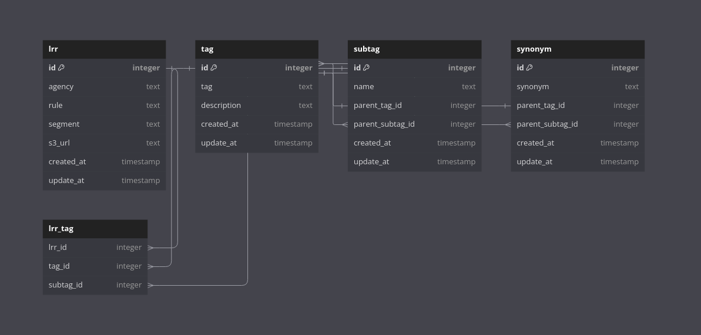
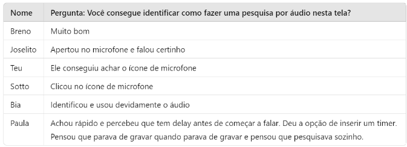

<table style="width: 100%; text-align: center;">
  <tr>
    <td colspan="2" style="text-align: center;">
      
    </td>
  </tr>
  <tr>
    <td style="text-align: center; width: 50%;">
      
    </td>
    <td style="text-align: center; width: 50%;">
      
    </td>
  </tr>
</table>


# LawHunter

## Desenvolvido por Hunters

## :student: Integrantes:

- <a href="https://www.linkedin.com/in/anna-aragao/">Anna Aragão</a>
- <a href="https://br.linkedin.com/in/davi-ferreira-arantes">Davi Ferreira Arantes</a>
- <a href="https:/www.linkedin.com/in/kaiane-souza">Kaiane Souza Cordeiro</a>
- <a href="https://br.linkedin.com/in/kaleb-carvalho-286735250">Kaleb Carvalho</a>
- <a href="https://www.linkedin.com/in/omatheusrsantos/">Matheus Ribeiro</a>
- <a href="https://www.linkedin.com/in/rafael-coutinho2004/">Rafael Coutinho</a>

## Sumário

- [1. Entendimento do Negócio](#1-entendimento-do-negócio)
  - [1.1 Análise e Contexto da Indústria](#11-análise-e-contexto-da-indústria)
  - [1.2 O Problema](#12-o-problema)
  - [1.3 A Solução](#13-a-solução)
  - [1.4 Proposta de Valor (Value Proposition Canvas)](#14-proposta-de-valor-value-proposition-canvas)
  - [1.5 Matriz de Risco](#15-matriz-de-risco)
  - [1.6 Estimativa de Investimento](#16-estimativa-de-investimento)
  - [1.7 Análise Financeira do Projeto](#17-análise-financeira-do-projeto)
- [2. Entendimento do Design](#2-entendimento-do-design)
  - [2.1 Estudo sobre o Usuário](#21-estudo-sobre-o-usuário)
  - [2.2 Experiência do Usuário](#22-experiência-do-usuário)
  - [2.3 Proposta de UX](#23-proposta-de-ux)
  - [2.4 Pilha de Tecnologias](#24-pilha-de-tecnologias)
  - [2.5 Arquitetura de Banco de Dados](#25-arquitetura-de-banco-de-dados)
- [3. Entendimento da Arquitetura do Sistema](#3-entendimento-da-arquitetura-do-sistema)
  - [3.1 Arquitetura da Solução](#31-arquitetura-da-solução)
  - [3.2 Requisitos](#32-requisitos)
    - [3.2.1 Requisitos Funcionais](#321-requisitos-funcionais)
    - [3.2.2 Requisitos não Funcionais](#322-requisitos-não-funcionais)
  - [3.3 Work Pattern - Padrão de trabalho](#33-work-pattern---padrão-de-trabalho)
  - [3.4 Webhook](#34-webhook)
- [4. Os serviços](#4-os-serviços)
  - [4.1 NLU](#41-nlu)
  - [4.2 Tagueamento](#42-tagueamento)
  - [4.3 Speach-to-text](#43-speach-to-text)
  - [4.4 Core](#44-core)
  - [4.5 Web Scrapping](#45-web-scrapping)
  - [4.6 Log](#46-log)
- [5. Frontend](#5-frontend)
- [6. Testes](#6-testes)
  - [6.1 Testes unitários](#61-testes-unitários)
  - [6.2 Testes de integração](#62-testes-de-integração)
  - [6.3 Testes de usabilidade](#63-testes-de-usabilidade)
  - [6.4 Teste de carga](#64-teste-de-carga)
- [7. Docker](#7-docker)
- [8. Deploy](#8-deploy)
  - [8.1 Ambiente de Desenvolvimento](#81-ambiente-de-desenvolvimento)
  - [8.2 Aperfeiçoamentos Futuros](#82-aperfeiçoamentos-futuros)
- [9. Referências](#9-referências)


# 1. Entendimento do Negócio

## 1.1 Análise e Contexto da Indústria

&emsp;&emsp;A indústria financeira no Brasil é uma das mais complexas e reguladas do mundo, sendo composta por um vasto número de instituições financeiras que oferecem uma gama diversificada de produtos e serviços. Essa indústria é crucial para a economia brasileira, desempenhando um papel fundamental no financiamento de empresas, no acesso ao crédito por consumidores, e na intermediação de recursos entre poupadores e investidores.

### Regulamentação e Desafios
&emsp;&emsp;O setor financeiro no Brasil é intensamente regulado por uma variedade de órgãos governamentais, incluindo o Banco Central do Brasil (BACEN), a Comissão de Valores Mobiliários (CVM), e a Autoridade Nacional de Proteção de Dados (ANPD), entre outros. Essas entidades emitem um grande volume de Leis, Regras e Regulamentos (LRRs) que impactam diretamente as operações das instituições financeiras. O cenário regulatório tem se tornado cada vez mais dinâmico e complexo, especialmente após a crise financeira global de 2008, com um aumento significativo no volume e ritmo das mudanças regulatórias.
- **Banco Central do Brasil (BACEN)**: Responsável pela política monetária e pela supervisão das instituições financeiras, garantindo a estabilidade do sistema financeiro.
- **Comissão de Valores Mobiliários (CVM)**: Supervisiona e regula o mercado de capitais, incluindo a emissão e negociação de títulos.
- **Federação Brasileira de Bancos (FEBRABAN)**: Representa os interesses das instituições financeiras e auxilia na formulação de políticas que afetam o setor bancário.
- **Autoridade Nacional de Proteção de Dados (ANPD)**: Regula a proteção de dados pessoais, especialmente relevante em transações financeiras.

### Características do Mercado Financeiro Brasileiro
&emsp;&emsp;O mercado financeiro brasileiro é caracterizado por sua diversidade e complexidade, oferecendo uma ampla gama de produtos e serviços tanto para clientes institucionais quanto para indivíduos. Esse mercado inclui desde operações tradicionais, como empréstimos e contas correntes, até transações mais sofisticadas envolvendo derivativos, títulos de renda fixa e variada, e fusões e aquisições. Um aspecto marcante da indústria financeira no Brasil é a alta concentração bancária, onde algumas poucas grandes instituições, incluindo o Bank of America, dominam o mercado. Essas instituições oferecem serviços especializados de alto valor agregado, como gestão de fortunas, banco de investimento, e operações no mercado de capitais, além de participarem ativamente em operações internacionais e no financiamento de grandes projetos.

### Importância da Conformidade Regulatória
&emsp;&emsp;A conformidade com as regulamentações financeiras é uma prioridade absoluta para as instituições que operam no Brasil. A complexidade do arcabouço regulatório brasileiro, combinada com a necessidade de se adequar a mudanças frequentes nas leis e normas, exige que as instituições mantenham robustos sistemas de governança e controle. A aderência às regulamentações não apenas protege as instituições contra sanções legais, mas também é crucial para manter a confiança dos clientes e a integridade do mercado financeiro.

### Desafios da Indústria
&emsp;&emsp;O setor financeiro no Brasil enfrenta vários desafios, incluindo a necessidade de constante adaptação às mudanças regulatórias, a competição acirrada, e a busca por inovação em um ambiente econômico volátil. A digitalização e o uso crescente de tecnologia no setor também impõem desafios, especialmente em termos de segurança cibernética e proteção de dados.

## 1.1.1 Modelo de Negócio do Bank Of America
&emsp;&emsp;O Bank of America (BofA) opera como uma das maiores e mais influentes instituições financeiras globais, com um modelo de negócio diversificado que abrange várias áreas de atuação, desde serviços bancários de varejo até operações nos mercados de capitais. No Brasil, o BofA se especializa em banco de atacado, banco de investimento e serviços de mercados de capitais, atendendo principalmente clientes corporativos e institucionais. O banco oferece soluções financeiras complexas, incluindo consultoria para fusões e aquisições, gestão de ativos, financiamento estruturado, e operações em bolsa, posicionando-se como um parceiro estratégico para grandes corporações e investidores institucionais no país.

## 1.1.2 Tendências na Indústria Financeira
&emsp;&emsp;A indústria financeira global, e particularmente no Brasil, está passando por uma transformação significativa impulsionada por tendências como a digitalização, a automação de processos e o foco crescente em compliance regulatório. No âmbito das mudanças regulatórias, as instituições financeiras enfrentam a necessidade de adaptar-se rapidamente a novas leis e regulamentos, especialmente em um ambiente pós-crise financeira global, onde a regulamentação se tornou mais rigorosa e frequente. Além disso, a adoção de tecnologias emergentes, como a inteligência artificial e o aprendizado de máquina, está ganhando espaço como uma maneira de melhorar a eficiência operacional e reduzir riscos, especialmente no campo da conformidade regulatória, onde o BofA já está focado em inovar.

## 1.1.3 Partes Interessadas
&emsp;&emsp;Dentro do Bank of America, várias partes interessadas desempenham papéis críticos na operação e na gestão da conformidade regulatória. O departamento de Compliance é responsável por monitorar e garantir a aderência às leis e regulamentos aplicáveis, enquanto a equipe de Tecnologia desenvolve e implementa soluções para automatizar e otimizar esses processos. A liderança executiva define as estratégias e aloca os recursos necessários para manter a competitividade e a conformidade regulatória da instituição. Além disso, colaboradores em áreas como auditoria interna, gestão de riscos, e jurídico trabalham em conjunto para identificar, mitigar, e gerenciar riscos regulatórios, assegurando que o banco atue de forma ética e em conformidade com as normas.

## 1.2 O Problema

&emsp;&emsp;O Bank of America, uma das maiores instituições financeiras do mundo, enfrenta desafios significativos no Brasil devido à crescente complexidade do ambiente regulatório. A conformidade com as leis, regras e regulamentações emitidas por diversos órgãos reguladores é um processo essencial para a operação segura e eficiente do banco no país. No entanto, a gestão desse processo tem se tornado cada vez mais onerosa e complexa, exigindo soluções inovadoras para garantir que todas as mudanças regulatórias sejam identificadas, analisadas e implementadas de maneira precisa e eficaz. Neste contexto, a análise detalhada do problema se torna crucial para o desenvolvimento de uma solução tecnológica que possa otimizar esse processo e mitigar os riscos envolvidos.

### 1.2.1 Análise do Problema

&emsp;&emsp;A gestão de mudanças regulatórias é um desafio crítico para instituições financeiras de grande porte, como o Bank of America, especialmente em mercados complexos e dinâmicos como o brasileiro. Desde a crise financeira global de 2008, os reguladores têm intensificado seus esforços para reforçar a estabilidade do sistema financeiro, resultando em um aumento substancial na quantidade e complexidade das leis, regras e regulamentações (LRRs) que as instituições precisam monitorar e implementar [1].

&emsp;&emsp;No Brasil, o cenário regulatório é particularmente intrincado, abrangendo uma vasta gama de órgãos reguladores, como o Banco Central do Brasil (BACEN), a Comissão de Valores Mobiliários (CVM), a Associação Brasileira das Entidades dos Mercados Financeiro e de Capitais (ANBIMA), entre outros. Cada um desses órgãos emite LRRs de forma independente, com formatos, linguagens e estruturas variados, exigindo das instituições financeiras um esforço contínuo e robusto para assegurar a conformidade com todas as normas aplicáveis.

&emsp;&emsp;O processo de monitoramento regulatório envolve a identificação diária de novas LRRs, a análise de impacto para determinar sua aplicabilidade, a comunicação eficiente dessas mudanças para as áreas de negócio relevantes, e a revisão de políticas e procedimentos internos. Além disso, é necessário manter um relacionamento ativo com os reguladores e garantir que a documentação e as práticas de conformidade estejam sempre atualizadas. No entanto, a diversidade e o volume de informações regulatórias, aliados à complexidade do ambiente regulatório brasileiro, tornam esse processo altamente desafiador [2].

&emsp;&emsp;Para uma instituição como o Bank of America, que opera em um ambiente regulatório tão diverso, a identificação do que é aplicável à sua operação no Brasil é uma tarefa que demanda recursos significativos. A falha em identificar e implementar as mudanças regulatórias eficazmente pode resultar em graves consequências, incluindo multas, sanções e danos à reputação da instituição. A gestão de mudanças regulatórias também acarreta outro custos para as instituições financeiras, exigindo um equilíbrio delicado entre a conformidade regulatória e a eficiência operacional. Além disso, a complexidade das práticas de compliance, que envolve desde a capacitação contínua dos funcionários até a atualização de sistemas e processos internos, pode impactar diretamente a capacidade da instituição de operar de forma eficiente e competitiva [3].

&emsp;&emsp;Em resumo, o problema central enfrentado pelo Bank of America no Brasil reside na necessidade de gerenciar eficazmente o crescente volume e a complexidade das mudanças regulatórias, garantindo a conformidade com todas as LRRs aplicáveis, ao mesmo tempo, em que se minimizam os custos e se maximiza a eficiência operacional. Este desafio torna evidente a necessidade de uma solução tecnológica avançada que possa automatizar e otimizar os processos de identificação, classificação e implementação de mudanças regulatórias.

## 1.3 A Solução

### 1.3.1 Proposta de Solução
A solução proposta é uma plataforma tecnológica integrada que automatiza o monitoramento e o acompanhamento das mudanças regulatórias na indústria financeira no Brasil. Essa plataforma permitirá que as instituições financeiras se mantenham atualizadas com as novas normas e leis de forma eficiente e precisa, minimizando os riscos de não conformidade e otimizando os processos internos de adequação regulatória.

### 1.3.2 Funcionalidades Principais
- **Monitoramento Automatizado:** A plataforma utiliza tecnologias de **scraping**, **machine learning** e **search engine** para monitorar continuamente fontes oficiais de informação, como o Banco Central do Brasil, a Comissão de Valores Mobiliários (CVM), e outros órgãos reguladores, identificando automaticamente novas publicações e alterações nas regulações.

- **Análise Inteligente:** O sistema aplica algoritmos de análise de texto para interpretar as mudanças regulatórias, categorizá-las por relevância e impacto, e gerar resumos executivos. Isso facilita a compreensão rápida das alterações por parte dos gestores e equipes de conformidade (compliance analysts).

- **Gestão de Conformidade:** A solução oferece ferramentas para a gestão do ciclo de vida das mudanças regulatórias, desde a identificação e análise até a implementação e auditoria.

- **Integração com Sistemas Internos:** A plataforma pode ser integrada com sistemas de gestão de risco e conformidade já existentes na instituição, facilitando a sincronização de dados e a automação de processos.

### 1.3.3 Benefícios Esperados
- **Redução de Custos e Tempo:** Automatizar o acompanhamento regulatório reduz significativamente o tempo e os recursos necessários para monitorar e interpretar as mudanças, permitindo que as equipes de conformidade se concentrem em atividades estratégicas.

- **Aumento da Precisão:** A automação diminui a margem de erro humano, assegurando que todas as mudanças relevantes sejam identificadas e tratadas adequadamente.

- **Melhora na Gestão de Risco:** A capacidade de reagir rapidamente às mudanças regulatórias melhora a gestão de risco, evitando possíveis penalidades e danos à reputação da instituição.

- **Conformidade Consistente:** A solução garante que todas as áreas impactadas pela mudança regulatória estejam cientes e que as medidas necessárias sejam implementadas de forma consistente e em tempo hábil.

A solução tecnológica proposta transformará o processo de acompanhamento das mudanças regulatórias na indústria financeira brasileira, proporcionando às instituições uma ferramenta poderosa para gerenciar a conformidade de maneira proativa e eficaz. Ao automatizar e centralizar o monitoramento, análise e gestão das mudanças regulatórias, a plataforma não apenas reduz riscos e custos, mas também melhora a eficiência operacional, garantindo que as instituições permaneçam competitivas e conformes em um ambiente regulatório em constante evolução.

## 1.4 Proposta de Valor (Value Proposition Canvas)

&emsp;O *Value Proposition Canvas*, ou Canvas de Proposta de Valor, é uma ferramenta de gerenciamento estratégico utilizada para desenvolver e visualizar a proposta de valor de um produto ou serviço. Criado por Alexander Osterwalder e Yves Pigneur como parte da metodologia *Business Model Canvas*, o *Value Proposition Canvas* concentra-se especificamente na relação entre um produto ou serviço e seus clientes. O Canvas de Proposta de Valor é composto por dois blocos principais:

- Segmento de Cliente (*Customer Segment*): Este bloco identifica os diferentes grupos de clientes para os quais a proposta de valor é direcionada. Os segmentos de clientes podem ser definidos com base em características demográficas, comportamentais, geográficas ou outras.

- Proposta de Valor (*Value Proposition*): Neste bloco, você descreve os benefícios e valores específicos que seu produto ou serviço oferece aos clientes. Isso inclui os problemas que seu produto resolve, os benefícios que proporciona e as características únicas que o diferenciam da concorrência.

&emsp;Este documento apresenta uma análise dos componentes-chave do "*Value Proposition Canvas*", ressaltando sua importância na criação de uma proposta de valor sólida. A análise é dividida em seis tópicos essenciais, sendo eles: "Aliviam as Dores (*Pain Relievers*)," "Segmento de Cliente (*Customer Segment*)," "Dores (*Pains*)," "Tarefas do Cliente (*Customer Jobs*)," "Ganhos (*Gains*)," e "Criadores de Ganho (*Gain Creators*)."

- **Ganhos ("*Gains*"):** Os Ganhos representam os benefícios, metas e resultados positivos que os clientes buscam alcançar. O foco nesse tópico ajuda a destacar o valor que o produto ou serviço oferece e a criar uma proposta de valor atraente.

- **Criadores de Ganho ("*Gain Creators*"):** Esta seção descreve como o produto ou serviço cria benefícios e ganhos para os clientes, enfatizando como ele atende aos objetivos desejados.

- **Aliviam as Dores ("*Pain Relievers*"):** Este componente destaca como o produto ou serviço oferecido pode aliviar os problemas e preocupações enfrentados pelos clientes, tornando-se um elemento fundamental na criação de uma proposta de valor atraente.

- **Segmento de Cliente ("*Customer Segment*"):** A análise do Segmento de Cliente identifica claramente os grupos de público-alvo para os quais o produto ou serviço é destinado. Isso é fundamental para direcionar estrategicamente os esforços de "*marketing*" e atender às necessidades específicas de cada grupo de clientes.

- **Dores ("*Pains*"):** As Dores representam os desafios, problemas e frustrações cotidianas dos clientes. Compreender essas dores é crucial para a criação de soluções eficazes que atendam às necessidades dos clientes e solucionem seus problemas.

- **Tarefas do Cliente ("*Customer Jobs*"):** Este componente se concentra nas tarefas que os clientes precisam realizar e como o produto ou serviço pode otimizá-las, economizando tempo e esforço.

<div align="center">
  <sub>Figura X: Canvas de Proposta de Valor</sub>
  
  <sup>Fonte: Elaborado por LawHunter</sup>
</div>

&emsp;&emsp;POrtanto, o Canvas de Proposta de Valor é uma ferramenta essencial para garantir que o desenvolvimento do LawHUnter esteja alinhado com as necessidades e expectativas dos clientes. Ele permite identificar com precisão como a solução resolve problemas específicos e gera valor, servindo como um guia estratégico para todas as etapas do projeto.

## 1.5 Matriz de Risco

&emsp;&emsp;Uma matriz de risco é uma ferramenta cuja função é identificar, avaliar e priorizar riscos dentro de uma organização. Ela fornece uma visualização clara dos potenciais problemas que podem impactar um projeto ou processo, classificando-os com base na probabilidade de ocorrência e na gravidade de suas consequências.

<div align="center">
  <sub>Figura X: Matriz de Risco</sub>
  
  <sup>Fonte: Elaborado por LawHunter</sup>
</div>

&emsp;&emsp;A seguir, identificaremos uma série de riscos que podem impactar negativamente o sucesso da solução. Esses riscos estão divididos em quatro categorias principais:

1. Riscos Relacionados ao Parceiro: Envolvem a colaboração com o Bank of America, incluindo diferenças nas expectativas e a relevância da search engine para os analistas do banco.

2. Riscos Relacionados ao Processo: Referem-se à organização e execução das atividades do projeto, como planejamento desorganizado e dificuldades de comunicação e colaboração.

3. Riscos Relacionados ao Grupo: Incluem desafios internos enfrentados pela equipe, como falta de conhecimento técnico e dificuldade em manter o engajamento dos membros.

4. Riscos Relacionados à Entrega de Valor: Envolvem a capacidade de fornecer um produto final que atenda às necessidades e expectativas dos usuários, incluindo a manutenção e suporte pós-projeto e a disponibilidade do site fonte.

&emsp;&emsp;Abaixo, apresentamos uma matriz detalhada que descreve cada risco, sua probabilidade, impacto e as estratégias de mitigação propostas.

<div align="center">
  <sub>Tabela x: Análise da Matriz de Risco</sub>

| Risco                                                          | Descrição                                                                                                               | Probabilidade | Impacto    | Mitigação                                                                                                                         |
| -------------------------------------------------------------- | ----------------------------------------------------------------------------------------------------------------------- | ------------- | ---------- | --------------------------------------------------------------------------------------------------------------------------------- |
| Manutenção e suporte pós-projeto inexistente                   | Falta de suporte contínuo e atualizações após a conclusão                                                               | 90%           | Moderado   | Desenvolver um plano de procedimento de implantação da solução                                                                    |
| Planejamento desorganizado das tarefas do projeto              | Falta de organização clara nas tarefas e prazos do projeto                                                              | 50%           | Alto       | Utilizar as plannings para desenvolver o planejamento e realizar as modificações necessárias com a equipe ao participar da daily  |
| Dificuldade na comunicação e colaboração                       | Problemas na troca de informações entre membros da equipe e o parceiro                                                  | 70%           | Moderado   | Estabelecer canais de comunicação eficazes e reuniões regulares                                                                   |
| Limitações de tempo devido ao calendário acadêmico             | Restrições de tempo impostas pelas obrigações acadêmicas                                                                | 70%           | Muito Alto | Planejar atividades com antecedência e priorizar tarefas críticas                                                                 |
| Site ficar fora do ar e interromper o serviço da search engine | Falhas técnicas que causam indisponibilidade do serviço                                                                 | 50%           | Muito Alto | Desenvolver planos de contingência para o site                                                                                    |
| Diferença nas expectativas entre o banco e a equipe            | Divergências nas expectativas do projeto entre o cliente e a equipe                                                     | 30%           | Alto       | Realizar reuniões frequentes para alinhar expectativas e documentar requisitos                                                    |
| Falta de conhecimento técnico                                  | Insuficiência de habilidades técnicas necessárias                                                                       | 10%           | Moderado   | Buscar apoio entre colegas da equipe e professores dentro da Instituição de ensino                                                |
| A search engine pode não ser relevante para os analistas       | Possibilidade da ferramenta não atender às necessidades dos analistas                                                   | 10%           | Alto       | Realizar pesquisas de usuário e ajustar funcionalidades conforme necessário                                                       |
| Dificuldade em manter o engajamento da equipe                  | Desmotivação e perda de interesse dos membros da equipe                                                                 | 10%           | Muito Alto | Promover atividades de integração e reconhecer o trabalho da equipe                                                               |
| Search Engine fornecer informações erradas ao analista         | O mecanismo de busca fornecer informações incorretas ao analista, o que poderia resultar em grandes perdas para o banco | 90%           | Muito Alto | Estabelecer uma política de revisão das análises realizadas, com auditorias regulares para identificar e corrigir possíveis erros |

  <sup>Fonte: Elaborado por LawHunter</sup>
</div>

&emsp;&emsp;Além dos riscos, é igualmente importante identificar e explorar as oportunidades que podem surgir ao longo do desenvolvimento de nosso projeto em parceria com o Bank of America. A matriz de oportunidade nos permite visualizar e planejar ações que possam agregar valor ao projeto, maximizando os benefícios e aprimorando a colaboração entre as partes envolvidas. Essas oportunidades estão distribuídas em quatro categorias principais:

1. Oportunidades Relacionadas ao Parceiro: Envolvem a possibilidade de desenvolver benefícios para a inovação da empresa como a contribuição para implementar uma inovação bancária e ter a possibilidade de criar uma patente da solução.

2. Oportunidades Relacionadas ao Processo: Referem-se à melhoria contínua dos processos de trabalho, incluindo a possibilidade de melhoria da eficiência operacional, redução de erros humanos.

3. Oportunidades Relacionadas ao Grupo: Incluem o desenvolvimento das habilidades e capacidades da equipe, tanto com habilidades técnicas quanto de gestão.

4. Oportunidades Relacionadas à Entrega de Valor: Envolvem a criação de um produto final que não só atenda, mas supere as expectativas dos usuários, trazendo benefícios tangíveis e intangíveis para todas as partes interessadas, como ter a oportunidade de escalar a solução para outras áreas do banco e a possibilidade de melhoria na satisfação dos funcionários.

<div align="center">
  <sub>Tabela x: Detalhes da Persona</sub>

| Oportunidade                                         | Descrição                                                      | Probabilidade | Impacto    |
| ---------------------------------------------------- | -------------------------------------------------------------- | ------------- | ---------- |
| Melhoria da eficiência operacional                   | Aumento da eficiência dos processos internos e operacionais    | 90%           | Muito Alto |
| Contribuição para implementar inovação bancária      | Desenvolvimento de soluções inovadoras para o setor bancário   | 90%           | Alto       |
| Redução de erros humanos                             | Diminuição dos erros cometidos por operadores humanos          | 70%           | Alto       |
| Desenvolvimento de habilidades técnicas e de gestão  | Aperfeiçoamento das habilidades técnicas e de gestão da equipe | 90%           | Moderado   |
| Escalabilidade e expansão para outras áreas do banco | Expansão das soluções desenvolvidas para outras áreas          | 70%           | Moderado   |
| Melhoria na satisfação dos funcionários              | Aumento da satisfação e motivação dos colaboradores            | 50%           | Moderado   |
| Possibilidade de patentear a solução                 | Obtenção de patentes para as soluções desenvolvidas            | 30%           | Moderado   |

  <sup>Fonte: Elaborado por LawHunter</sup>
</div>

&emsp;&emsp;Ao classificar e priorizar essas oportunidades, as empresas garantem que seus recursos sejam direcionados para as iniciativas com maior potencial de retorno, minimizando riscos e maximizando eficiência. Portanto, ao integrar a matriz de oportunidades no processo de tomada de decisão, as organizações fortalecem sua capacidade de alcançar resultados sustentáveis e competitivos a longo prazo.

## 1.6 Estimativa de Investimento

&emsp;&emsp;A estimativa de investimento para o desenvolvimento da LawHunter é uma etapa crítica para assegurar que todos os recursos necessários para sua construção e operação estejam devidamente planejados. Dada a complexidade dos fluxos de busca, catalogação e consulta, que envolvem a captura e processamento diário de LRRs emitidas por reguladores, é essencial prever os custos associados. Isso inclui não apenas o desenvolvimento técnico da solução, mas também a infraestrutura necessária para garantir sua eficiência de atender às necessidades dos Compliance Officers, que utilizarão a ferramenta diariamente na gestão de mudanças regulatórias.

&emsp;&emsp;Nesta seção, explorar-se os principais fatores que impactam a estimativa de investimento para a LawHunter, garantindo que todas as áreas essenciais sejam devidamente consideradas e que o projeto avance com estabilidade financeira. Vale destacar que esta estimativa abrange um período de 12 meses, contemplando tanto o desenvolvimento quanto a manutenção da solução. A seguir, detalhamos os custos envolvidos.

### 1.6.1 Despesas com Recursos Humanos

&emsp;&emsp;A seguir, abordar-se a lógica aplicada para levantar as despesas com recursos humanos, que são fundamentais para o sucesso do projeto. O cálculo dessas despesas envolve a consideração dos salários relacionados a cada membro da equipe, desde desenvolvedores até gerentes de projeto. Além disso, levar-se em conta a distribuição dessas despesas ao longo das fases de desenvolvimento e manutenção, garantindo uma alocação adequada dos recursos ao longo dos 12 meses de operação (10 semanas ou 2,5 meses de desenvolvimento e 9,5 meses de manutenção). A seguir, detalhar-se como cada um desses elementos foi estimado e sua importância para a viabilidade do projeto:

<div align="center">
  <sub>Tabela x: Matriz de Estimativa de Investimento em Recursos Humanos - Desenvolvimento</sub>

| **Cargo**          | **Salário Mensal (R$)** | **Período (meses)** | **Quantidade de Pessoas** | **Valor Total (R$)** |
| ------------------ | ----------------------- | ------------------- | ------------------------- | -------------------- |
| Desenvolvedores    | R$ 11.867               | 2,5                 | 5                         | R$ 148.337,5         |
| Designers UX/UI    | R$ 6.542                | 2,5                 | 1                         | R$ 16.355,0          |
| Gerente de Projeto | R$ 10.333               | 2,5                 | 1                         | R$ 25.832,5          |
| Testadores/QA      | R$ 4.546                | 2,5                 | 3                         | R$ 34.095,0          |

  <sup>Fonte: Elaborado por LawHunter</sup>
</div>

&emsp;&emsp;Somando esses valores, durante 2,5 meses seriam gastos R$ 224.620 com recurso humano. Para concluir esse custo, precisamos analisar os 9,5 meses seguintes, focados em atualizações e manutenções. Pode-se calcular o restante dos gastos da seguinte maneira:

<div align="center">
  <sub>Tabela x: Matriz de Estimativa de Investimento em Recursos Humanos - Manutenção</sub>

| **Cargo**          | **Salário Mensal (R$)** | **Período (meses)** | **Quantidade de Pessoas** | **Valor Total (R$)** |
| ------------------ | ----------------------- | ------------------- | ------------------------- | -------------------- |
| Desenvolvedores    | R$ 11.867               | 9,5                 | 3                         | R$ 338.209,5         |
| Gerente de Projeto | R$ 10.333               | 9,5                 | 1                         | R$ 98.163,5          |
| Testadores/QA      | R$ 4.546                | 9,5                 | 2                         | R$ 86.374            |


  <sup>Fonte: Elaborado por LawHunter</sup>
</div>

&emsp;&emsp;Portanto, o valor gasto com desenvolvedores nos 9,5 meses seguidos do desenvolvimento inicial seria de R$ 522.747. Então, juntando esses dois períodos, calculando os 12 meses completos, o investimento seria um valor **Total de R\$747.367**.


&emsp;&emsp;A escolha dos cargos descritos para compor a equipe do projeto LawHunter é fundamentada na necessidade de cobrir todas as áreas essenciais para o sucesso da solução. **Desenvolvedores** são indispensáveis para a construção e implementação do software, garantindo que todas as funcionalidades sejam desenvolvidas com alta qualidade e eficiência, nesse sentido de complexidade, foram considerandos desenvolvedores seniors. **Designers** são necessários para criar uma interface intuitiva e eficiente, que melhora a experiência do usuário e facilita a interação com a plataforma. O **gerente de projeto** desempenha um papel crucial na coordenação das atividades, garantindo que o projeto siga o cronograma, orçamento e escopo definidos, além de assegurar a comunicação entre as diferentes partes interessadas. **Testadores** são essenciais para realizar a garantia de qualidade, identificando e corrigindo erros antes que a solução seja lançada, o que é fundamental para garantir a estabilidade e a confiabilidade do sistema. A combinação desses profissionais assegura que todas as etapas do desenvolvimento e manutenção da LawHunter sejam cuidadosamente gerenciadas e executadas, contribuindo para o sucesso do projeto e a satisfação dos usuários finais.

>Acesse a seção ["Referências"](#referências) deste documento [clicando aqui](#referências) para visualizar a fonte dos dados salariais.

### 1.6.2 Despesas com Infraestrutura

&emsp;&emsp;Nesta subseção, detalha-se as despesas relacionadas à infraestrutura necessária para o desenvolvimento e operação contínua do LawHunter. A infraestrutura inclui os recursos de hardware e software essenciais para garantir que a solução funcione de maneira eficiente e confiável, atendendo às demandas diárias de processamento e armazenamento de dados. Uma infraestrutura bem planejada é fundamental para assegurar que a solução possa suportar a carga de trabalho esperada, oferecendo um desempenho seguro para os times da área de Compliance que utilizarão a aplicação diariamente.

&emsp;&emsp;Assim, para a execução correta de todas as funcionalidades definidas, a equipe desenvolvedora do LawHunter definiu as tecnologias de infraestrutura necessária. As tecnologias envolvidas foram selecionadas com base na arquitetura do projeto, garantindo que cada componente do sistema seja suportado de maneira eficiente e escalável.

&emsp;&emsp;O contexto de hardware, incluindo CPUs, RAM, armazenamento e rede, se encaixa na estimativa de investimento ao garantir que a LawHunter disponha dos recursos necessários para operar com eficiência. Esses componentes de hardware, dão a base para a infraestrutura em nuvem, suportam as operações críticas da aplicação e são fundamentais para seu desempenho. A escolha cuidadosa e a alocação de recursos para essas áreas garantem que o sistema possa atender às demandas do projeto.

<div align="center">
  <sub>Tabela x: Matriz de Estimativa de Investimento em Infraestrutura</sub>

| **Tecnologia** | **Descrição**                                                       | **Custo Mensal** | **Período (meses)** | **Custo Total** |
| -------------- | ------------------------------------------------------------------- | ---------------- | ------------------- | --------------- |
| EC2            | Instâncias de computação na nuvem para hospedar a aplicação         | 35,26 USD        | 12                  | 423,12 USD      |
| CloudFront     | Rede de entrega de conteúdo (CDN) para o frontend                   | 5,25 USD         | 12                  | 63,00 USD       |
| RDS            | Serviço de banco de dados relacional gerenciado                     | 1.177,54 USD     | 12                  | 14.130,48 USD   |
| SQS            | Serviço de fila para comunicação entre diferentes partes do sistema | 46,48 USD        | 12                  | 557,76 USD      |
| S3             | Serviço de armazenamento das LRRs                                   | 48,56 USD        | 12                  | 582,72 USD      |
| Lambda         | Execução de funções serverless para captura de LRRs                 | 00,00 USD        | 12                  | 00,00 USD       |

  <sup>Fonte: Elaborado por LawHunter</sup>
</div>

obs:  O nível gratuito do Lambda inclui 1 milhão de solicitações gratuitas por mês e 400.000 GB/segundos de tempo de computação por mês.

&emsp;&emsp;Portanto, o valor gasto com infraestrutura nos 12 meses seria um valor **Total de 15.757,08 USD ou R\$86.348,79**.

### EC2
&emsp;&emsp;A instância `m6g.large` foi escolhida para o desenvolvimento da aplicação devido à sua configuração equilibrada, que inclui 2 vCPUs e 8 GiB de memória, utilizando processadores AWS Graviton2 baseados em ARM. Esta configuração é adequada para o estágio inicial de desenvolvimento, onde as cargas de trabalho de processamento de linguagem natural (NLP) são leves a moderadas. No entanto, como o NLP é uma tarefa intensiva em processamento e memória, se o projeto evoluir para lidar com um grande volume de dados ou análises mais complexas, será necessário considerar a migração para outras famílias de instâncias com maior capacidade, como `m6g.xlarge` ou `m6g.2xlarge`, para garantir que a aplicação continue a operar de maneira eficiente e escalável..

### CloudFront
&emsp;&emsp;Neste caso, considera-se 50 GB por mês de transferência de dados de saída para a Internet e outros 50 GB por mês de transferência de dados para fora do CloudFront para o servidor de origem (incluindo solicitações POST e PUT). Além disso, estima-se que serão 500.000 solicitações HTTPS mensais.

### RDS
&emsp;&emsp;A instância selecionada de RDS, **db.m2.2xlarge**, com 4 vCPUs e 34.2 GiB de memória, é uma escolha robusta e adequada para a aplicação, que envolve o armazenamento de informações cruciais que serão solicitadas pelos usuários finais.

### SQS
&emsp;&emsp;Estimando que o ambiente utilize 2 milhões de solicitações por mês para filas padrão, que oferecem alto throughput e baixa latência, e 1 milhão de solicitações por mês para filas FIFO, que garantem a ordem das mensagens. Além disso, estima-se uma transferência de 512 GB de dados de entrada e 512 GB de dados de saída por mês.

### S3
&emsp;&emsp;Com base na estimativa detalhada para o uso do Amazon S3, o custo mensal para armazenamento e operações é de aproximadamente 0,10 USD. Essa estimativa inclui o armazenamento de 4 GB por mês no S3 Standard, além de 100.000 solicitações PUT, COPY, POST, LIST, e 100.000 solicitações GET, SELECT, entre outras. Também está incluída a transferência de 4 GB de dados retornados pelo S3 Select e a verificação de 3 GB de dados pelo mesmo serviço. Essa configuração é adequada para armazenar e gerenciar dados com alta frequência de acessos e operações, garantindo a eficiência e a segurança dos dados armazenados.

> Clicando nos seguintes links, é possível visualizar a simulação de preço da [instância EC2](/docs/images/business/investment_estimative/ec2-cost.png), [Cloudfront](/docs/images/business/investment_estimative/cloudfront-cost.png), [RDS](/docs/images/business/investment_estimative/rds-cost.png), [S3](/docs/images/business/investment_estimative/s3-cost.png), [Lambda](/docs/images/business/investment_estimative/lambda-cost.png) e a simulação de preço do [SQS](/docs/images/business/investment_estimative/sqs-cost.png)

> **Nota:** O custo da infraestrutura foi determinado com base na cotação do dólar estabelecida em R$5,48 em 13 de agosto de 2024. Estes valores estão sujeitos a flutuações cambiais.

### Valor Total

&emsp;&emsp;A conclusão da nossa análise detalhada sobre os investimentos necessários para o desenvolvimento e manutenção do LawHunter, revela um panorama financeiro bem planejado e estruturado. O cálculo de um investimento total de aproximadamente **R$ 833.715,79** para os primeiros 12 meses ilustra um comprometimento com a eficiência e a sustentabilidade econômica do projeto.

&emsp;&emsp;Importante ressaltar que, embora esses números forneçam uma base sólida para o planejamento inicial, eles estão sujeitos a variações devido a fatores como flutuações cambiais, mudanças nas tarifas de serviços da AWS e alterações nos salários. Portanto, é crucial manter uma abordagem flexível e iterativa ao planejamento financeiro, com revisões periódicas do orçamento para ajustar-se às realidades do mercado e às necessidades do projeto.

## 1.7 Análise Financeira do Projeto

# 2. Entendimento do Design

## 2.1 Estudo sobre o Usuário

&emsp;&emsp;Essa seção apresenta uma análise do perfil e das necessidades de um Analista de Compliance do Bank of America, com o objetivo de compreender suas expectativas, desafios e comportamentos no contexto de suas funções diárias. Suas responsabilidades ao desempenhar este papel envolvem assegurar a conformidade regulatória e a mitigação de riscos em um ambiente financeiro complexo.

&emsp;&emsp;A análise realizada busca não apenas identificar as necessidades e os pontos de dor deste usuário, mas também oferecer recomendações práticas para aprimorar os processos que ele utiliza no cumprimento de suas funções através da solução proposta.

&emsp;&emsp;Através da aplicação de frameworks consolidados, o objetivo é garantir que a solução proposta esteja alinhada às expectativas e ao perfil comportamental deste Analista de Compliance, além de promover uma eficiência e satisfação ao utilizar a aplicação.

<div align="center">
  <sub>Figura x: Persona</sub>
  
  <sup>Fonte: Elaborado por LawHunter</sup>
</div>


<div align="center">
  <sub>Tabela x: Detalhes da Persona</sub>

| **Campo**       | **Detalhes**                              |
| --------------- | ----------------------------------------- |
| **Nome**        | João Pedro                                |
| **Idade**       | 26 anos                                   |
| **Gênero**      | Masculino                                 |
| **Ocupação**    | Analista de Compliance no Bank of America |
| **Localização** | São Paulo, SP                             |

  <sup>Fonte: Elaborado por LawHunter</sup>
</div>


**1. Background e Formação**

&emsp;&emsp;João Pedro é um jovem paulista, nascido e criado em São Paulo, formado em Direito com especialização em Compliance. Ele trabalha há 1 ano no Bank of America, onde realiza o monitoramento diário e identificação de novas LRRs. Se faz necessário que João seja altamente detalhista e rigoroso para que não ocorra erros que possam prejudicar a operação do banco.

**2. Função e Responsabilidade**

&emsp;&emsp;Como Analista de Compliance, João Pedro é responsável por garantir que o banco esteja em conformidade com todas as regulamentações legais e normativas nacionais. Suas principais tarefas incluem o monitoramento e a identificação diária de novas LRRs e auditorias internas para garantir que todas as operações do banco estejam alinhadas com as normas vigentes.

**3. Comportamento e Atitudes**

&emsp;&emsp;João acredita que a conformidade rigorosa é essencial para a segurança e a reputação do banco. Sua abordagem ao trabalho é altamente analítica, preferindo verificar cada detalhe e assegurar que não haja margem para erros. Ele confia fortemente em dados concretos e processos bem estabelecidos, sendo avesso a qualquer tipo de risco desnecessário.

**4. Principais Necessidades**

**Automatização de Processos:** João precisa de ferramentas que automatizem a verificação e monitoramento das regulamentações, para reduzir o tempo gasto em tarefas manuais e aumentar a precisão das análises.

**Atualizações Diárias:** Ele requer sistemas que ofereçam atualizações diárias sobre mudanças nas regulamentações (LRR - Leis, Regulamentos e Regras), permitindo que ele reaja rapidamente às novas exigências.

**5. Frustração Principal**

&emsp;&emsp;João Pedro se frustra com a necessidade de monitorar manualmente as regulamentações para identificar novas LRRs que possam impactar as operações do banco. Este processo é demorado, sujeito a erros humanos, e desvia sua atenção de outras atividades críticas. A falta de automatização faz com que ele se sinta sobrecarregado e preocupado com a possibilidade de perder alguma atualização importante.

**6. Objetivos**

**Eficiência Operacional:** Reduzir o tempo e o esforço necessários para monitorar e adaptar-se às mudanças regulatórias, permitindo-lhe focar em análises estratégicas mais complexas.

**Minimização de Riscos:** Garantir que todas as operações do banco estejam em conformidade com as últimas LRRs, minimizando o risco de penalidades ou outros impactos negativos.

**Aprimoramento Profissional:** João busca continuamente aprimorar suas habilidades e conhecimentos em compliance, mantendo-se atualizado das melhores práticas do setor.

### 2.1.1 Dados Psicográficos

&emsp;&emsp;O perfil psicográfico oferece uma visão profunda sobre as motivações, valores, comportamentos e estilo de vida do usuário.

**1. Valores e Crenças**

**Valorização da Integridade:** João acredita firmemente na importância da integridade e da conformidade, não apenas como um requisito profissional, mas como um princípio ético. Ele vê sua função como uma linha de defesa crucial na manutenção da reputação e da operação segura do Bank of America.

**Responsabilidade e Precisão:** Ele acredita que, em seu trabalho, a precisão é essencial, pois erros podem ter consequências significativas, tanto para o banco quanto para sua carreira.

**Segurança e Estabilidade:** João valoriza a segurança e a estabilidade, tanto em sua vida pessoal quanto profissional. Ele prefere seguir procedimentos bem estabelecidos e tem uma baixa tolerância ao risco.

**2. Motivações**

**Excelência Profissional:** João é motivado pelo desejo de se destacar como um especialista em compliance. Ele se empenha em manter-se atualizado com as mudanças regulatórias e melhorar continuamente suas habilidades.

**Reconhecimento:** Embora não seja sua motivação primária, João valoriza o reconhecimento de seus pares e superiores por seu trabalho diligente e meticuloso.

**Crescimento Pessoal e Profissional:** Ele se interessa por treinamentos e certificações que possam aprimorar suas habilidades e ampliar suas oportunidades de carreira dentro do banco.

**3. Estilo de Vida**

**Rotina Estruturada:** Ele gosta de planejar seu dia e seguir uma agenda bem definida, garantindo que todas as suas responsabilidades sejam cumpridas.

**Consumo de Informação:** Ele acompanha regularmente publicações sobre compliance e finanças, e participa de webinars e conferências para se manter atualizado.

**Equilíbrio entre Trabalho e Vida Pessoal:** Embora João seja dedicado ao trabalho, ele também valoriza o tempo com amigos e família. Ele procura manter um equilíbrio saudável entre sua vida profissional e pessoal, reservando tempo para atividades que o ajudem a relaxar e recarregar.

**4. Interesses e Hobbies**

**Esportes e Atividades ao Ar Livre:** Nos fins de semana, João gosta de praticar esportes, como corrida e ciclismo, atividades que o ajudam a liberar o estresse e manter a saúde física.

**Leitura:** João dedica parte de seu tempo livre à leitura de livros filosóficos, buscando aprofundar seu entendimento sobre questões éticas, morais e existenciais.

**Culinária:** A paixão de João pela culinária é uma forma de expressão criativa e relaxamento. Ele gosta de experimentar novas receitas e cozinhar para amigos e familiares, utilizando essa atividade como uma maneira de se desconectar do trabalho e ao mesmo tempo de socializar.

**5. Segmentação Psicográfica**

**Orientado por Proficiência (Achievement-Oriented):** João se enquadra na categoria de indivíduos altamente orientados por proficiência e realização. Ele está sempre em busca de aprimorar suas habilidades e alcançar a excelência em sua área de atuação.

**Cauteloso (Risk-Averse):** Sua aversão ao risco o posiciona como alguém que prefere segurança e estabilidade em vez de experimentar novas abordagens sem a devida validação.

**Conservador (Conservative):** João tende a seguir métodos tradicionais e comprovados, especialmente quando se trata de cumprir normas e regulamentações rigorosas.

&emsp;&emsp;Compreender o perfil psicográfico de um usuário, suas motivações e comportamentos é essencial para desenvolver soluções que não apenas automatizem processos e melhorem a eficiência operacional, mas também ressoem com seus valores e estilo de vida. Ao alinhar a solução com suas necessidades e preferências, podemos criar ferramentas que sejam intuitivas, eficazes e que potencializem seu desempenho, minimizando frustrações e maximizando o engajamento e satisfação dos usuários que irão usufruir da ferramenta.

## 2.2 Experiência do Usuário

&emsp;&emsp;A análise de experiência do usuário é um processo fundamental para compreender como os usuários interagem com um sistema ou aplicação, visando otimizar a eficiência, satisfação e usabilidade dos produtos ou serviços oferecidos. Através dessa análise, é possível identificar pontos de fricção, barreiras e oportunidades de melhoria, proporcionando uma visão clara sobre as necessidades e expectativas dos usuários. Essa abordagem não só contribui para o desenvolvimento de interfaces mais intuitivas, mas também para a criação de uma experiência mais agradável e eficaz, que aumenta a probabilidade de retenção e engajamento do usuário.

## 2.2.1 Jornada do Usuário

&emsp;&emsp;A jornada do usuário retrata um mapa visual que visa definir as fases pelas quais os usuários passam pelo sistema até a etapa de conclusão, que pode se categorizar como uma compra, tomada de decisão ou aderência de algum serviço oferecido na aplicação. No caso da empresa parceira, temos serviços que visam automatizar processos existentes.

&emsp;&emsp;Desta forma, a jornada descreve um passo a passo percorrido e detalhado de todos os pontos de contato e interações pela perspectiva do usuário.

**Jornada de João Pedro (Analista de Compliance)**

&emsp;&emsp;O perfil do analista do Bank of America é retratado através do Pedro que possui valores íntegros e pragmáticos. Seu ponto de valor é sua competência no conhecimento das normas e serviços oferecidos pelo banco e áreas impactadas, com tarefa de buscar documentos mediante linguagem natural, áudio ou texto.

<div align="center">
  <sub>Figura X: Jornada do Usuário</sub>
  
  <sup>Fonte: Elaborado por LawHunter</sup>
</div>

&emsp;&emsp;Para concluir a seção sobre a jornada do usuário, pode-se destacar a importância de compreender detalhadamente as interações e os pontos de contato do usuário com a solução. O entendimento profundo que essa análise gera é essencial para alinhar as expectativas e necessidades das partes interessadas, contribuindo diretamente para o sucesso e adoção da solução.

## 2.3 Proposta de UX

&emsp;&emsp;A proposta de UX desempenha um papel crucial na eficácia e adoção do sistema proposto. Dada a complexidade e a criticidade das operações envolvidas, é fundamental que a interface do usuário não apenas seja funcional, mas também ofereça uma navegação intuitiva e acessível. Esta seção aborda a visão geral e os objetivos da UX, destacando como a proposta visa transformar a interação do usuário com o sistema em uma experiência fluida e eficiente, contribuindo para a solução dos desafios identificados.

### 2.3.1 Visão Geral e Objetivos

&emsp;&emsp;Os objetivos de UX para o sistema são centrados em resolver os desafios operacionais identificados no levantamento de requisitos, especialmente a complexidade na manipulação e consulta de LRRs. O sistema deve proporcionar uma experiência de usuário que seja altamente eficiente, intuitiva e adaptada às necessidades específicas dos operadores.

&emsp;&emsp;Nosso objetivo principal é facilitar o acesso rápido e preciso às LRRs, minimizando o esforço do usuário ao buscar, filtrar, e manipular essas informações. Isso será alcançado por meio de uma interface clara e organizada, que prioriza a apresentação das informações mais relevantes e permite a realização de ações com o mínimo de cliques possível. A interface deve ser projetada para guiar o usuário de maneira lógica e intuitiva, reduzindo o tempo necessário para a execução de tarefas importantes e minimizando a possibilidade de erros.

&emsp;&emsp;Além disso, a interface deve ser projetada para fornecer uma experiência fluida e responsiva, com feedback imediato para as ações do usuário, garantindo uma interação sem frustrações. O design deve minimizar a necessidade de treinamento extensivo, permitindo que os operadores utilizem o sistema de maneira eficiente desde o primeiro contato. Em última análise, a proposta de UX visa maximizar a produtividade, reduzir a curva de aprendizado e melhorar a satisfação geral dos usuários ao interagir com o sistema.

### 2.3.2 Wireframe

&emsp;&emsp;A criação de wireframes é uma etapa fundamental no processo de design de interfaces de usuário, ao permitir a visualização e o planejamento da estrutura e navegação do sistema antes mesmo de sua implementação. Ao projetar a experiência do usuário por meio de wireframes, é possível explorar diferentes abordagens de layout, testar a disposição de elementos e ajustar a usabilidade com base em feedbacks e iterações. Esse método traz inúmeros benefícios, como a capacidade de identificar e resolver problemas de navegação imaturo, garantir que a arquitetura da informação seja clara e funcional, e assegurar que a interface atenda às necessidades do usuário final.

#### Tela de resultados

<div align="center">
  <sub>Figura X: Tela de resultados</sub>
  
  <sup>Fonte: Elaborado por LawHunter</sup>
</div>

&emsp;&emsp;A tela inicial do sistema tem o objetivo de proporcionar ao usuário uma interface intuitiva para realizar buscas e visualizar documentos relevantes. A experiência do usuário é cuidadosamente pensada, começando pela inclusão de filtros na lateral esquerda, que permitem ao usuário refinar suas buscas de forma prática, por data, órgão regulador, e tags. Isso garante uma usabilidade fluida, onde o usuário encontra rapidamente as informações desejadas. Os documentos são apresentados em cards, facilitando a leitura e organização visual, além de destacar as tags associadas, proporcionando uma rápida identificação do conteúdo. A barra de busca no topo centraliza a funcionalidade principal, permitindo que o usuário insira palavras-chave diretamente, enquanto o ícone de microfone ao lado sugere a opção de busca por voz, ampliando as possibilidades de interação e representando o reconhecimento de áudio do projeto, que a seguir será interpretado pelo processamento de linguagem natural.

#### Visualização das LRRs

<div align="center">
  <sub>Figura X: Visualização das LRRs</sub>
  
  <sup>Fonte: Elaborado por LawHunter</sup>
</div>

&emsp;&emsp;Esse modal foi desenvolvida para a visualização detalhada de documentos específicos, priorizando uma experiência limpa e focada. Nessa interface, o usuário pode visualizar o documento em um grande espaço dedicado, com a conveniência de uma opção de download facilmente acessível. Ao lado do documento, uma área para a descrição detalhada permite que o usuário compreenda o contexto e os detalhes relevantes sem a necessidade de alternar entre várias janelas. As tags associadas permanecem visíveis, facilitando a categorização mental e a navegação entre documentos relacionados. Esta interface é projetada para ser funcional e eficiente, reunindo todas as informações necessárias em um único local de fácil acesso.

#### Gerenciamento das Tags

<div align="center">
  <sub>Figura X: Configuração de tags</sub>
  <br>
  
  <br>
  <sup>Fonte: Elaborado por LawHunter</sup>
</div>

&emsp;&emsp;A interface do gerenciamento das tags foi projetada para ser direta e funcional. A usabilidade é simplificada, permitindo que o usuário adicione, edite ou exclua tags com poucos cliques. A presença de um campo de busca melhora ainda mais a experiência, facilitando a localização de tags específicas. A opção de criar novas tags de forma rápida contribui para uma gestão mais dinâmica e adaptável às necessidades do usuário. Essa interface garante que o sistema permaneça organizado e que o usuário tenha controle total sobre a categorização, promovendo uma experiência de uso eficiente e personalizada.

&emsp;&emsp;Em resumo, os wireframes foram projetados com foco na funcionalidade e na experiência do usuário. Cada parte da interface cumpre uma função específica, proporcionando uma navegação intuitiva e um acesso rápido às informações mais relevantes. A organização em cards, o uso de filtros, a visualização detalhada e a gestão de tags são elementos que se complementam para criar um sistema coeso e fácil de usar.

## 2.4 Pilha de Tecnologias

&emsp;&emsp;A escolha precisa das tecnologias utilizadas em um projeto de engenharia de software desempenha um papel essencial na criação de uma solução robusta e eficiente. A seleção cuidadosa de linguagens de programação, frameworks e ferramentas de desenvolvimento é crucial para garantir a eficácia e a confiabilidade do software desenvolvido. Tecnologias bem escolhidas proporcionam uma base sólida para a implementação dos requisitos funcionais e não funcionais, garantindo a escalabilidade, segurança e desempenho do sistema.

&emsp;&emsp;Além disso, a precisão na escolha das tecnologias adequadas facilita a manutenção do código, reduzindo custos e tempo de desenvolvimento a longo prazo. No contexto da solução LawHunter, ao alinhar as tecnologias com os objetivos do projeto e as necessidades dos usuários finais, os engenheiros de software podem assegurar uma entrega bem-sucedida e de alta qualidade. Uma abordagem criteriosa na seleção das tecnologias permite que os desenvolvedores otimizem o processo de desenvolvimento, minimizem a ocorrência de bugs e garantam uma experiência de usuário final satisfatória.

## Inteligência Artificial e Processamento de Linguagem Natural (NLP)
No projeto LawHunter, diversas tecnologias são utilizadas para entender a intencionalidade do usuário e processar linguagem natural:
1. **NLTK**: Uma biblioteca robusta para trabalhar com linguagem natural em Python, útil para tokenização, stemming, e outras tarefas de NLP.
2. **spaCy**: Um framework avançado de NLP que oferece suporte a modelos de aprendizado profundo e é usado para tarefas como extração de entidades e análise de sentimentos.
3. **scikit-learn**: Uma biblioteca de aprendizado de máquina para Python que é utilizada para construir modelos preditivos que entendem a intenção do usuário.
4. **Pandas**: Essencial para a manipulação e análise de dados, especialmente para pré-processamento de dados textuais.
5. **Gensim**: Uma biblioteca para modelagem de tópicos, usada para identificar padrões e relações em grandes conjuntos de dados textuais.
6. **FastText**: Uma biblioteca eficiente para representação de palavras e classificação de texto, que melhora a precisão do entendimento de linguagem natural.

## Backend
O backend do projeto é desenvolvido utilizando:
1. **GO**: Uma linguagem de programação eficiente e rápida, ideal para a criação de serviços web escaláveis e de alto desempenho.
2. **C# e ASP.NET Core**: Um framework moderno, open-source, e multiplataforma para construir APIs web robustas. ASP.NET Core é acompanhado por ferramentas como:
   - **Entity Framework Core**: Um ORM que facilita a interação com bancos de dados relacionais.
   - **AutoMapper**: Uma biblioteca que simplifica a mapeamento de objetos entre diferentes camadas da aplicação.
   - **Swashbuckle (Swagger)**: Utilizado para a documentação automática das APIs RESTful.
   - **Serilog**: Uma ferramenta de logging que ajuda a monitorar e depurar a aplicação.
3. **Python**: Uma linguagem poderosa e versátil, amplamente usada para preprocessamento de dados e criação de modelos de machine learning. No backend, Python será utilizado para realizar o preprocessamento de grandes volumes de dados e gerar predições de uma forma rápida e profissional, facilitando a integração com bibliotecas de machine learning (como Scikit-learn, TensorFlow e PyTorch) e fornecendo um pipeline eficiente para previsões em tempo real.

## Frontend
O frontend do projeto LawHunter faz uso das seguintes tecnologias:
1. **React**: Uma biblioteca JavaScript amplamente utilizada para construir interfaces de usuário interativas, especialmente para aplicações single-page.
2. **Vite**: Uma ferramenta de construção rápida que melhora a produtividade durante o desenvolvimento, proporcionando um ambiente de desenvolvimento mais rápido e eficiente.
3. **Shacdn**: Biblioteca de componentes.
4. **Tailwind CSS**: Um framework CSS utilitário que oferece grande flexibilidade na estilização dos componentes de interface de usuário.

## Banco de Dados e Persistência de Dados
1. **PostreSQL**: Um banco de dados open-source e escalável, adequado para armazenar e consultar grandes volumes de dados estruturados.
2. **S3 (Amazon Simple Storage Service)**: Utilizado para a persistência de dados, S3 oferece armazenamento seguro e escalável para arquivos e backups.

## Infraestrutura
A infraestrutura do projeto é suportada por várias soluções da Amazon Web Services (AWS):
1. **Amazon CloudFront**: Um serviço de distribuição de conteúdo que melhora a entrega de ativos estáticos e dinâmicos com baixa latência.
2. **EC2 (Elastic Compute Cloud)**: Fornece capacidade de computação escalável na nuvem, permitindo flexibilidade no gerenciamento de cargas de trabalho.
3. **SQS (Simple Queue Service)**: Facilita a comunicação entre diferentes componentes do sistema através de filas de mensagens, garantindo a escalabilidade e resiliência do sistema.
4. **Docker**: Uma plataforma para criar e gerenciar contêineres, assegurando consistência entre ambientes de desenvolvimento e produção, e facilitando a integração contínua e entrega contínua (CI/CD).
5. **AWS Lambda**: Um serviço de computação serverless que permite executar código em resposta a eventos sem a necessidade de gerenciar servidores. Ele é ideal para executar funções que respondem a eventos de maneira escalável e com alta disponibilidade.

## 2.5 Arquitetura de Banco de Dados

### **Utilização do PostgreSQL e Amazon RDS**

&emsp;&emsp;A escolha do PostgreSQL como banco de dados relacional e a implementação via Amazon RDS (Relational Database Service) oferecem uma combinação poderosa para o desenvolvimento de uma aplicação de tagueamento automático de documentos. O PostgreSQL é conhecido por sua robustez, conformidade com padrões SQL e um conjunto abrangente de funcionalidades que suportam operações avançadas, como tipos de dados personalizados, procedimentos armazenados, e controle transacional sofisticado.

&emsp;&emsp;O Amazon RDS, por sua vez, oferece uma plataforma gerenciada que abstrai as complexidades de configuração, escalabilidade, backups e recuperação de desastres, permitindo que os desenvolvedores se concentrem no desenvolvimento de funcionalidades de negócio. A integração com o AWS permite também um fácil ajuste de capacidade, alta disponibilidade via réplicas Multi-AZ e segurança aprimorada com criptografia em trânsito e em repouso. Ao combinar PostgreSQL com Amazon RDS, garantimos um desempenho consistente, gerenciamento simplificado e a escalabilidade necessária para atender às crescentes demandas da aplicação.

<div align="center">
  <sub>Figura X: Arquitetura de Banco de Dados</sub>
  
  <sup>Fonte: Elaborado por LawHunter</sup>
</div>

### **Explicação das Funções SQL e sua Relevância na Estrutura da Aplicação**

&emsp;&emsp;O esquema SQL apresentado é composto por várias tabelas e constraints (restrições) que desempenham papéis específicos na estrutura da aplicação de tagueamento automático de documentos. A seguir, vamos detalhar as funções de cada tabela e como elas atendem aos requisitos da aplicação.

#### 1. **Tabela `lrr`**
   - **Função:** Armazenar metadados dos documentos.
   - **Relevância na Aplicação:** Esta tabela centraliza as informações básicas sobre cada documento (como a agência, regra associada, e segmento). Ela é essencial para a associação posterior das tags ou subtags que identificam o conteúdo do documento. A `lrr` serve como a base sobre a qual o processo de tagueamento será aplicado.

#### 2. **Tabela `tag`**
   - **Função:** Armazenar as tags principais.
   - **Relevância na Aplicação:** As tags principais representam as categorias ou classificações mais amplas que podem ser atribuídas aos documentos. Elas são o primeiro nível da árvore hierárquica de tags e são fundamentais para a organização e estruturação inicial do sistema de tagueamento. Cada tag pode ter uma descrição associada, o que facilita o entendimento de seu propósito e uso dentro da aplicação.

#### 3. **Tabela `subtag`**
   - **Função:** Armazenar subtags que podem ser associadas a outras tags ou subtags, formando uma estrutura hierárquica.
   - **Relevância na Aplicação:** A `subtag` permite criar uma árvore de tags, onde cada tag pode ter múltiplas subtags associadas, e essas subtags podem ter outras subtags associadas a elas. Essa hierarquia é crucial para garantir que o tagueamento seja o mais específico possível, melhorando a precisão da classificação dos documentos. A possibilidade de associar subtags a outras subtags ou tags cria uma flexibilidade que é essencial para um sistema de tagueamento escalável.

#### 4. **Tabela `synonym`**
   - **Função:** Armazenar sinônimos de tags e subtags.
   - **Relevância na Aplicação:** A tabela `synonym` amplia a capacidade do sistema de identificar tags relevantes ao incluir diferentes termos que podem ser encontrados no conteúdo dos documentos. Ao mapear sinônimos para tags e subtags específicas, a aplicação pode reconhecer variações linguísticas e garantir que as tags mais relevantes sejam aplicadas, independentemente da terminologia exata usada no texto do documento.

#### 5. **Tabela `lrr_tag`**
   - **Função:** Associar documentos a tags ou subtags.
   - **Relevância na Aplicação:** A `lrr_tag` é onde ocorre a associação final entre um documento e a tag ou subtag mais relevante. As constraints garantem que cada associação seja clara: um documento pode estar associado a uma tag ou a uma subtag, mas não a ambas simultaneamente. Isso é vital para manter a integridade dos dados e assegurar que as associações reflitam com precisão a análise realizada pelo sistema.

#### 6. **Constraints e Foreign Keys**
   - **Função:** Manter a integridade referencial e garantir a consistência dos dados.
   - **Relevância na Aplicação:** As foreign keys e as constraints de integridade garantem que as relações entre tags, subtags, sinônimos e documentos sejam mantidas de forma consistente. Por exemplo, as foreign keys na tabela `subtag` e `synonym` asseguram que toda subtag ou sinônimo referencie uma tag ou subtag existente, e as constraints nas tabelas `lrr_tag` garantem que um documento só possa ser associado a uma única tag ou subtag por vez, evitando duplicações ou associações inconsistentes.

### Como as Funções SQL Atendem à Estrutura da Aplicação

&emsp;&emsp;A estrutura SQL foi projetada para suportar um processo de tagueamento automático robusto e eficiente. A organização em tabelas separadas para tags, subtags, sinônimos e documentos permite a construção de uma árvore hierárquica flexível e escalável. Cada parte do esquema SQL colabora para garantir que o sistema possa:

1. **Gerenciar e Organizar Tags Hierarquicamente:**
   - Através das tabelas `tag` e `subtag`, o sistema pode criar uma estrutura em árvore que reflete a complexidade e as especificidades dos documentos analisados. 

2. **Reconhecer Variações Linguísticas:**
   - Com a tabela `synonym`, a aplicação pode mapear sinônimos a tags e subtags, ampliando a capacidade de identificar termos relevantes e aplicá-los corretamente.

3. **Associar Documentos a Tags com Precisão:**
   - A tabela `lrr_tag` assegura que cada documento seja vinculado à tag ou subtag mais relevante, apoiando o objetivo da aplicação de encontrar a correspondência mais específica possível.

4. **Manter a Integridade dos Dados:**
   - As constraints e foreign keys garantem que todas as relações no banco de dados sejam consistentes, evitando erros como tags órfãs ou associações duplicadas.


&emsp;&emsp;As funções definidas no esquema SQL não apenas suportam a operação da aplicação, mas também asseguram que o sistema de tagueamento possa crescer e se adaptar ao longo do tempo. A estrutura hierárquica e a integridade dos dados são mantidas de forma rigorosa, garantindo que as tags aplicadas sejam as mais relevantes e específicas possíveis, otimizando o processo de pesquisa e recuperação de informações dentro da aplicação.

# 3. Entendimento da Arquitetura do Sistema

## 3.1 Arquitetura da Solução

&emsp;&emsp;A arquitetura do sistema foi cuidadosamente planejada para atender aos requisitos funcionais e não funcionais, garantindo rastreabilidade, escalabilidade, modularidade, otimização de custos em cloud, e disponibilidade, alinhando-se com os padrões da ISO/IEC 25010.

&emsp;&emsp;Primeiramente, a rastreabilidade é garantida por meio de uma estrutura que registra e monitora todas as alterações e interações do usuário com o sistema. Cada modificação em Leis, Regras e Regulamentos (LRRs), como adições, exclusões ou edições de tags personalizadas, é registrada por meio de logs, permitindo uma visão clara do histórico e das mudanças, conforme exigido pelo RF06. Isso assegura que as revisões e auditorias sejam facilmente conduzidas, mantendo a integridade e a confiabilidade das informações.

&emsp;&emsp;Em termos de escalabilidade, a arquitetura foi projetada para suportar um número crescente de usuários e consultas simultâneas, caso necessário. Isso é essencial para garantir que o sistema continue a funcionar eficientemente à medida que a demanda aumenta. A implementação de serviços em nuvem permite o dimensionamento automático dos recursos, assegurando que o desempenho não seja comprometido durante picos de uso, o que é crucial para a execução eficiente dos RF01 e RF07, que envolvem consultas em linguagem natural e download automático de novas LRRs.

&emsp;&emsp;A modularidade foi um aspecto central na concepção do sistema. Cada funcionalidade, como a gestão de tags (RF02, RF03, RF04 e RF05), a visualização e download de PDFs (RF11 e RF12), e a categorização e busca de LRRs (RF09 e RF10), foi desenvolvida como um módulo independente. Isso não só facilita a manutenção e a evolução do sistema, mas também permite que novos módulos sejam adicionados ou modificados sem impactar negativamente o funcionamento dos outros. A modularidade, aliada à manutenibilidade, assegura que o sistema possa ser adaptado às novas necessidades dos usuários com agilidade.

&emsp;&emsp;A otimização de custos em cloud foi um fator-chave na arquitetura. A adoção de serviços em nuvem, como armazenamento e processamento sob demanda, permite que o sistema utilize os recursos de forma eficiente, pagando apenas pelo que é utilizado. Essa abordagem é particularmente importante para gerenciar grandes volumes de dados, como os arquivos brutos de LRRs (RF08), e garantir que o sistema permaneça econômico sem comprometer a performance ou a disponibilidade.

&emsp;&emsp;Por fim, a alta disponibilidade é assegurada por meio de um sistema de comunicação baseado em filas, que retém as requisições até que sejam processadas por um serviço disponível. Isso garante que o sistema permaneça acessível aos usuários, mesmo em caso de falhas em partes da infraestrutura. A redundância integrada nos serviços de nuvem permite que as operações continuem sem interrupções, garantindo que funcionalidades críticas, como consultas de LRRs e visualização de documentos, estejam sempre disponíveis.

&emsp;&emsp;Assim, a arquitetura planejada para o sistema não só atende aos requisitos funcionais e não funcionais estabelecidos, como também garante que o sistema seja confiável, escalável, modular, economicamente viável e sempre disponível para os usuários.

### 3.1.1 Proposta da Arquitetura

&emsp;&emsp;A arquitetura proposta para o sistema é projetada para abordar eficientemente o desafio de gerenciamento e processamento das LRRs. Cada componente da arquitetura foi desenvolvido para satisfazer requisitos específicos e garantir a eficiência, escalabilidade e robustez do sistema. A seguir, é apresentada a descrição de cada componente, juntamente com o fluxo e a interligação entre os serviços.

<div align="center">
  <sub>Figura X: Arquitetura da Solução</sub>
  
  <sup>Fonte: Elaborado por LawHunter</sup>
</div>

&emsp;&emsp;Serviço de **Web Scraping**: Este componente é responsável pela captura diária das LRRs emitidos pelos diversos órgãos reguladores. O Web Scraping é essencial para a coleta sistemática e automatizada de documentos regulatórios de diferentes fontes, garantindo que a solução esteja sempre atualizada com as informações mais recentes. O serviço armazena em um **Bucket S3**, garantindo que as informações brutas estejam disponíveis para processamento subsequente.

&emsp;&emsp;**Bucket S3**: Após a captura dos dados pelo serviço de Web Scraping, os documentos são armazenados no Amazon S3. Este componente fornece uma base segura e escalável para os arquivos brutos, garantindo que todos os documentos estejam acessíveis para processamento e análise futura, sem comprometer a integridade dos dados.

&emsp;&emsp;Serviço de **Processamento de Linguagem Natural (PLN)**: O PLN processa os documentos armazenados no S3, realizando o mapeamento de palavras e compreendendo a linguagem natural das LRRs. Este serviço também é responsável por interpretar a intenção dos usuários quando estes realizam buscas em linguagem natural, identificando os critérios de pesquisa e convertendo-os em consultas que possam ser processadas pelo sistema.

&emsp;&emsp;Serviço de **Tagueamento**: Com base nas informações processadas pelo PLN, o serviço gera tags que categorizam as LRRs e as armazena no banco de dados. Além de criar tags, este serviço também é responsável por armazenar as LRRs no banco de dados, garantindo que todas as informações estejam devidamente categorizadas e prontas para consulta.

&emsp;&emsp;Serviço **CORE (API)**: A API CORE atua como a interface central entre o front-end e os diversos componentes do sistema. Ela recebe as solicitações do usuário, incluindo consultas em linguagem natural, e interage com o **PLN** para interpretar essas consultas. Com base nas respostas do **PLN**, o CORE consulta o banco de dados para fornecer as informações relevantes ao usuário. O CORE também se comunica com o front-end para exibir os resultados e permitir que os usuários interajam com o sistema intuitivamente.

&emsp;&emsp;**Front-End**: O front-end é a interface do usuário, onde as buscas e interações são realizadas. Ele está conectado diretamente ao Serviço **CORE**, permitindo que os usuários façam consultas em linguagem natural e recebam respostas processadas. O front-end é responsável por proporcionar uma experiência de usuário fluida e intuitiva, facilitando a interação com o sistema.

&emsp;&emsp;**Banco de Dados**: O banco de dados armazena tanto as LRRs quanto as tags geradas pelo Serviço de **Tagueamento**. Ele fornece uma estrutura eficiente para a recuperação e a organização das informações, permitindo consultas rápidas e precisas a partir do Serviço **CORE**.

&emsp;&emsp;**Sistema de Logs**: O sistema de logs registra todas as interações e alterações no sistema, oferecendo uma trilha de auditoria completa. Isso é crucial para garantir a rastreabilidade e a integridade das operações realizadas, bem como para facilitar revisões e auditorias conforme necessário.

&emsp;&emsp;**Kafka**: A comunicação entre os diversos serviços é gerida por tópicos do Apache Kafka. O Kafka permite que as mensagens e requisições sejam transmitidas de forma ordenada e confiável entre os componentes, assegurando que as operações sejam realizadas eficientemente e com alta disponibilidade. A escolha do Kafka proporciona maior escalabilidade e tolerância a falhas, garantindo que o sistema possa lidar com grandes volumes de dados e eventos de maneira robusta.

&emsp;&emsp;A arquitetura proposta estabelece uma rede interconectada de serviços que trabalham em conjunto para oferecer uma solução robusta e eficiente. Cada componente tem um papel específico e interage com outros serviços conforme necessário, garantindo que o sistema funcione de maneira harmoniosa e atenda às necessidades do Bank of America eficazmente.

### 3.1.2 Mensageiria

&emsp;&emsp; A arquitetura do sistema foi desenhada para que os componentes trabalhem de forma desacoplada e assíncrona, garantindo escalabilidade, resiliência e alta desempenho. Para possibilitar essa comunicação eficiente entre os serviços, a mensageria foi adotada como a base para a troca de informações entre diferentes módulos. A implementação da mensageria é fundamental para lidar com grandes volumes de dados, mantendo a operação dos serviços fluida e garantindo que as mensagens sejam transmitidas e processadas sem perda de informações, mesmo em situações de falha temporária de algum componente.

### 3.1.2.1 Conceito de Mensageria

&emsp;&emsp; Mensageria é uma técnica de comunicação entre sistemas, que permite a troca de mensagens de forma assíncrona, sem que os serviços precisem estar diretamente conectados ou sincronizados. Em vez de interações síncronas, onde um serviço precisa esperar pela resposta de outro antes de continuar sua execução, a mensageria possibilita que as mensagens sejam enviadas a uma fila ou tópico, onde podem ser consumidas por outro serviço quando este estiver disponível.

&emsp;&emsp; Esse modelo de comunicação desacoplada é vantajoso porque permite que os sistemas sejam mais resilientes, já que uma falha temporária em um dos serviços não compromete o funcionamento do restante da aplicação. Além disso, o uso da mensageria facilita a escalabilidade, pois novos serviços podem ser adicionados como consumidores ou produtores de mensagens sem necessidade de reconfigurar os componentes já existentes.

### 3.1.2.2 Apache Kafka

&emsp;&emsp; Para implementar a mensageria no sistema, foi escolhido o Apache Kafka, uma plataforma de streaming de eventos altamente escalável, distribuída e confiável. O Kafka permite a publicação, armazenamento e consumo de fluxos de eventos (mensagens) em tempo real, organizando-os em tópicos. Cada serviço no sistema pode atuar como produtor, enviando mensagens a um tópico, ou como consumidor, recebendo e processando as mensagens armazenadas.

&emsp;&emsp; A principal razão para a escolha do Kafka foi sua capacidade de lidar com grandes volumes de dados, mantendo alta taxa de transferência e baixa latência. Além disso, o Kafka oferece alta disponibilidade e tolerância a falhas, o que é essencial para garantir que as mensagens sejam preservadas e processadas mesmo em caso de falhas temporárias em um ou mais serviços.

&emsp;&emsp; Outros benefícios incluem o escalonamento horizontal, onde novos consumidores podem ser facilmente adicionados a um tópico para lidar com aumentos na demanda de processamento, e a garantia de ordem das mensagens, assegurando que eventos críticos sejam processados na sequência correta.

### 3.1.2.3 Comunicação entre Serviços

&emsp;&emsp; O serviço de web-scraping, responsável por capturar LRRs de fontes externas, publica mensagens em um tópico do Kafka assim que novos documentos são armazenados no bucket S3. Essas mensagens notificam o serviço de tagueamento sobre a existência de novos dados para processamento. O serviço de tagueamento, por sua vez, consome essas mensagens, processa os dados recebidos, aplicando as tags e armazenando-os no banco de dados.

&emsp;&emsp; Outro exemplo crucial é a comunicação entre o core e o serviço de PLN. Quando o core recebe uma consulta do usuário, ele publica uma mensagem no Kafka para o serviço de PLN. O serviço de PLN consome a mensagem, processa a solicitação e retorna os resultados ao core via Kafka. Esse processo ocorre de forma assíncrona, permitindo que o sistema continue responsivo enquanto o PLN processa as consultas.

&emsp;&emsp; Essa arquitetura baseada em mensageria, com o uso do Kafka, proporciona um alto grau de desacoplamento entre os serviços, melhorando a flexibilidade, a escalabilidade e a resiliência do sistema. Cada serviço pode ser escalado de forma independente e falhas em um deles não impactam o funcionamento dos demais, uma vez que as mensagens permanecem nos tópicos até serem processadas. Assim, o uso do Kafka não apenas facilita a comunicação entre os módulos, mas também garante que o sistema consiga lidar com grandes volumes de dados e continue funcionando de maneira robusta em diferentes cenários de carga.

# 3.2 Requisitos

## 3.2.1 Requisitos Funcionais

&emsp;&emsp;Requisitos funcionais são especificações que descrevem o que um sistema de software deve fazer para atender às necessidades dos usuários e atingir seus objetivos, ou seja, eles detalham as funcionalidades e comportamentos específicos que o software deve apresentar.

&emsp;&emsp;Ao definir claramente os requisitos funcionais, a engenharia de software é orientada a seguir a elaboração de soluções que atendam diretamente às necessidades dos usuários, a garantia de que todas as funcionalidades essenciais sejam implementadas de forma eficaz e a facilitação da comunicação entre desenvolvedores, stakeholders e usuários finais. Além disso, a clareza nos requisitos funcionais ajuda a identificar e mitigar riscos precocemente, promovendo um desenvolvimento mais organizado que resulta em um produto final de maior qualidade.

<div align="center">
  <sub>Tabela x: Requisitos Funcionais</sub>

| Nº do Requisito | Descrição                                                                                                                                               | Utilidade                                                                                          | Atributo ISO/IEC 25010                      |
| --------------- | ------------------------------------------------------------------------------------------------------------------------------------------------------- | -------------------------------------------------------------------------------------------------- | ------------------------------------------- |
| RF01            | O sistema deve permitir que o cliente realize consultas sobre Leis, Regras e Regulamentos (LRRs) utilizando linguagem natural, seja por texto ou áudio. | Facilita a interação dos usuários com o sistema, permitindo consultas rápidas e acessíveis.        | Adequação funcional (integridade funcional) |
| RF02            | O sistema deve categorizar as LRRs utilizando tags pré-definidas para facilitar a organização e recuperação da informação.                              | Melhora a estruturação e a busca eficiente de LRRs dentro do sistema.                              | Usabilidade (operabilidade)                 |
| RF03            | O sistema deve possibilitar a criação de novas tags personalizadas para melhor classificação das LRRs de acordo com as necessidades do usuário.         | Proporciona flexibilidade e personalização na categorização das LRRs.                              | Manutenibilidade (modificabilidade)         |
| RF04            | O sistema deve permitir que o usuário exclua tags personalizadas quando não forem mais necessárias.                                                     | Garante a manutenção da organização e a relevância das tags utilizadas.                            | Manutenibilidade (modificabilidade)         |
| RF05            | O sistema deve permitir que o usuário edite tags personalizadas para refletir mudanças nas classificações das LRRs.                                     | Mantém a precisão e a atualização das tags em relação ao conteúdo classificado.                    | Manutenibilidade (modificabilidade)         |
| RF06            | O sistema deve apresentar as mudanças feitas em LRRs revogadas, indicando o que foi alterado, seja parcialmente ou totalmente.                          | Auxilia na compreensão do impacto das mudanças em normas revogadas e mantém a rastreabilidade.     | Segurança (rastreabilidade de uso)          |
| RF07            | A aplicação deve ser capaz de acessar os sites pré-determinados para baixar as novas LRRs de maneira automatizada.                                      | Automatiza o processo de atualização de LRRs, garantindo que o sistema esteja sempre atualizado.   | Adequação funcional (integridade funcional) |
| RF08            | A aplicação deve reter em banco as LRRs em arquivo bruto.                                                                                               | Garante a integridade dos dados armazenando as LRRs em seu formato original.                       | Confiabilidade (recuperabilidade)           |
| RF09            | O cliente deve ser capaz de fazer buscas e filtros por período, número da norma, TAG, segmento e órgão regulador.                                       | Proporciona ao usuário uma ferramenta poderosa para localizar LRRs específicas de forma eficiente. | Usabilidade (adequação reconhecível)        |
| RF10            | A aplicação deve ser capaz de retornar uma lista de documentos para o usuário.                                                                          | Facilita a navegação e seleção de LRRs relevantes pelo usuário.                                    | Adequação Funcional (integridade funcional) |
| RF11            | O usuário pode baixar os PDFs retornados da consulta.                                                                                                   | Permite ao usuário ter uma cópia offline das LRRs de interesse.                                    | Adequação (integridade funcional)           |
| RF12            | O usuário pode visualizar os PDFs retornados da consulta.                                                                                               | Oferece uma visualização direta dos documentos, sem necessidade de ferramentas externas.           | Usabilidade (operabilidade)                 |


  <sup>Fonte: Elaborado por LawHunter</sup>
</div>

&emsp;&emsp;A utilização de requisitos funcionais é extremamente necessária para atender às necessidades reais dos usuários, definindo claramente as funcionalidades que o software deve oferecer. Além disso, vincular esses requisitos à ISO 25010 fortalece a qualidade do projeto, pois alinha as funcionalidades a padrões internacionais que garantem atributos como usabilidade, confiabilidade e segurança. Essa abordagem não só orienta o desenvolvimento para atender expectativas específicas, mas também assegura que o produto final esteja de acordo com as melhores práticas do mercado.

&emsp;&emsp;Além dos requisitos funcionais, é essencial criar casos de teste abrangentes para garantir que o sistema funcione conforme esperado.

<div align="center">
  <sub>Tabela x: Casos de Teste</sub>

| Nº do Requisito | Caso de Teste                                                                                                                                                                 |
| --------------- | ----------------------------------------------------------------------------------------------------------------------------------------------------------------------------- |
| RF01            | Verificar se o sistema retorna corretamente as LRRs relevantes ao realizar uma consulta em linguagem natural, tanto por texto quanto por áudio.                               |
| RF02            | Verificar se as LRRs são categorizadas automaticamente com as tags pré-definidas após a inclusão de novos documentos no sistema.                                              |
| RF03            | Verificar se o usuário pode criar uma nova tag personalizada e se essa tag é aplicada corretamente às LRRs selecionadas.                                                      |
| RF04            | Verificar se o usuário pode excluir uma tag personalizada e se essa tag é removida corretamente de todas as LRRs que a utilizam.                                              |
| RF05            | Verificar se o usuário pode editar uma tag personalizada existente e se a alteração é refletida em todas as LRRs que utilizam essa tag.                                       |
| RF06            | Verificar se o sistema apresenta as mudanças feitas em LRRs revogadas, destacando claramente as alterações parciais ou totais.                                                |
| RF07            | Verificar se a aplicação acessa automaticamente os sites pré-determinados e baixa corretamente as novas LRRs.                                                                 |
| RF08            | Verificar se as LRRs são armazenadas no banco de dados em seu formato bruto e se podem ser recuperadas em caso de necessidade.                                                |
| RF09            | Verificar se o sistema permite ao usuário realizar buscas e aplicar filtros por período, número da norma, tag, segmento e órgão regulador, retornando os resultados corretos. |
| RF10            | Verificar se o sistema retorna uma lista de documentos para o usuário com base nos critérios de busca aplicados.                                                              |
| RF11            | Verificar se o usuário pode baixar corretamente os PDFs retornados da consulta e se os arquivos estão íntegros.                                                               |
| RF12            | Verificar se o usuário pode visualizar corretamente os PDFs retornados da consulta diretamente na aplicação.                                                                  |


  <sup>Fonte: Elaborado por LawHunter</sup>
</div>

&emsp;&emsp;Os casos de teste descritos asseguram que cada requisito funcional do sistema seja validado quanto à sua capacidade de atender às necessidades dos usuários. Esses testes são cruciais para garantir a adequação, usabilidade, confiabilidade e manutenibilidade do sistema, conforme os atributos da norma ISO/IEC 25010.

## 3.2.2 Requisitos não Funcionais
&emsp;&emsp; Os requisitos não funcionais especificam como o sistema deve se comportar e as qualidades que ele deve possuir para ser eficaz, confiável e sustentável ao longo do tempo.

&emsp;&emsp;No contexto deste projeto, a definição clara dos requisitos não funcionais, alinhada com as diretrizes da ISO/IEC 25010, será crucial para assegurar que o sistema atenda não apenas às expectativas imediatas, mas também seja capaz de sustentar-se e adaptar-se às necessidades futuras. Essa abordagem proativa e estruturada garantirá a entrega de um produto de software de alta qualidade, robusto, seguro e preparado para desafios e oportunidades no mercado.

<div align="center">
  <sub>Tabela x: Requisitos não funcionais</sub>

| **Código** | **Requisito Não Funcional (RNF)**        | **Descrição**                                                                                                                                                                                                                                                                                                                            |
| ---------- | ---------------------------------------- | ---------------------------------------------------------------------------------------------------------------------------------------------------------------------------------------------------------------------------------------------------------------------------------------------------------------------------------------- |
| **RNF01**  | Desempenho                               | **Tempo de Resposta**: O sistema deve responder às solicitações em até 2 segundos. Um tempo de resposta maior que esse resultará em insatisfação significativa dos usuários.                                                                                                                                                             |
| **RNF02**  | Autossuficiência                         | **Dependência de APIs**: O sistema não deve utilizar APIs externas, garantindo total controle sobre as funcionalidades e segurança dos dados.                                                                                                                                                                                            |
| **RNF03**  | Manutenibilidade                         | **Facilidade de Manutenção**: O sistema deve ser projetado para facilitar a manutenção e a evolução, permitindo que novas funcionalidades e correções sejam implementadas rapidamente e com mínimo esforço.                                                                                                                              |
| **RNF04**  | Busca por NLP                            | **Processamento de Linguagem Natural**: O sistema deve implementar funcionalidades de busca utilizando Processamento de Linguagem Natural (NLP) para interpretar e entender consultas em linguagem natural (em formato de texto e áudio) de forma eficiente.                                                                             |
| **RNF05**  | Escalabilidade - Requisições Simultâneas | **Capacidade de Requisições**: O sistema deve ser capaz de suportar ao menos 24 requisições simultâneas, durante o kick-off com o cliente foi mencionado que esse é o número mínimo de usuários dentro da plataforma, garantindo que múltiplos usuários possam acessar e utilizar o sistema ao mesmo tempo sem degradação de desempenho. |
| **RNF06**  | Escalabilidade - Crescimento             | **Expansão do Uso Interno**: O sistema deve ser escalável para se tornar um produto interno que possa ser utilizado por outras áreas do banco. A escalabilidade deve considerar a quantidade de usuários potenciais dentro da organização, como no Back Office (BOF), para estipular a capacidade de usuários simultâneos.               |
| **RNF07**  | Alta Disponibilidade                     | **Disponibilidade Contínua**: O sistema deve estar disponível 24 horas por dia, 7 dias por semana, com um tempo de inatividade mínimo para manutenção, visando alcançar um uptime de pelo menos 99%.                                                                                                                                     |
| **RNF08**  | Precisão                                 | **Consistência na Interpretação**: O sistema deve garantir que a extração e interpretação das informações legais sejam precisas e consistentes, minimizando erros e fornecendo resultados confiáveis.                                                                                                                                    |
| **RNF09**  | Integridade dos Dados                    | **Atualização e Preservação de Dados**: As informações devem ser atualizadas diariamente, assegurando que não haja perda ou corrupção de dados durante o processo.                                                                                                                                                                       |
| **RNF10**  | Interface de Usuário                     | **Usabilidade**: A interface do usuário deve ser intuitiva e fácil de usar, permitindo que os usuários acessem rapidamente as informações pertinentes para a análise das mudanças nas LLRs.                                                                                                                                              |
| **RNF11**  | Facilidade de Atualização                | **Adição de Novas Regras**: O sistema deve permitir a adição e atualização de novas fontes (sites) onde as legislações são publicadas, de forma simples e eficiente, sem a necessidade de alterações complexas no código.                                                                                                                |
| **RNF12**  | Integração                               | **Compatibilidade com Outros Sistemas**: O sistema deve ser capaz de se integrar facilmente com outros sistemas financeiros ou legais existentes, permitindo a troca de informações e a interoperabilidade.                                                                                                                              |
| **RNF13**  | Compatibilidade de Plataforma            | **Suporte a Múltiplos Dispositivos**: O sistema deve ser compatível com dispositivos desktop e notebooks, garantindo uma experiência consistente em diferentes ambientes de trabalho.                                                                                                                                                    |
| **RNF14**  | Flexibilidade de Implantação             | **Portabilidade**: O sistema deve ser projetado para ser facilmente implantado em diferentes ambientes, seja na nuvem ou em servidores on-premises, permitindo flexibilidade na escolha da infraestrutura.                                                                                                                               |
| **RNF15**  | Conformidade com Regulações              | **Adesão a Normas**: O sistema deve cumprir todas as regulações e normas aplicáveis ao tratamento de dados financeiros e legais, garantindo conformidade legal e segurança.                                                                                                                                                              |

  <sup>Fonte: Elaborado por LawHunter</sup>
</div>

&emsp;&emsp;Além dos requisitos não funcionais, é essencial criar casos de teste abrangentes para garantir que o sistema funcione conforme esperado.

<div align="center">
  <sub>Tabela x: Casos de Teste</sub>

| **Código** | **Requisito Não Funcional (RNF)**        | **Caso de Teste**                                                                                                                                                                                                                                                 |
| ---------- | ---------------------------------------- | ----------------------------------------------------------------------------------------------------------------------------------------------------------------------------------------------------------------------------------------------------------------- |
| **RNF01**  | Desempenho                               | **Teste de Tempo de Resposta**: Realizar 1000 requisições ao sistema e medir o tempo de resposta para cada uma. O tempo de resposta médio deve ser de no máximo 2 segundos. Caso ultrapasse, analisar e otimizar o código.                                        |
| **RNF02**  | Autossuficiência                         | **Verificação de Dependência de APIs**: Revisar o código e a arquitetura do sistema para garantir que nenhuma API externa está sendo utilizada. Caso existam APIs externas, buscar alternativas internas ou desenvolver a funcionalidade internamente.            |
| **RNF03**  | Manutenibilidade                         | **Avaliação de Manutenibilidade**: Realizar uma revisão de código para verificar se está bem estruturado e documentado, facilitando futuras modificações. Tentar adicionar uma nova funcionalidade ou corrigir um bug e medir o tempo necessário.                 |
| **RNF04**  | Busca por NLP                            | **Teste de NLP**: Submeter diferentes consultas em linguagem natural (em texto e áudio) ao sistema e verificar se ele interpreta e retorna resultados corretos. Avaliar a precisão e eficiência do sistema de NLP.                                                |
| **RNF05**  | Escalabilidade - Requisições Simultâneas | **Teste de Carga para Requisições Simultâneas**: Simular 24 requisições simultâneas ao sistema e medir o tempo de resposta e desempenho. Garantir que não haja degradação perceptível no desempenho.                                                              |
| **RNF06**  | Escalabilidade - Crescimento             | **Teste de Escalabilidade Interna**: Simular o uso do sistema por diferentes áreas do banco, como o Back Office, e medir o desempenho conforme o número de usuários aumenta. Garantir que o sistema possa suportar a carga adicional sem problemas.               |
| **RNF07**  | Alta Disponibilidade                     | **Teste de Disponibilidade**: Monitorar o sistema por um período prolongado (ex.: 30 dias) para garantir que ele esteja disponível 24/7 e atenda ao SLA de uptime de 99%. Implementar testes de falha para verificar a recuperação rápida.                        |
| **RNF08**  | Precisão                                 | **Teste de Precisão de Extração e Interpretação**: Submeter uma variedade de documentos legais ao sistema e verificar se a extração e interpretação dos dados são precisas e consistentes, comparando com resultados esperados.                                   |
| **RNF09**  | Integridade dos Dados                    | **Teste de Integridade e Atualização de Dados**: Realizar operações de atualização diária e verificar se os dados permanecem íntegros e não ocorrem perdas ou corrupções durante o processo.                                                                      |
| **RNF10**  | Interface de Usuário                     | **Teste de Usabilidade**: Realizar testes com usuários reais para avaliar a facilidade de uso da interface. Coletar feedback sobre a experiência de navegação e acesso às informações.                                                                            |
| **RNF11**  | Facilidade de Atualização                | **Teste de Adição de Novas Regras**: Tentar adicionar uma nova fonte de legislação ao sistema e verificar se o processo é simples e direto, sem a necessidade de modificar o código substancialmente.                                                             |
| **RNF12**  | Integração                               | **Teste de Integração com Outros Sistemas**: Implementar a integração com um sistema financeiro ou legal existente e verificar se a troca de informações ocorre corretamente e sem problemas.                                                                     |
| **RNF13**  | Compatibilidade de Plataforma            | **Teste de Compatibilidade**: Executar o sistema em diferentes dispositivos (desktop e notebooks) e verificar se a interface e funcionalidades são consistentes em todos os ambientes de trabalho.                                                                |
| **RNF14**  | Flexibilidade de Implantação             | **Teste de Portabilidade**: Implantar o sistema tanto em um ambiente na nuvem quanto em um servidor on-premises e verificar se a instalação e configuração ocorrem sem problemas em ambos os casos.                                                               |
| **RNF15**  | Conformidade com Regulações              | **Verificação de Conformidade**: Realizar uma auditoria do sistema para garantir que ele cumpre todas as regulações e normas aplicáveis ao tratamento de dados financeiros e legais. Documentar o processo e garantir que todas as conformidades sejam atendidas. |

  <sup>Fonte: Elaborado por LawHunter</sup>
</div>

&emsp;&emsp;Os casos de teste descritos asseguram que cada **requisito não funcional** do sistema seja validado quanto à sua capacidade de atender às necessidades dos usuários.

&emsp;&emsp;A combinação bem planejada de requisitos funcionais e não funcionais, alinhada com as diretrizes da ISO/IEC 25010, é fundamental para a criação de software que seja não apenas funcional, mas também confiável, seguro e capaz de evoluir junto com as necessidades do mercado e da organização. Esta abordagem assegura que o sistema entregue seja um ativo valioso e sustentável para a empresa, oferecendo uma base sólida para o sucesso contínuo do projeto.

# 3.3 *Work Pattern* - Padrão de trabalho

&emsp;&emsp;Padrões de trabalho são diretrizes, práticas ou procedimentos estabelecidos para orientar a execução de tarefas, processos ou atividades dentro de uma organização, equipe ou projeto.

&emsp;&emsp;Ao estabelecer padrões de trabalho, o grupo de desenvolvedores do grupo02 busca alcançar os seguintes objetivos:

1. **Consistência**: Garantir que as atividades sejam realizadas de maneira uniforme e padronizada em toda a organização.

2. **Eficiência**: Promover a utilização eficaz dos recursos, reduzindo o tempo e os esforços desnecessários.

3. **Qualidade**: Assegurar que os produtos ou serviços atendam aos padrões de qualidade estabelecidos e às expectativas das partes interessadas.

4. **Colaboração**: Facilitar a comunicação e a cooperação entre os membros da equipe, promovendo um ambiente de trabalho colaborativo.

5. **Melhoria Contínua**: Fornecer uma base para a análise e aprimoramento contínuo dos processos e práticas de trabalho.

&emsp;&emsp;Os padrões de trabalho do grupo02 contemplam:

- Procedimentos para gerenciamento de projetos, como planejamento, execução e controle de atividades.
- Processos para garantia da qualidade, como testes de software, controle de versões e revisões de código.
- Normas de conduta profissional e ética, como políticas de comunicação não violenta e respeito no ambiente de trabalho.

## 3.3.1 Versionamento e produção de código

### Commits:
&emsp;&emsp;Alterações individuais feitas no código-fonte, acompanhadas de uma mensagem descritiva. Os commits são utilizados para rastrear e gerenciar as alterações no código ao longo do tempo. Eles são frequentemente associados a uma tarefa ou problema específico. O grupo02 optou por seguir os padrões do  [Conventional Commits](https://www.conventionalcommits.org/en/v1.0.0/).

````feat:```` Indica a adição de uma nova funcionalidade ao projeto.

````fix:```` Usado para correções de bugs.

```docs():``` Refere-se exclusivamente a mudanças na documentação.

```refactor:``` Utilizado quando fazemos uma alteração no código que nem corrige um bug, nem adiciona uma funcionalidade. Pense como uma refatoração, de fato. Quando refatoramos, tentamos fazer uma mesma coisa com uma qualidade superior, sem adicionar funcionalidades nem corrigir bugs (isso entra em outro tipo e escopo).

```test:``` Inclui tudo que é relacionado a testes no projeto.

Exemplo de Commit Usando Conventional Commits:
>docs(3.4): adds value proposition canvas

### Branching Strategy

#### **Branches Principais**
- **Main**: Branch principal, sempre estável e pronta para entrega. Merges são feitos a partir da develop.
- **Develop**: Branch de desenvolvimento onde todas as features são integradas. Merges na main ocorrem no final de cada sprint.

#### **Branches de Trabalho**
- **Feature Branches**: `feature/descricao-curta` - Para desenvolvimento de novas funcionalidades.
- **Docs Branches**: `docs/descricao-curta` - Para alterações de documentação.

#### **Fluxo de Trabalho**
1. **Criação de Branch**:
   - Criar uma nova branch a partir da develop: `feature/descricao-curta` ou `docs/descricao-curta`.
   - Desenvolver a task na branch criada.

2. **Merge na Develop**:
   - Abrir um Pull Request para mergear a branch na develop.
   - Revisar e aprovar o Pull Request antes do merge.

3. **Merge na Main**:
   - No final da sprint, abrir um Pull Request para mergear a develop na main.
   - Revisar, aprovar e testar antes do merge.

Exemplo de Branch:
>docs/work-pattern

### *Pull Requests*:
&emsp;&emsp;Solicitações feitas por membros da equipe para mesclar suas alterações em uma branch de desenvolvimento principal. Eles fornecem uma maneira de revisar, discutir e aprovar as alterações antes de serem mescladas no código principal. *Pull requests* também podem ser usados para iniciar discussões e colaboração entre membros da equipe.

**Título**: resume sobre o que é o pull request.
ÁREA DO PROJETO | tema do pr
exemplo:
> BACK | user middleware

**Descrição**: Explica o que contém no pull request.
exemplo: ``` :memo: Changelog ```
># :memo: Changelog
> - adds folder structure

&emsp;&emsp;Além do corpo do pull request, o grupo02 também padronizou revisores, *labels*, *milestones*, prazos e *issues*.

### *Labels*:
&emsp;&emsp;Marcadores ou tags atribuídos a problemas, *pull requests* ou outras atividades no GitHub para categorizá-los ou organizá-los de acordo com critérios específicos, como prioridade, tipo de tarefa, status, etc. *Labels* ajudam a manter o fluxo de trabalho organizado e a identificar rapidamente o que precisa ser feito.

&emsp;&emsp;Guiadas pelos artefatos de cada sprint, as *labels* marcam cada card do project (será explicado a seguir) e também cada pull request.

### Issues:
&emsp;&emsp;As Issues são uma ferramenta do GitHub que permite aos usuários reportar problemas, solicitar novas funcionalidades ou discutir ideias dentro de um repositório de código. Elas definem as tarefas planejadas na *planning*.

### Project:
&emsp;&emsp;O GitHub Projects é uma ferramenta de gerenciamento de projetos integrada ao GitHub, que permite que equipes organizem e acompanhem o progresso de tarefas e problemas de forma visual. Com ele, é possível criar painéis personalizados, adicionar cartões para representar tarefas e problemas, e mover esses cartões entre colunas para refletir o fluxo de trabalho. Essa funcionalidade simplifica a gestão de projetos e promove a colaboração entre os membros da equipe. No contexto do grupo02, o *projects* é utilizado como um kanban.

> Obs: o grupo02 optou pela padronização em inglês, desde commits até a estrutura de código.

### Gestão do Ciclo de Vida das Tasks

&emsp;&emsp;No contexto de uma Sprint, o ciclo de vida das tasks é gerenciado através de um quadro de tarefas (Kanban), onde cada task é representada por um card que passa por diferentes status até sua conclusão. Abaixo descrevemos o processo e as regras de negócio adotadas pelo grupo para a gestão das tasks:

#### Status das Tasks
1. **Backlog do produto**: Tasks que foram identificadas, mas ainda não foram selecionadas para uma Sprint.
2. **Backlog da sprint**: Tasks para serem realizadas na Sprint em questão.
3. **Desenvolvimento (Doing)**: Tasks que estão atualmente sendo desenvolvidas.
4. **Desenvolvimento (Done)**: Tasks que foram concluídas pelo desenvolvedor e estão aguardando revisão de código.
5. **Revisão/Homologação (Doing)**: Tasks que estão passando pela revisão.
6. **Revisão/Homologação (Done)**: Tasks que passaram pela revisão e estão pontas para serem incorporadas na branch principal, aguardando o merge da branch "develop".
7. **Main**: Tasks que foram totalmente concluídas e integradas na branch principal.

#### Regras de Negócio
- **Seleção de Tasks para a Sprint**: Durante o planejamento da Sprint, a equipe de desenvolvimento seleciona a divisão das tasks do backlog que serão trabalhadas na Sprint.
- **Movimentação de Tasks**: Cada membro da equipe é responsável por mover os cards no quadro de tarefas conforme o progresso. Por exemplo, ao iniciar o trabalho em uma task, o desenvolvedor move o card de "To Do" para "In Progress".
- **Revisão de Código**: Antes de uma task ser considerada concluída, o código deve passar por uma revisão. O desenvolvedor cria um Pull Request (PR) no GitHub e solicita a revisão de pelo menos um colega de equipe.
- **Conclusão**: Após a aprovação do PR, a task é movida para a branch de desenvolvimento da sprint. E no final da sprint, acontece o merge da branch "develop" para a "main".

## 3.3.2 Gestão de projetos na metodologia ágil
&emsp;&emsp;A gestão de projetos na metodologia ágil no grupo02 é estruturada para maximizar a flexibilidade, colaboração e entrega contínua de valor. O foco está em ciclos de desenvolvimento curtos e iterativos, com constante feedback e adaptação. Abaixo estão os principais componentes do processo ágil adotado pelo grupo02:

### Sprints
&emsp;&emsp;As sprints são ciclos curtos de desenvolvimento, geralmente de 1 a 4 semanas, onde uma parte do backlog do produto é selecionada para ser desenvolvida e entregue. Cada sprint tem um objetivo claro e deve resultar em um incremento de produto potencialmente entregável.

- **Planejamento da Sprint (Sprint Planning)**: Durante essa reunião, a equipe define o escopo da sprint, escolhendo as tarefas do backlog que serão abordadas. O planejamento envolve a criação das tarefas necessárias para cumprir as metas da sprint, levando em consideração a capacidade da equipe e as prioridades do projeto.
- **Incremento da Sprint**: No final de cada sprint, deve haver um incremento do produto que esteja pronto para ser lançado ou revisado, com funcionalidades completas e testadas.

### Dailies
&emsp;&emsp;As dailies são reuniões diárias, de curta duração (geralmente 15 minutos), onde a equipe sincroniza suas atividades e planeja o trabalho para o dia. A estrutura básica das dailies no grupo envolve cada membro da equipe respondendo a três perguntas:

1. O que fiz desde no dia anterior?
2. O que farei hoje?
3. Existe algum impedimento que possa atrapalhar meu progresso?

### Revisão da Sprint (Sprint Review)
&emsp;&emsp;Ao final de cada sprint, a equipe realiza uma revisão para apresentar o trabalho realizado e coletar feedback. A revisão da sprint é uma oportunidade para demonstrar as funcionalidades desenvolvidas para as partes interessadas e avaliar se os objetivos da sprint foram alcançados. Baseado no feedback recebido, o backlog do produto pode ser ajustado para refletir as novas necessidades ou prioridades.

### Retrospectiva da Sprint (Sprint Retrospective)
&emsp;&emsp;A retrospectiva da sprint é uma reunião onde a equipe reflete sobre o processo de trabalho da sprint que acabou de ser concluída. O objetivo é identificar o que funcionou bem, o que pode ser melhorado, e quais ações podem ser tomadas para aumentar a eficiência e a qualidade nas próximas sprints. Essa reunião é fundamental para a melhoria contínua do time.

### Backlog do Produto
&emsp;&emsp;O backlog do produto é uma lista priorizada de todas as funcionalidades, melhorias, correções de bugs e outras tarefas que precisam ser feitas no projeto e não necessariamente já estão alocadas em sprints. Ele é constantemente atualizado e refinado para refletir as necessidades e prioridades do projeto.

### Planning
&emsp;&emsp;O planejamento segue uma estrutura bem definida para garantir que todos os membros da equipe estejam cientes das prioridades e do trabalho a ser realizado. Durante a sprint planning, são discutidas as metas da sprint, e o trabalho é dividido em tarefas claras e realizáveis.

### Papel do Scrum Master e Product Owner
&emsp;&emsp;O Scrum Master tem o papel de facilitar as reuniões, remover impedimentos e assegurar que a equipe siga os princípios ágeis. O Product Owner, por outro lado, é responsável por gerenciar o backlog do produto e priorizar as tarefas de acordo com o valor que trazem para o projeto.

&emsp;&emsp;Portanto, com esses padrões de trabalhos definidos, a equipe desenvolvedora do LawHunter pode concentrar seus esforços na implementação de soluções robustas e eficientes, garantindo que o sistema atenda às necessidades específicas dos Compliance Officers. Ao seguir as diretrizes estabelecidas, será possível criar um fluxo de trabalho coerente e alinhado com os objetivos do projeto, permitindo uma integração suave das diferentes etapas do desenvolvimento. Isso também proporcionará uma base sólida para futuras expansões e adaptações do sistema, mantendo a consistência e a qualidade em todas as fases de execução.

## 3.4 Webhook

&emsp;&emsp;Um webhook é um mecanismo que permite a comunicação automática e em tempo real entre sistemas. Ele funciona como um "gatilho", acionado por eventos específicos, enviando dados para um endpoint previamente configurado. No contexto do serviço de endereços registrados e *LRRs* (Leis, Regras e Regulamentações) tagueados, o uso de webhooks é essencial para garantir que os usuários recebam informações relevantes e atualizadas em tempo real, facilitando a conformidade com regulações em ambientes de negócios dinâmicos.

**Webhook para LRR Tags**

&emsp;&emsp;O webhook para *LRRs* tagueados desempenha um papel crucial na gestão da conformidade regulatória. A natureza dinâmica de leis, regras e regulamentações exige que as empresas estejam constantemente atualizadas para evitar multas e penalidades. Nesse sentido, o webhook automatiza o processo de notificação, permitindo que os endereços cadastrados no sistema recebam alertas sempre que novos *LRRs* forem identificados e tagueados. 

**Funcionamento do Webhook de LRR Tags**

1. *Tagueamento de LRR:* Quando um novo LRR é tagueado, o sistema dispara um evento que aciona o webhook.
2. *Disparo do Webhook:* O webhook coleta as informações do LRR tagueado e as envia para todos os endereços previamente registrados.
3. *Recepção da Notificação:* Os destinatários recebem as informações em tempo real, permitindo que tomem ações imediatas, como revisar contratos ou atualizar processos internos.

**Importância para Negócios e ConformidadeI**

&emsp;&emsp;O principal benefício desse webhook para empresas é a capacidade de se manterem conformes com as mudanças regulatórias de maneira automatizada e eficiente. Isso é especialmente relevante em setores como o financeiro, onde alterações legais podem impactar operações diárias e a estratégia de negócios. Com o webhook de *LRRs* tagueados, as empresas podem se antecipar a essas mudanças e evitar surpresas que possam resultar em consequências legais ou financeiras.

&emsp;&emsp;Além disso, o uso de webhooks nesse contexto melhora a eficiência operacional, já que elimina a necessidade de um monitoramento manual contínuo. Com as notificações automáticas, os funcionários podem focar em atividades de maior valor agregado, enquanto o sistema garante a entrega rápida e precisa das informações regulatórias. Isso também contribui para a escalabilidade do sistema, uma vez que o número crescente de endereços registrados não comprometerá a performance.


**Webhook para Centralização de Logs**

&emsp;&emsp;O segundo webhook, voltado para centralização de logs, foca em um aspecto igualmente importante para o gerenciamento de sistemas: a coleta e centralização de logs gerados por diferentes serviços. Ao centralizar os logs em um único ponto, este webhook facilita a auditoria e o diagnóstico de problemas, permitindo que a empresa mantenha um controle rigoroso sobre as operações do sistema. Embora atualmente o webhook sirva apenas como um centralizador de logs, em uma futura implementação ele pode ser expandido para um digestor de logs, capaz de processar e organizar essas informações de forma mais estruturada.

**Funcionamento do Webhook de Logs**

1. *Geração de Log:* Um log é gerado em uma parte do sistema, seja durante uma operação regular ou em resposta a um evento específico.
2. *Disparo do Webhook:* O webhook coleta o log gerado e o envia para o centralizador de logs.
3. *Centralização e Armazenamento:* O centralizador armazena os logs, facilitando a consulta e auditoria futura.

**Benefícios para o Negócio e Auditoria**

&emsp;&emsp;A centralização de logs é um componente crítico em sistemas que precisam ser auditados regularmente para garantir a conformidade com normas de segurança e boas práticas de TI. A capacidade de manter um histórico de logs, acessível em um ponto único, permite identificar falhas, problemas de desempenho e garantir a segurança do ambiente de produção. Empresas que dependem de conformidade com regulações de segurança e privacidade (como GDPR e LGPD) também podem se beneficiar dessa centralização, já que facilita a identificação de incidentes e a produção de relatórios de auditoria.

&emsp;&emsp;Além disso, a centralização e futura digestão de logs podem ser escaláveis, permitindo que empresas com grandes infraestruturas tecnológicas monitorem diversos serviços simultaneamente. Isso melhora a eficiência operacional e a capacidade de resposta a incidentes, contribuindo para um ambiente de negócios mais seguro e confiável.

&emsp;&emsp;A implementação dos webhooks para LRR tags e centralização de logs oferece uma solução robusta para lidar com dois aspectos críticos de qualquer negócio moderno: a conformidade regulatória e a gestão de operações de TI. Com o webhook de LRR tags, as empresas garantem que estão sempre informadas sobre mudanças em regulamentações, evitando penalidades e mantendo suas operações dentro dos padrões exigidos. Já o webhook de logs permite uma auditoria eficiente e a criação de um repositório centralizado de informações que, no futuro, pode ser transformado em uma solução ainda mais poderosa para processamento e organização de dados operacionais.

# 4. Os serviços

Durante essa seção, serão explorados os serviços que compõe a solução "LawHunter".

## 4.1 NLU 

**Objetivo**

&emsp;&emsp;Este serviço foi desenvolvido para realizar identificação da intenção do usuário ao utilizar a _search engine_, que é preditada por meio de um modelo de machine learning. O processo visa realizar o pré-processamento do input fornecido pelo usuário, bem como transformar essa informação de linguagem natural para um formato que seja compreensível pelor uma máquina. Essa análise identifica intenção do usuário dentre as classificadas pela equipe da solução, como consequência, é possível realizar o leventamento de documentos tagueados disponíveis no banco de dados e exibi-los para o cliente que utiliza o projeto LawHunter.

**Descrição Geral**

&emsp;&emsp;O código se divide em três principais pilares, o pré-processamento, a inteligência artificial e a predição da intenção do usuário. Esses pilares colaboram para realizar essa predição com base no levantamento de possíveis assuntos e tags que classificam os documentos disponíveis na plataforma da [Apimec](https://www.apimecbrasil.com.br/noticias/apimec-brasil/) (Associação dos Analistas e Profissionais de Investimento do Mercado de Capitais do Brasil), responsável por realizar a interface entre entidades do mercado financeiro e de capitais, órgãos fiscalizadores, poderes executivo e legislativo, imprensa e profissionais de investimentos, participando de diversos fóruns de discussão em outras entidades, no Brasil e no exterior [4]. Assim, pode-se entender o fluxo dessa parte do sistema da seguinte maneira:

1. **Input do usuário vindo do front-end:**

&emsp;&emsp;Por meio do serviço "CoreService", a requisição do usuário é publica em um tópico da fila, que é consumido pelo "NLUService".

2. **Pré-processamento do texto:**

&emsp;&emsp;O input do usuário é recebido em linguagem natual, por exempo: "Qual são os documentos emitidos que se referem ao SILOC?".

&emsp;&emsp;Para conseguir passar pelo modelo treinado, é preciso pré-processar esse input por meio da seguinte função (Presente na classe ```TextProcessor```):

```Python
  def process(self, text):
  """Execute the complete text processing pipeline."""
  # Remove punctuation from the text
  text = self.remove_punctuation(text)

  # Convert the text to lowercase
  text = self.lowercase_standardization(text)

  # Identify named entities before stop word removal
  entities = self.entity_identification(text)

  # Tokenize the text into words
  tokens = self.tokenize_text(text)

  # Normalize tokens by replacing slang/abbreviations
  tokens = self.normalize_text(tokens)

  # Remove stop words from the tokenized list
  tokens = self.remove_stop_words(tokens)

  # Lemmatize the tokens to their base forms
  lemmatized = self.lemmatize(tokens)

  # Return the processed data as a dictionary
  return {
      "tokens": tokens,
      "entities": entities,
      "lemmatized": lemmatized,
  }
```
&emsp;&emsp;Após essas etapas (remoção de stop words, de pontuação, lematização entre outras), a função retorna palavras lematizadas que serão vetorizadas pelo word to vector.

5. **Vetorização**

&emsp;&emsp;Para o melhor treinamento do modelo, a equipe de desenvolvedores decidiu usar para a vetorização do input do usuário um modelo pré-treinado do word to vector (w2v).

&emsp;&emsp;Disponível no [repositório de Word Embeddings do NILC - Núcleo Interinstitucional de Linguística Computacional](http://nilc.icmc.usp.br/nilc/index.php/repositorio-de-word-embeddings-do-nilc), que traz vetores gerados a partir de um grande córpus do português do Brasil, foram escolhidos os vetores disponíveis no arquivo ```SKIP-GRAM 300 dimensões```.

&emsp;&emsp;Esse pacote de vetores se encontra [disponível no S3](https://law-hunter.s3.amazonaws.com/Word2VecTrained/skip_s300.txt) do projeto e será automaticamente baixado quando acontecer o deploy da solução na máquina utilizada. 

&emsp;&emsp;É nesta etapa que ocorre a vetorização das palavras vindas do pré-processamento:

```python
def vectorize_token(self, token):
        if token in self.model:
            return self.model[token]
        else:
            return None
```

&emsp;&emsp;A seguir é feita a média dos vetores identificados e informa-se o modelo para realizar a predição da intenção.

4. **Predição por meio do modelo:**

O modelo predita qual é a intenção do usuário com base nesses vetores recebidos:

```python
def predict(self, data):
    logging.info(f"Realizando a previsão para: {data}")
    prediction = self.model.predict(data)
    return prediction
```

**Justificativa do Algoritmo Escolhido - SVM**

&emsp;&emsp;O SVM (Support Vector Machine) é uma abordagem robusta para a predição de intenções no contexto de Natural Language Understanding (NLU), destacando-se por sua capacidade de criar margens de decisão otimizadas para classificar dados com alta dimensionalidade, como texto. Embora o SVM seja considerado uma "caixa preta" em comparação com modelos mais interpretáveis, como árvores de decisão, ele oferece vantagens consideráveis na capacidade de generalização e na modelagem de relações complexas, especialmente em dados textuais.

&emsp;&emsp;Uma das principais razões para a escolha do SVM é sua habilidade de lidar eficientemente com a linearidade e não-linearidade dos dados por meio do uso de *kernels*. No NLU, a relação entre as palavras nem sempre é linear, e o SVM com kernel, como o *RBF* (Radial Basis Function), pode capturar padrões complexos, permitindo identificar com precisão a intenção por trás das expressões e frases.

&emsp;&emsp;Além disso, o SVM é conhecido por ser eficaz em cenários com conjuntos de dados com muitas características (como vetores de palavras), tornando-o ideal para tarefas de classificação em NLP. Sua robustez contra o overfitting, especialmente em contextos de alta dimensionalidade, garante que o modelo consiga generalizar bem para novos dados, um fator essencial quando se trata de interpretar a intenção de usuários em linguagem natural.

&emsp;&emsp;O desempenho do modelo SVM foi avaliado com base em várias métricas de classificação, demonstrando resultados promissores:
- **Accuracy**: 0.90
- **Precision**: 0.92
- **Recall**: 0.90
- **F1 Score**: 0.90

&emsp;&emsp;A matriz de confusão, abaixo, também reflete a eficácia do modelo em diferenciar as classes de intenção:

```
Confusion Matrix:
[[ 8  1  2]
 [ 0  9  0]
 [ 0  0 11]]
```

Esses resultados demonstram que o SVM conseguiu classificar as intenções com precisão, ao mesmo tempo que mantém um equilíbrio robusto entre precisão e sensibilidade, conforme evidenciado pelo F1 Score de 0.90.


**Fluxo de Execução - NLUService**

1. Consumir a mensagem do tópico `user-messages`;
2. Realiza o pré-processamento;
3. Predição da intenção.
5. Publicação da intenção levantada no tópico.

Este código implementa o processo para a identificação de intenção do usuário, o dataset utilizado para o treinamento do modelo se encontra disponível para download [neste link](https://docs.google.com/spreadsheets/d/1i0dgQwPX8yc-Bin2fSufYohVFVv-jg5MMLxW9bOA4SQ/edit?usp=sharing).

### 4.1.1 Testes

&emsp;&emsp; Os testes feitos a partir do pytest verificam a confiabilidade do código desenvolvido. Nesse sentido, tanto a classe de pré-processamento e seus métodos como o método "predict" do modelo foram colocados a prova para garantir essa confiabilidade.

<div align="center">
  <sub>Figura X: Testes de Pré-processamento</sub>
  
  <sup>Fonte: Elaborado por LawHunter</sup>
</div>

<div align="center">
  <sub>Figura X: Teste de Predição do Modelo</sub>
  
  <sup>Fonte: Elaborado por LawHunter</sup>
</div>

Obs: Ademais, o notebook base de exploração de NLU do LawHunter se encontra disponível no diretório "notebooks" ou neste [link](https://colab.research.google.com/drive/1mrBwNMWA-XyRP50WTMWf2iiIgjvlFtnZ?usp=sharing).

## 4.2 Tagueamento 

**Objetivo**

&emsp;&emsp;Este código foi desenvolvido para realizar uma análise léxica de um documento, que é recebido por meio de técnicas de web scraping. O processo visa realizar o tagueamento do documento com base em uma estrutura hierárquica de tags armazenadas em um banco de dados. A análise identifica a tag mais apropriada para o conteúdo do documento, priorizando a tag mais profunda dentro da árvore de tags.

**Justificativa para o Uso de Árvore no Tagueamento de Documentos**

&emsp;&emsp;A escolha de uma estrutura em árvore para o tagueamento de documentos é uma decisão estratégica que visa aumentar a relevância e precisão das tags aplicadas, além de melhorar a eficácia do sistema de pesquisa que utilizará essas tags. A árvore permite organizar as tags de forma hierárquica, o que facilita a identificação e aplicação da tag mais específica possível para cada documento. Além disso, essa estrutura é altamente escalável, permitindo a adição contínua de novas tags e subtags, aprimorando constantemente o sistema sem a necessidade de reestruturações complexas.

**Descrição Geral**

&emsp;&emsp;O código se divide em várias partes que colaboram para realizar o tagueamento do documento com base em uma árvore de tags construída a partir de um banco de dados.

1. **Carregamento da Configuração e Conexão ao Banco de Dados:**

&emsp;&emsp;O código inicia carregando configurações, como as credenciais de acesso ao banco de dados, a partir de variáveis de ambiente.
&emsp;&emsp;Em seguida, uma conexão com o banco de dados é estabelecida para recuperar as informações necessárias para a construção da árvore de tags.

2. **Estrutura da Árvore de Tags:**

&emsp;&emsp;A árvore de tags é composta por nós (`TreeNode`), onde cada nó pode conter sinônimos e filhos (subtags).
&emsp;&emsp;A árvore é construída a partir das informações recuperadas do banco de dados, incluindo tags principais, subtags e sinônimos.
&emsp;&emsp;O nó raiz de cada tag principal é criado e, em seguida, as subtags são adicionadas, criando uma estrutura hierárquica.

3. **Análise de Ocorrências e Tagueamento:**

&emsp;&emsp;O conteúdo do documento é analisado para contar as ocorrências de sinônimos relacionados às tags e subtags na árvore.
&emsp;&emsp;A função `findBestMatch` é responsável por identificar a tag ou subtag com a maior contagem de ocorrências, determinando assim a tag mais relevante para o documento.

4. **Associação de Tags no Banco de Dados:**

&emsp;&emsp;Após identificar a tag ou subtag mais relevante, o código associa essa informação ao documento no banco de dados, registrando o LRR (Long Range Reference) com a tag ou subtag correspondente.

5. **Exibição da Estrutura da Árvore e Resultado da Associação:**

&emsp;&emsp;O código também permite a visualização da estrutura da árvore de tags, exibindo as relações entre tags, subtags e seus sinônimos.
&emsp;&emsp;Finalmente, ele imprime a associação realizada no banco de dados, mostrando a tag ou subtag associada ao documento.

**Principais Funções**

- **initConfig:** Carrega as configurações necessárias para conectar ao banco de dados.
- **getEnv:** Recupera variáveis de ambiente com valores padrão.
- **TreeNode (struct):** Representa um nó na árvore de tags, contendo sinônimos e filhos (subtags).
- **buildTreeFromDB:** Constrói a árvore de tags a partir do banco de dados, organizando tags, subtags e sinônimos.
- **findBestMatch:** Encontra a tag ou subtag mais relevante no conteúdo do documento.
- **associateLLRWithBestMatch:** Registra no banco de dados a associação do documento com a tag ou subtag identificada.
- **printAssociatedTagOrSubtag:** Exibe a tag ou subtag associada ao documento.
- **PrintTree:** Imprime a estrutura da árvore de tags.

**Fluxo de Execução**

1. Inicialização das configurações e conexão com o banco de dados.
2. Leitura do conteúdo do documento.
3. Construção da árvore de tags a partir do banco de dados.
4. Análise do documento para encontrar a melhor tag ou subtag correspondente.
5. Associação da tag/subtag ao documento no banco de dados.
6. Impressão da estrutura da árvore e do resultado da associação.

Este código implementa um processo robusto para tagueamento automático de documentos, utilizando uma estrutura hierárquica de tags e sinônimos para identificar a classificação mais precisa possível com base no conteúdo textual. A escolha de uma árvore como estrutura de dados garante a relevância e especificidade das tags aplicadas, além de proporcionar flexibilidade e escalabilidade ao sistema, permitindo que ele se adapte e melhore continuamente.

**Prova de deploly**

<div align="center">
  <sub>Figura X: Deploy tag</sub>
  
  <sup>Fonte: Elaborado por LawHunter</sup>
</div>

## 4.2.1 Teste

&emsp;&emsp;Os teste realizado verifica a confiabilidade do código desenvolvido. 

<div align="center">
  <sub>Figura X: Teste de tagueamento de documentos</sub>
  
  <sup>Fonte: Elaborado por LawHunter</sup>
</div>

## 4.3 Speech-to-text

&emsp;&emsp;Neste cenário, estamos utilizando a API de `Speech to Text do Google Chrome` para capturar e transcrever áudios diretamente no front-end. Esses áudios transcritos são então enviados para um backend desenvolvido em `Golang`, que os armazena em um `bucket S3 da AWS`. A seguir, será explicado como cada parte desse fluxo funciona, desde a captura do áudio até o armazenamento seguro na nuvem.


&emsp;&emsp;O front-end utiliza a `API de Web Speech do Google Chrome`, que inclui o objeto `SpeechRecognition` para realizar a transcrição de áudio em tempo real. O processo começa com a captura de áudio através do microfone do usuário. Esse áudio é processado em chunks e, ao mesmo tempo, transcrito usando a API.

### Backend em Golang

&emsp;&emsp;O backend em Golang é responsável por receber os arquivos de áudio e os textos transcritos do frontend, armazenando-os em um bucket no Amazon S3. O processo é relativamente simples e envolve algumas etapas principais:

1. **Recebimento de Dados:** O backend recebe os dados enviados pelo frontend via um formulário `multipart/form-data`, que inclui tanto o arquivo de áudio quanto a transcrição.

2. **Validação:** O backend valida se os dados necessários foram recebidos corretamente, como o arquivo de áudio e a transcrição.

3. **Upload para o S3:** Após validar, o backend realiza o upload do arquivo de áudio para um bucket do S3, gerando um nome único para o arquivo com base no timestamp.

4. **Resposta ao Cliente:** Finalmente, o backend responde ao cliente com a chave do arquivo no S3 e a transcrição recebida.

```
func uploadHandler(w http.ResponseWriter, r *http.Request) {
  err := r.ParseMultipartForm(10 << 20) // 10 MB
  if err != nil {
    http.Error(w, err.Error(), http.StatusInternalServerError)
    return
  }

  // Extrai o arquivo de áudio
  audioFile, audioHeader, err := r.FormFile("audio")
  if err != nil {
    http.Error(w, "Falha ao obter o arquivo de áudio", http.StatusBadRequest)
    return
  }
  defer audioFile.Close()

  // Extrai a transcrição
  transcript := r.FormValue("transcript")
  if transcript == "" {
    http.Error(w, "A transcrição é obrigatória", http.StatusBadRequest)
    return
  }

  // Nome do bucket S3
  bucketName := "speech-service-inteli"

  // Faz upload do arquivo de áudio para o S3
  fileKey, err := uploadFileToS3(audioFile, audioHeader, bucketName)
  if err != nil {
    http.Error(w, "Falha ao fazer upload do arquivo", http.StatusInternalServerError)
    return
  }

  // Responde com a chave do arquivo no S3 e a transcrição
  response := fmt.Sprintf("Arquivo enviado com sucesso: %s\nTranscrição: %s", fileKey, transcript)
  w.Write([]byte(response))
}
```

&emsp;&emsp;Esta função lida com a requisição HTTP recebida, extrai o arquivo de áudio e a transcrição, valida os dados, chama a função `uploadFileToS3` para armazenar o arquivo no S3, e responde ao cliente com a chave do arquivo no S3 e a transcrição recebida.

```
func uploadFileToS3(file multipart.File, fileHeader *multipart.FileHeader, bucketName string) (string, error) {
  fileKey := fmt.Sprintf("uploads/%d-%s", time.Now().Unix(), fileHeader.Filename)
  _, err := s3Client.PutObject(context.TODO(), &s3.PutObjectInput{
    Bucket: aws.String(bucketName),
    Key:    aws.String(fileKey),
    Body:   file,
  })
  if err != nil {
    return "", err
  }
  return fileKey, nil
}
```

&emsp;&emsp;Esta função recebe um arquivo, o cabeçalho do arquivo e o nome do bucket do S3, realiza o upload do arquivo para o bucket e retorna a chave do arquivo.

### Parâmetros e Requisitos

Parâmetros de entrada aceitos:

- Áudio: Formatos `webm` e `wav`.
- Texto: Transcrição em formato de texto puro. 
- Tamanho máximo do arquivo: 10 MB

### Exemplos de Chamadas à API 

&emsp;&emsp;Aqui está um exemplo de como o front-end faz a chamada à API para enviar o áudio e a transcrição ao backend. 

<div align="center">

  <sub>Bloco de Código x: Código de Exemplo de Chamadas à API</sub>
</div>
<div>

```
const sendToBackend = async (audioBlob: Blob, transcript: string) => {
    const formData = new FormData();
    formData.append('audio', audioBlob, 'recording.webm');
    formData.append('transcript', transcript);

    try {
        const response = await fetch('http://localhost:8080/upload', {
            method: 'POST',
            body: formData,
        });

        if (response.ok) {
            console.log('Áudio e transcrição enviados com sucesso!');
        } else {
            console.error('Erro ao enviar os dados para o backend.');
        }
    } catch (error) {
        console.error('Erro na requisição:', error);
    }
};
```
</div>
<div align="center">
<sup>Fonte: Elaborado por LawHunter</sup>
</div>

&emsp;&emsp;Esse código lida com a captura, transcrição e envio de dados de áudio de maneira eficiente, garantindo que os arquivos sejam armazenados de forma segura na nuvem.

## 4.3.1 Teste de Integração do Sistema 

&emsp;&emsp;O objetivo é verificar se o sistema é capaz de realizar o upload de um arquivo de áudio e sua transcrição corretamente para um bucket S3, garantindo que o arquivo seja armazenado com o nome e tamanho corretos e dentro de um tempo adequado.

### **Pré-condições**

| Pré-condição                                                                                     | Detalhes                                                                                     |
|--------------------------------------------------------------------------------------------------|----------------------------------------------------------------------------------------------|
| 1. Configuração do Cliente S3                                                                    | O cliente S3 deve estar corretamente configurado usando a função `setupS3Client()`.          |
| 2. Existência do Bucket                                                                          | O bucket S3 chamado `speech-service-inteli` deve existir.                                    |
| 3. Endpoint `/upload` disponível                                                                 | O endpoint HTTP POST `/upload` deve estar ativo e aceitando requisições multipart.           |

### **Etapas do Teste**

| Etapa                | Descrição                                                                                                             |
|----------------------|-----------------------------------------------------------------------------------------------------------------------|
| 1. Preparação        | Configurar o cliente S3 e criar um arquivo de áudio fake (`audioContent`).                                            |
| 2. Criar Requisição  | Criar uma requisição HTTP POST contendo o arquivo de áudio e a transcrição em um corpo multipart.                      |
| 3. Gravar Tempo      | Registrar o tempo de início (`startTime`) antes de enviar a requisição para comparar posteriormente.                  |
| 4. Enviar Requisição | Enviar a requisição para o endpoint `/upload` utilizando `httptest.NewRecorder()` para capturar a resposta.           |
| 5. Verificar Status  | Verificar se o código de resposta HTTP é `200 OK` usando `assert.Equal`.                                              |
| 6. Verificar S3      | Listar os objetos no bucket S3 usando `s3Client.ListObjectsV2` e verificar se o arquivo foi armazenado corretamente.  |

### **Pós-condições**

| Pós-condição                                           | Detalhes                                                                                                         |
|--------------------------------------------------------|------------------------------------------------------------------------------------------------------------------|
| 1. Arquivo Enviado com Sucesso                         | O arquivo de áudio deve estar presente no bucket S3 com a chave correta e o tamanho adequado.                    |
| 2. Nome e Tamanho Corretos                             | O nome do arquivo no S3 deve seguir o padrão de nomeação, e o tamanho deve corresponder ao tamanho do arquivo enviado. |
| 3. Tempo de Modificação Adequado                       | O tempo de modificação (`LastModified`) do arquivo no S3 deve estar dentro de uma margem de 10 segundos em relação ao `startTime`. |

### **Comparação entre Resultados Obtidos e Esperados**

| Critério                     | Resultado Esperado                                         | Resultado Obtido                                         |
|------------------------------|-----------------------------------------------------------|----------------------------------------------------------|
| Código de Resposta HTTP      | `200 OK`                                                  | Verificado usando `assert.Equal(t, http.StatusOK, rr.Code)` |
| Presença do Arquivo no S3    | O arquivo deve estar presente no S3 com a chave correta.  | Verificado iterando sobre `output.Contents`.             |
| Tamanho do Arquivo no S3     | O tamanho do arquivo deve corresponder ao conteúdo enviado. | Verificado usando `assert.Equal(t, int64(len(audioContent)), *object.Size)`. |
| Tempo de Modificação no S3   | O tempo de modificação deve estar dentro de uma margem de 10 segundos. | Verificado usando `assert.WithinDuration(t, startTime, object.LastModified.UTC(), time.Second*10)`. |

<div align="center">

  <sub>Figura X: Resultado do Teste de Integração </sub>

  
  <sup>Fonte: Elaborado por LawHunter</sup>
</div>

&emsp;&emsp;Este teste de integração assegura que o sistema de upload de arquivos está funcionando conforme esperado, desde o envio do arquivo até o armazenamento no bucket S3. Verificações detalhadas foram feitas para garantir que o arquivo seja corretamente recebido, armazenado com o nome apropriado, e que seu tamanho e tempo de modificação estejam alinhados com as expectativas. 

## 4.3.2 Teste de Reconhecimento e Transcrição de Voz

&emsp;&emsp;A qualidade e precisão desse reconhecimento são cruciais para garantir uma experiência de usuário satisfatória e a usabilidade da aplicação. Neste teste manual, será realizada uma gravação de áudio com uma fala específica, que será transcrita pelo sistema em desenvolvimento. O objetivo é comparar a transcrição obtida com a fala original para verificar a precisão do reconhecimento de voz.

#### 1. Pré-condições

| **Pré-condições**       | **Descrição**                                                    |
|-------------------------|------------------------------------------------------------------|
| Aplicação Configurada    | A aplicação deve estar configurada e funcionando corretamente.   |
| Dispositivo de Áudio     | O sistema deve estar conectado a um dispositivo de áudio com um microfone funcional. |
| API Integrada            | A API de reconhecimento de voz deve estar integrada e acessível. |

#### 2. Etapas do Teste

| **Etapa** | **Descrição**                                                                 |
|-----------|-------------------------------------------------------------------------------|
| 1         | Abrir a aplicação e navegar até a funcionalidade de gravação de áudio.        |
| 2         | Preparar uma fala ou frase específica para ser gravada |
| 3         | Clicar no botão de gravação e falar a frase preparada no microfone.           |
| 4         | Encerrar a gravação após concluir a fala.                                     |
| 5         | Verificar a transcrição gerada pelo sistema após a gravação.                  |

#### 3. Pós-condição

| **Pós-condição**        | **Descrição**                                                    |
|-------------------------|------------------------------------------------------------------|
| Transcrição Exibida      | A transcrição gerada pelo sistema deve ser exibida na interface do usuário. |
| Áudio Salvo              | A gravação de áudio deve ser salva no sistema para referência futura. |

#### 4. Comparação entre Resultados Obtidos e Esperados

Obs: O desing do frontend presente nas imagens foi atualizado. O novo design se encontra disponível na seção [5. Frontend](#5-frontend) desse documento.

<div align="center">

  <sub>Figura X: Teste de transcrição "Leis" </sub>

  
  <sup>Fonte: Elaborado por LawHunter</sup>
</div>

&emsp;&emsp;O resultado esperado era 'Eu quero leis de câmbio' e o resultado obtido foi idêntico. A acentuação está correta, sem erros de transcrição. O sotaque utilizado durante a gravação foi o carioca.


<div align="center">

  <sub>Figura X: Teste de transcrição "Leis" </sub>

  
  <sup>Fonte: Elaborado por LawHunter</sup>
</div>

&emsp;&emsp;Entretanto, ao utilizarmos o sotaque paulista, sem uma entonação pronunciada no 's', ocorreu um erro na transcrição, onde o esperado era 'leis', mas o resultado obtido foi 'laser'. É necessário realizar testes adicionais com mais usuários de ambos os sotaques, repetindo o procedimento diversas vezes, para avaliar esse comportamento na transcrição.

<div align="center">

  <sub>Figura X: Teste de transcrição Órgãos Reguladores </sub>

  
  <sup>Fonte: Elaborado por LawHunter</sup>
</div>

&emsp;&emsp;O próximo teste visa avaliar o reconhecimento de voz para o nome de órgãos reguladores. O resultado esperado era 'normas da APIMEC', e o resultado obtido correspondeu exatamente ao esperado. Para este órgão, o teste foi bem-sucedido.

<div align="center">

  <sub>Figura X: Teste de transcrição Órgãos Reguladores </sub>

  
  <sup>Fonte: Elaborado por LawHunter</sup>
</div>

&emsp;&emsp;Entretanto, para o órgão Núclea, o teste não foi tão bem-sucedido. O resultado esperado era 'normas da núclea', mas o resultado obtido foi 'normas da núcleo'. É necessário avaliar o impacto dessa diferenciação na análise de intenção do usuário e aprimorar o desempenho da transcrição. Além disso, é importante considerar possíveis medidas de mitigação para lidar com eventuais erros lexicais que possam ocorrer.

<div align="center">

  <sub>Figura X: Teste de transcrição Numérica </sub>

  
  <sup>Fonte: Elaborado por LawHunter</sup>
</div>

&emsp;&emsp;O teste final concentrou-se na transcrição de números, visando atender a situações em que um analista deseje buscar especificamente uma lei. A pronúncia dos números foi realizada dígito a dígito. O resultado esperado era 'lei número 1945', e o resultado obtido foi precisamente 'lei número 1945'.

<div align="center">

  <sub>Figura X: Teste de transcrição Numérica </sub>

  
  <sup>Fonte: Elaborado por LawHunter</sup>
</div>

&emsp;&emsp;Desta vez, a pronúncia realizada para a captura da transcrição foi '19' e '45'. O resultado esperado era 'lei número 1945', e o resultado obtido foi  'lei número 1945'.

<div align="center">

  <sub>Figura X: Teste de transcrição Numérica </sub>

  
  <sup>Fonte: Elaborado por LawHunter</sup>
</div>

&emsp;&emsp;Por fim, foi realizada a pronúncia do número inteiro '1945'. O resultado esperado era 'lei número 1945', e o resultado obtido também foi 'lei número 1945'.

&emsp;&emsp;O teste de reconhecimento e transcrição de voz é essencial para avaliar a precisão e confiabilidade da aplicação em transformar áudio em texto. A comparação entre o resultado esperado e o resultado obtido permitirá identificar possíveis falhas ou áreas de melhoria no sistema de reconhecimento de voz.

### Registro dos áudios enviados pelo usuário por meio de API 

&emsp;&emsp;A funcionalidade de gravação de áudio na aplicação a ser desenvolvida é essencial para o sistema de reconhecimento de fala. No caso desta aplicação, utilizamos a API de `MediaStream Recording` do navegador para capturar o áudio do usuário, que posteriormente é processado e enviado para um backend. Vamos analisar etapa por etapa desse processo desde a captura do áudio até o seu envio para o Back-end. 


&emsp;&emsp;A captura de áudio é iniciada quando o usuário interage com a interface, acionando o microfone para gravar sua voz. A API de `MediaStream Recording` permite que o navegador acesse o microfone do dispositivo, capture o fluxo de áudio e o armazene em chunks (pedaços de dados). Esses chunks são posteriormente unidos em um único arquivo de áudio que é enviado para o backend.

### Implementação da Captura de Áudio

<div align="center">

  <sub>Bloco de Código x: Código para Iniciar e Parar a Gravação</sub>
</div>
<div>

```
const handleMicClick = async () => {
    if (!isRecording) {
        try {
            const stream = await navigator.mediaDevices.getUserMedia({ audio: true });
            const recorder = new MediaRecorder(stream, { mimeType: 'audio/webm;codecs=opus' });
            setMediaRecorder(recorder);
            recorder.start();
            startSpeechRecognition();
            setIsRecording(true);
        } catch (error) {
            console.error('Erro ao acessar o microfone:', error);
        }
    } else {
        mediaRecorder?.stop();
        mediaRecorder?.stream.getTracks().forEach(track => track.stop());
        stopSpeechRecognition();
        setIsRecording(false);
    }
};
```
</div>
<div align="center">
<sup>Fonte: Elaborado por LawHunter</sup>
</div>

&emsp;&emsp;Neste código, ao clicar no ícone de microfone, o fluxo de áudio é capturado com a `MediaRecorder` e a gravação é iniciada. Quando a gravação é parada, os dados são processados e prontos para serem enviados. O parâmetro de entrada desse processo é o `audio` que é o Blob contendo o áudio capturado. 

### Formatos de Áudio Suportados

&emsp;&emsp;A aplicação suporta os seguintes formatos de áudio:

- **WebM (audio/webm; codecs=opus):** Um formato moderno e eficiente, amplamente suportado nos navegadores atuais.
- **WAV (audio/wav):** Formato mais tradicional, que não sofre compressão e mantém a qualidade máxima do áudio.

### Limite de Tamanho de Arquivo

&emsp;&emsp;O limite de tamanho para o arquivo de áudio é de **10 MB**. Este limite foi estabelecido para garantir que o envio de arquivos seja realizado de forma eficiente, evitando sobrecarga no backend e garantindo a responsividade do sistema.

### Enviando o Áudio para o Backend

<div align="center">

  <sub>Bloco de Código x: Código para Enviar o Áudio para o Backend</sub>
  </div>
<div>

```
const sendToBackend = async (audioBlob: Blob, transcript: string) => {
    const formData = new FormData();
    formData.append('audio', audioBlob, 'recording.webm');
    formData.append('transcript', transcript);

    try {
        const response = await fetch('http://localhost:8080/upload', {
            method: 'POST',
            body: formData,
        });

        if (response.ok) {
            console.log('Áudio e transcrição enviados com sucesso!');
        } else {
            console.error('Erro ao enviar os dados para o backend.');
        }
    } catch (error) {
        console.error('Erro na requisição:', error);
    }
};
```
</div>
<div align="center">
<sup >Fonte: Elaborado por LawHunter</sup>
</div>

&emsp;&emsp;Neste exemplo, o áudio e a transcrição são enviados ao backend utilizando um `FormData`. A chamada à API é feita via `fetch`, utilizando o método `POST`.

&emsp;&emsp;A captura de áudio e sua posterior transcrição são processos que demandam cuidados com a qualidade do áudio, os formatos suportados e o tamanho dos arquivos. Esta implementação visa garantir uma experiência fluida e eficiente para o usuário, ao mesmo tempo que facilita a integração com o backend para processamento e armazenamento dos dados.

## 4.3.3 Teste de Captura de Áudio

&emsp;&emsp;Este caso de teste tem como objetivo verificar a funcionalidade de captura de áudio e transcrição na aplicação utilizando a API de reconhecimento de fala `(SpeechRecognition)` e a `API MediaDevices.getUserMedia`. O teste foca em assegurar que a aplicação seja capaz de iniciar e parar a gravação de áudio, capturar o áudio em um formato adequado, transcrever o conteúdo falado com precisão e, finalmente, enviar tanto o áudio quanto a transcrição para um backend. A execução deste teste é fundamental para garantir a integridade do fluxo de captura e processamento de áudio na aplicação.

### **Pré-condições**

| **Pré-condição** | **Detalhes** |
|------------------|--------------|
| **1. Suporte ao navegador** | O navegador utilizado para o teste deve suportar tanto a API `MediaDevices.getUserMedia` quanto a API `SpeechRecognition` ou `webkitSpeechRecognition`. |
| **2. Permissões de microfone** | O usuário deve ter concedido as permissões necessárias para que a aplicação acesse o microfone do dispositivo. |
| **3. Microfone funcional** | O microfone do dispositivo deve estar funcionando corretamente e ser capaz de capturar áudio sem interrupções. |
| **4. Ambiente de Teste** | A aplicação deve estar sendo executada em um ambiente de teste adequado, com acesso ao backend para validação da transmissão dos dados capturados. |

### **Etapas do Teste**

| **Etapa** | **Descrição** |
|-----------|---------------|
| **1. Iniciar gravação** | O usuário clica no botão de microfone na interface para iniciar a gravação de áudio. |
| **2. Solicitação de Permissão** | O navegador pode solicitar permissão para acessar o microfone (se ainda não concedida). O usuário concede a permissão. |
| **3. Captura de Áudio** | A aplicação começa a capturar o áudio usando o `MediaRecorder` e armazena os dados em chunks de áudio. |
| **4. Iniciar Reconhecimento de Fala** | Simultaneamente à captura de áudio, o reconhecimento de fala (`SpeechRecognition`) é iniciado, capturando transcrições em tempo real. |
| **5. Fala do Usuário** | O usuário fala ao microfone, permitindo que a aplicação capture e transcreva o conteúdo falado durante um período definido. |
| **6. Parar Gravação** | O usuário clica novamente no botão de microfone para parar a gravação. A gravação de áudio e a transcrição de fala são finalizadas. |
| **7. Processamento de Áudio** | A gravação é finalizada, e o áudio é convertido em um Blob. O Blob é armazenado em uma variável para envio posterior. |
| **8. Envio ao Backend** | O áudio (Blob) e a transcrição são enviados para o backend através de uma requisição HTTP para serem armazenados. |

### **Pós-condições**

| **Pós-condição** | **Detalhes** |
|------------------|--------------|
| **1. Áudio Capturado** | O áudio foi capturado corretamente durante a gravação, sem perda de dados. |
| **2. Transcrição Gerada** | A transcrição gerada reflete com precisão o que foi dito pelo usuário durante a gravação. |
| **3. Dados Enviados ao Backend** | O arquivo de áudio e a transcrição foram enviados com sucesso ao backend, recebendo um status HTTP 200 como resposta. |

### **Comparação entre Resultados Obtidos e Esperados**

| **Critério** | **Resultado Esperado** | **Resultado Obtido** |
|--------------|------------------------|----------------------|
| **1. Captura de Áudio** | O áudio é capturado corretamente durante o tempo em que o usuário está gravando. | *A ser determinado após a execução do teste*. |
| **2. Transcrição de Fala** | A transcrição corresponde de forma precisa ao conteúdo falado pelo usuário durante a gravação. | *A ser determinado após a execução do teste*. |
| **3. Envio ao Backend** | O áudio e a transcrição são enviados ao backend e uma resposta HTTP 200 é recebida, indicando sucesso na operação. | *A ser determinado após a execução do teste*. |

<div align="center">

  <sub>Figura X: Armazenamento no Bucket S3</sub>

  
  <sup>Fonte: Elaborado por LawHunter</sup>
</div>

&emsp;&emsp;Para garantir a eficácia do sistema de gravação e transcrição de áudio, foram realizados diversos testes com arquivos de áudio armazenados no Amazon S3. A seguir, apresentamos prints de áudio que ilustram diferentes casos de teste. Cada arquivo tem um tamanho específico, confirmando que não possui tamanho nulo e possibilita uma análise completa do desempenho do sistema. Os arquivos foram capturados e armazenados em formatos distintos para verificar a compatibilidade e a precisão da transcrição.

| Nome do Arquivo           | Formato | Data e Hora                | Tamanho | Tipo     |
|----------------------------|---------|-----------------------------|---------|----------|
| 1724960461-recording.webm | webm    | 29 Aug 2024 04:41:03 PM -03 | 120.6 KB | Padrão   |
| 1724965336-recording.webm | webm    | 29 Aug 2024 06:02:18 PM -03 | 61.0 KB  | Padrão   |
| 1724989950-test_audio.wav | wav     | 30 Aug 2024 12:52:31 AM -03 | 18.0 B   | Padrão   |

&emsp;&emsp;Com a confirmação de que os arquivos não possuem tamanhos nulos e são adequados para análise, o sistema demonstrou que é eficiente na captura e processamento de áudio.

## 4.4 Core

O serviço **CORE** é uma API central desenvolvida em ASP.NET que atua como a camada de comunicação principal entre o **front-end**, os **bancos de dados** e outros **serviços** dentro da arquitetura de um sistema distribuído. Ele serve como um ponto de entrada para a interação dos usuários, facilitando a comunicação entre diferentes componentes do sistema e processando informações para entregar respostas apropriadas.

### Arquitetura
O CORE é responsável por:
- Receber requisições do front-end e outros serviços.
- Processar e rotear essas requisições para os serviços apropriados.
- Interagir com bancos de dados e outras fontes de dados.
- Fornecer respostas formatadas de forma consistente para o front-end ou outro cliente.

### Principais Componentes

1. **Controllers**
    - Os controladores são os principais pontos de entrada para as requisições HTTP. Eles são responsáveis por interagir com os serviços internos, processar os dados e devolver a resposta ao cliente.

2. **Serviços**
    - São responsáveis por aplicar a lógica de negócios. Os controladores delegam a maior parte do trabalho para os serviços, que interagem com o banco de dados ou outros recursos externos.

3. **Mensageria com Kafka**
    - O CORE utiliza **Kafka** para enviar logs e outras mensagens para tópicos relevantes, garantindo que eventos importantes, como falhas ou sucessos, sejam registrados.

## Controllers

### 1. LrrController

- **Endpoint:** `/api/lrr`
- **Método:** `GET`
- **Descrição:** Esse endpoint retorna todos os registros de **LRR** mais recentes. 
- **Responsabilidades:**
    - Interage com o serviço `ILrrService` para buscar os dados mais recentes.
    - Mapeia as entidades `Lrr` para o DTO `LrrDto` usando o **AutoMapper**.
    - Envia logs para um tópico Kafka (`core-service-logs`) contendo informações sobre o sucesso ou falha da operação.

### 2. LrrTagController

- **Endpoint:** `/webhook/response`
- **Método:** `GET`
- **Descrição:** Retorna todas as novas **tags LRR** a partir do webhook.
- **Responsabilidades:**
    - Usa o serviço `ILrrTagService` para recuperar novas tags.
    - Mapeia as entidades `LrrTag` para `LrrTagDto`.

### 3. RegistredAddressController

- **Endpoints:** 
    - `/api/registredaddress` (`GET` e `POST`)
    - `/api/registredaddress/serve-webhook` (`GET`)
- **Descrição:** Controlador responsável pela gestão de endereços registrados e interação com webhooks.
- **Responsabilidades:**
    - Buscar todos os endereços registrados (`GET`).
    - Criar um novo endereço registrado (`POST`).
    - Retornar dados de endereços registrados juntamente com novas tags LRR a partir de um webhook (`GET serve-webhook`).

### 4. SearchController

- **Endpoints:**
    - `/api/search` (`POST`)
    - `/api/search/search-direct` (`POST`)
- **Descrição:** Este controlador lida com a pesquisa e interpretação de consultas dos usuários.
- **Responsabilidades:**
    - Receber uma consulta em formato JSON e enviar a mensagem para o tópico Kafka `user-messages`.
    - Consumir a resposta processada do tópico `user-predictions` e retornar os resultados ao usuário.
    - Lida com a previsão de intenções de consulta e extrai entidades relevantes para buscar informações relacionadas no banco de dados.

### 5. TagController

- **Endpoints:**
    - `/api/tag` (`GET`, `POST`, `PUT`, `DELETE`)
    - `/api/tag/{id}` (`GET`, `PUT`, `DELETE`)
- **Descrição:** Responsável por criar, atualizar, deletar e buscar **tags** no sistema.
- **Responsabilidades:**
    - Recuperar todas as tags ou uma tag específica por ID.
    - Criar uma nova tag.
    - Atualizar ou deletar tags existentes.
    - Enviar logs e mensagens sobre o status das operações para Kafka.

## Tecnologias e Ferramentas Utilizadas

- **ASP.NET Core:** Framework principal utilizado para construir a API.
- **Kafka:** Usado para mensageria entre os componentes, garantindo o envio e recebimento de logs e mensagens de eventos do sistema.
- **AutoMapper:** Para conversão entre entidades e Data Transfer Objects (DTOs).
- **Entity Framework Core:** Utilizado para realizar as operações de banco de dados.

## Considerações Finais

O serviço **CORE** é a espinha dorsal da arquitetura distribuída, permitindo que diferentes partes do sistema se comuniquem de maneira eficiente. Ele gerencia a interação entre o front-end, os serviços de back-end, mensageria e o banco de dados, garantindo a entrega de respostas rápidas e precisas aos usuários. O uso de Kafka para logs e eventos possibilita um monitoramento robusto e seguro do comportamento do sistema.

## 4.5 Web Scrapping

## Descrição do Serviço

&emsp;&emsp;Este serviço de web scraping foi desenvolvido em Golang com o objetivo de automatizar a coleta de arquivos PDF de atualizações publicadas no site [APIMEC Brasil](https://www.apimecbrasil.com.br/noticias/apimec-brasil/), enviando os bytes dos arquivos para uma fila Kafka e armazenando os arquivos em um bucket S3 na AWS. O serviço também conta com um cron job que realiza o scraping de maneira automática à meia-noite (00:00hrs) diariamente.

## Requisitos do Serviço

1. **Coletar PDFs**: O serviço realiza web scraping no site [APIMEC Brasil](https://www.apimecbrasil.com.br/noticias/apimec-brasil/) para baixar arquivos PDF de atualizações legais.

2. **Enviar arquivos para Kafka**: Os arquivos baixados são lidos, codificados em Base64, e os bytes desses arquivos são enviados para uma fila Kafka.

3. **Armazenamento no S3**: Os arquivos PDF baixados são salvos localmente e posteriormente enviados para um bucket S3 na AWS para armazenamento seguro e duradouro.

4. **Automação via Cron Job**: O serviço é configurado para executar automaticamente às 00:00 (meia-noite) todos os dias, realizando o scraping e processamento dos arquivos.

## Estrutura do Projeto

- kafka/: Diretório contendo a configuração e setup para a integração com o Kafka.

- logs/: Diretório usado para armazenar logs do sistema.

- s33/: Diretório que pode ser utilizado para armazenar scripts relacionados à integração com o serviço AWS S3 (apesar de estar escrito "s33", pode ser um erro tipográfico e talvez deva ser "s3").

- .gitignore: Arquivo para ignorar determinados arquivos e diretórios no controle de versão Git.

- docker-compose.yml: Arquivo de configuração do Docker Compose, responsável por orquestrar os containers usados pelo serviço, como o Kafka.

- Dockerfile: Arquivo usado para construir a imagem Docker do serviço.

- go.mod: Arquivo que especifica as dependências e o módulo Go.

- go.sum: Arquivo de verificação das dependências.

- main.go: Arquivo principal do serviço que contém a lógica de web scraping e integração com Kafka e S3.

## Funcionalidades

### 1. **Coleta de PDFs**
   - O serviço utiliza a biblioteca [Colly](https://github.com/gocolly/colly) para navegar no site e identificar links que levam a arquivos PDF.
   - Apenas arquivos com a extensão `.pdf` são baixados, ignorando outros tipos de arquivos.

### 2. **Envio para Kafka**
   - Após o download, o conteúdo do arquivo é lido, codificado em Base64 e enviado para uma fila Kafka.
   - A biblioteca Kafka é usada para produzir mensagens que contêm os bytes dos arquivos, sendo enviadas para um tópico Kafka chamado `"scrapped-files"`.

### 3. **Armazenamento no S3**
   - Os arquivos PDF baixados são enviados para um bucket S3 da AWS.
   - A função `uploadAllFilesToS3` é responsável por carregar os arquivos do diretório `/downloads` para o bucket S3 especificado.

### 4. **Automação com Cron Job**
   - O cron job é configurado para executar o scraping automaticamente todos os dias à meia-noite.
   - Caso ocorra qualquer erro durante o scraping ou envio de arquivos, o serviço registra nos logs para análise futura.

## Dependências

- **Bibliotecas Externas**:
  - [Colly](https://github.com/gocolly/colly): Biblioteca de web scraping.
  - [AWS SDK for Go](https://github.com/aws/aws-sdk-go-v2): SDK para interagir com o serviço S3 da AWS.
  - [Confluent Kafka](https://github.com/confluentinc/confluent-kafka-go): Biblioteca para produção e consumo de mensagens Kafka.
  - [cron](https://github.com/robfig/cron): Biblioteca para configurar e gerenciar cron jobs no Go.

- **Serviços**:
  - **Kafka**: Utilizado para enfileirar os arquivos baixados.
  - **AWS S3**: Para armazenamento dos arquivos PDFs.

## Funcionamento

### 1. **Inicialização**
   - O serviço é iniciado e, além de preparar as configurações de Kafka e S3, também agenda a execução automática de scraping através do cron job.

### 2. **Execução do Scraping**
   - À meia-noite, o cron job dispara a função de scraping, que navega no site da APIMEC Brasil em busca de atualizações.
   - Caso um link para um PDF seja encontrado, o serviço baixa o arquivo e o salva localmente.

### 3. **Envio de Arquivos para Kafka e S3**
   - Os arquivos PDF baixados são processados e seus bytes enviados para um tópico Kafka.
   - Em seguida, os arquivos são enviados para o bucket S3 na AWS para armazenamento.

## Configuração

- **S3**: Para configurar o acesso ao S3, é necessário fornecer as credenciais da AWS e o nome do bucket a ser utilizado.
  
  ```go
  cfg, err := config.LoadDefaultConfig(context.TODO(), config.WithRegion(awsRegion))
  s3Client = s3.NewFromConfig(cfg)
  ```

- **Kafka**: A conexão com o broker Kafka deve ser configurada com os endereços corretos dos brokers.
  
  ```go
  brokers := []string{"kafka:29092"}
  err := kafka.InitKafkaProducer(brokers)
  ```

## Logs

- O serviço gera logs detalhados para auxiliar no monitoramento do funcionamento, registrando:
  - Início e término do scraping.
  - Links e arquivos encontrados.
  - Erros durante a execução.
  - Arquivos enviados para Kafka e S3.


### Configuração do Cron Job:

- O cron job é configurado para rodar à meia-noite. O agendamento pode ser ajustado no seguinte trecho de código:

  ```go
  _, err = c.AddFunc("0 0 * * *", func() {
      fmt.Println("Executando web scraping à meia-noite...")
      err := executeScraping()
      if err != nil {
          log.Println("Erro ao executar o web scraping:", err)
      }
  })
  ```

## Considerações Finais

&emsp;&emsp;Este serviço é uma solução robusta para automação de coleta de dados, envio para fila e armazenamento em nuvem. Ele pode ser facilmente adaptado para outros sites ou requisitos, desde que a estrutura HTML seja analisada corretamente e as credenciais dos serviços sejam configuradas.

## 4.6 Log

&emsp;&emsp;O **Serviço de Centralização de Logs** é responsável por consumir os logs de diferentes serviços do sistema, publicados em tópicos Kafka, e armazená-los em um banco de dados MongoDB para centralização e futura análise. Isso permite um acompanhamento unificado das operações e facilita a identificação de problemas ou padrões nos logs gerados pelos diversos componentes da aplicação.

O serviço é composto por:

- **Produtores de Log**: Cada serviço no sistema publica seus logs em um tópico Kafka específico.
- **Consumidor Kafka**: Este serviço consome os logs publicados nos tópicos Kafka, processa e armazena os logs no MongoDB.
- **Banco de Dados MongoDB**: Utilizado para armazenar os logs consumidos em formato estruturado, permitindo consultas e análises futuras.

### Tecnologias Utilizadas

- **FastAPI**: Framework utilizado para expor endpoints que permitem iniciar e parar o consumidor de logs.
- **Kafka**: Plataforma de mensagens distribuída usada para garantir a entrega dos logs publicados pelos serviços.
- **MongoDB**: Banco de dados NoSQL que armazena os logs consumidos.
- **Pymongo**: Biblioteca para interagir com o MongoDB.
- **KafkaConsumer**: Biblioteca para consumir mensagens de tópicos Kafka.

### Fluxo de Dados

1. **Publicação de Logs**: Cada serviço do sistema publica seus logs em um dos tópicos Kafka definidos.
2. **Consumo de Logs**: O consumidor Kafka deste serviço se conecta aos tópicos de log e começa a consumir as mensagens.
3. **Processamento dos Logs**: As mensagens de log são desserializadas e preparadas para inserção no MongoDB.
4. **Armazenamento no MongoDB**: Os logs são salvos no MongoDB para persistência e análise futura.

### Tópicos Kafka

Os seguintes tópicos são monitorados pelo serviço:

- `tag-service-logs`
- `NLU-service-logs`
- `web-scrapping-logs`
- `SpeechService-logs`
- `core-service-logs`

Cada tópico corresponde aos logs de um serviço específico.

### Estrutura dos Logs

&emsp;&emsp;Os logs consumidos são armazenados no MongoDB em uma coleção chamada `service_logs`. Cada log possui um formato JSON que inclui informações como:

- **timestamp**: Indica o horário do log.
- **serviço de origem**: Especifica o serviço que gerou o log.
- **nível de log**: O nível de severidade (ex. `INFO`, `ERROR`).
- **mensagem**: Detalhe da operação ou erro registrado.

### Endpoints da API

&emsp;&emsp;O serviço expõe alguns endpoints através do FastAPI para controle do consumidor de logs:

#### 1. Iniciar o Consumidor de Logs

- **Rota**: `/start-consumer/`
- **Método**: `POST`
- **Descrição**: Inicia o consumidor Kafka, que começa a consumir os logs dos tópicos e os insere no MongoDB.
  
  **Exemplo de Requisição**:
  ```bash
  curl -X POST http://localhost:8000/start-consumer/
  ```

  **Resposta de Sucesso**:
  ```json
  {
    "message": "Consumidor iniciado."
  }
  ```

#### 2. Parar o Consumidor de Logs

- **Rota**: `/stop-consumer/`
- **Método**: `POST`
- **Descrição**: Para o consumidor Kafka, interrompendo a coleta de logs.
  
  **Exemplo de Requisição**:
  ```bash
  curl -X POST http://localhost:8000/stop-consumer/
  ```

  **Resposta de Sucesso**:
  ```json
  {
    "message": "Consumidor interrompido."
  }
  ```

#### 3. Verificar Status do Consumidor

- **Rota**: `/status/`
- **Método**: `GET`
- **Descrição**: Retorna o status atual do consumidor (em execução ou parado).

  **Exemplo de Requisição**:
  ```bash
  curl -X GET http://localhost:8000/status/
  ```

  **Resposta de Sucesso**:
  ```json
  {
    "status": "em execução"
  }
  ```

#### Tratamento de Erros e Logs

&emsp;&emsp;O serviço possui mecanismos para tratar erros comuns que podem ocorrer durante o consumo de logs, tais como falhas na conexão com o Kafka ou no MongoDB. Caso o consumidor perca a conexão com o Kafka, ele tentará se reconectar após um intervalo de tempo configurado. Os erros são registrados no console para facilitar o diagnóstico.

#### Considerações Finais

&emsp;&emsp;O **Serviço de Centralização de Logs** é uma peça fundamental para o monitoramento e a análise dos serviços no sistema. Ele garante que os logs sejam armazenados de forma centralizada e possam ser consultados ou analisados posteriormente, facilitando a manutenção e a identificação de problemas nos serviços.

# 5. Frontend

&emsp;&emsp;O front-end desta aplicação é voltado para uma search engine focada no processo de compliance do Bank of America. A interface permite a captura de áudio e escrita de texto para realizar a busca diária por LRR's (Leis, Regulamentos e Regras). A plataforma facilita a análise e verificação dessas regulamentações, combinando pesquisa por texto e áudio, além de oferecer filtros específicos e visualizações das LRR's recentes para que o usuário possa acessá-las rapidamente.

#### Procura de LRR na Barra de Pesquisa ou Gravação de Áudio

&emsp;&emsp;Na parte superior da interface, o usuário encontra uma barra de pesquisa centralizada para a direita que permite duas formas de busca:

- **Pesquisa por texto**: O usuário pode digitar manualmente o contexto para buscar as LRR's desejadas.
- **Gravação de áudio**: Há um botão de microfone ao lado da barra de pesquisa, onde o usuário pode clicar para falar e realizar a busca por comandos de voz. Após a gravação, o sistema faz a transcrição automática e insere o texto transcrito na barra de pesquisa, onde o usuário tem a possibilidade de corrigir quaisquer erros de transcrição. 

<div align="center">
  <sub>Figura X: Hero da solução LawHunter</sub>
  
  <sup>Fonte: Elaborado por LawHunter</sup>
</div>

#### Bloco de Filtros Específicos

&emsp;&emsp;No lado esquerdo da interface, há um bloco destinado a filtros específicos. Esses filtros permitem que o usuário refine os resultados da busca, aplicando critérios como:

- **Data inicial e final**: Filtrar as LRR's por data específica ou intervalo de tempo.
- **Órgão regulador**: Selecionar o órgão regulador que disponibiliza os dados.
- **Status**: sugestão de melhoria do projeto - adicionar status nos documentos (não implementado).
  
&emsp;&emsp;O bloco de filtros é de fácil acesso e mantém o layout intuitivo, permitindo que o usuário refine os resultados sem complicação.

<div align="center">
  <sub>Figura X: Filtros</sub>
  
  <sup>Fonte: Elaborado por LawHunter</sup>
</div>

#### Visualização das LRR's de Ontem 

&emsp;&emsp;Há uma área dedicada à visualização rápida das LRR's de ontem. Esta seção foi projetada para que o analista não precise refazer a pesquisa de regulamentações já visualizadas no dia anterior. O objetivo é fornecer acesso rápido e evitar retrabalho. As LRR's de ontem são exibidas em formato de lista.

<div align="center">
  <sub>Figura X: LRRs de ontem</sub>
  
  <sup>Fonte: Elaborado por LawHunter</sup>
</div>

#### Visualização das LRR's tagueadas

&emsp;&emsp;No lado direito da interface, o usuário encontra a visualização das LRR's resultantes da pesquisa. As LRR's são exibidas em um formato de lista em blocos, e cada item contém:

- **Título da LRR**: Nome completo da lei ou regulamento.
- **Conteúdo da LRR**: Breve resumo sobre a LRR.
- **Tags**: Conjunto de etiquetas associadas à LRR, que indicam categorias e temas principais.

&emsp;&emsp;Essa visualização permite ao analista estudar as regulamentações de forma detalhada, facilitando a verificação de conformidade com os processos de compliance do banco. Cada LRR pode ser expandida para mais detalhes ou baixada diretamente pelo sistema.

<div align="center">
  <sub>Figura X: Resultado da busca</sub>
  
  <sup>Fonte: Elaborado por LawHunter</sup>
</div>

#### Edição de tags

&emsp;&emsp;O usuário encontra a funcionalidade de edição de tags dentro do pop-up disponível ao clicar no ícone de ajustes, no header.

&emsp;&emsp;Essa funcionalidade permite ao analista estudar as tags existentes geradas a partir do TagService e edita-las ou exclui-las.

<div align="center">
  <sub>Figura X: Edição de tags</sub>
  
  <sup>Fonte: Elaborado por LawHunter</sup>
</div>

&emsp;&emsp;Desta forma, o front-end foi projetado com foco na usabilidade e eficiência, ajudando os analistas de compliance a realizar suas atividades diárias com mais agilidade, seja através da busca por texto, voz, ou filtros específicos.

#### Feedback de pesquisa do usuáio

&emsp;&emsp;Para mitigar problemas e confusões geradas a partir do tempo de resposta da aplicação, foi implementado o feedback para o usuário que sinaliza o decorrer da pesquisa.

<div align="center">
  <sub>Figura X: Feedback de pesquisa</sub>
  
  <sup>Fonte: Elaborado por LawHunter</sup>
</div>

## 5.1 Atuais Requisitos Funcionais e Não Funcionais do Projeto

**Requisitos Funcionais**

&emsp;&emsp;Nesta seção, apresentamos os requisitos funcionais que serão implementados no projeto, levando em consideração o escopo definido e o tempo disponível para execução. Durante o desenvolvimento, houve ajustes para garantir que as funcionalidades prioritárias fossem entregues com qualidade, mantendo o foco nas demandas essenciais dos usuários. No entanto, alguns desafios surgiram, principalmente relacionados ao tempo limitado para implementação de certos recursos, como foi demonstrado como um risco posteriormente.

&emsp;&emsp;Um exemplo de requisito funcional que não será implementado na versão atual é o **RF06**, que tratava da apresentação de mudanças feitas em LRRs revogadas, indicando o que foi alterado, seja de forma parcial ou total. Devido às limitações de tempo e à complexidade envolvida na rastreabilidade de modificações em normas revogadas, decidimos adiar a implementação dessa funcionalidade. Contudo, deixamos claro que essa feature poderá ser integrada em versões futuras, sendo uma boa adição que a própria equipe do BOFA poderá desenvolver posteriormente.

&emsp;&emsp;Atualmente, esta é a lista de requisitos funcionais que serão implementados:

| Nº do Requisito | Descrição                                                                                                                                               | Utilidade                                                                                          | Atributo ISO/IEC 25010                      |
| --------------- | ------------------------------------------------------------------------------------------------------------------------------------------------------- | -------------------------------------------------------------------------------------------------- | ------------------------------------------- |
| RF01            | O sistema deve permitir que o cliente realize consultas sobre Leis, Regras e Regulamentos (LRRs) utilizando linguagem natural, seja por texto ou áudio. | Facilita a interação dos usuários com o sistema, permitindo consultas rápidas e acessíveis.        | Adequação funcional (integridade funcional) |
| RF02            | O sistema deve categorizar as LRRs utilizando tags pré-definidas para facilitar a organização e recuperação da informação.                              | Melhora a estruturação e a busca eficiente de LRRs dentro do sistema.                              | Usabilidade (operabilidade)                 |
| RF03            | O sistema deve possibilitar a criação de novas tags personalizadas para melhor classificação das LRRs de acordo com as necessidades do usuário.         | Proporciona flexibilidade e personalização na categorização das LRRs.                              | Manutenibilidade (modificabilidade)         |
| RF04            | O sistema deve permitir que o usuário exclua tags personalizadas quando não forem mais necessárias.                                                     | Garante a manutenção da organização e a relevância das tags utilizadas.                            | Manutenibilidade (modificabilidade)         |
| RF05            | O sistema deve permitir que o usuário edite tags personalizadas para refletir mudanças nas classificações das LRRs.                                     | Mantém a precisão e a atualização das tags em relação ao conteúdo classificado.                    | Manutenibilidade (modificabilidade)         |
| RF07            | A aplicação deve ser capaz de acessar os sites pré-determinados para baixar as novas LRRs de maneira automatizada.                                      | Automatiza o processo de atualização de LRRs, garantindo que o sistema esteja sempre atualizado.   | Adequação funcional (integridade funcional) |
| RF08            | A aplicação deve reter em banco as LRRs em arquivo bruto.                                                                                               | Garante a integridade dos dados armazenando as LRRs em seu formato original.                       | Confiabilidade (recuperabilidade)           |
| RF09            | O cliente deve ser capaz de fazer buscas e filtros por período, número da norma, TAG, segmento e órgão regulador.                                       | Proporciona ao usuário uma ferramenta poderosa para localizar LRRs específicas de forma eficiente. | Usabilidade (adequação reconhecível)        |
| RF10            | A aplicação deve ser capaz de retornar uma lista de documentos para o usuário.                                                                          | Facilita a navegação e seleção de LRRs relevantes pelo usuário.                                    | Adequação Funcional (integridade funcional) |
| RF11            | O usuário pode baixar os PDFs retornados da consulta.                                                                                                   | Permite ao usuário ter uma cópia offline das LRRs de interesse.                                    | Adequação (integridade funcional)           |
| RF12            | O usuário pode visualizar os PDFs retornados da consulta.                                                                                               | Oferece uma visualização direta dos documentos, sem necessidade de ferramentas externas.           | Usabilidade (operabilidade)                 |


&emsp;&emsp;A exclusão do RF06 não impacta o funcionamento geral do sistema, mas sua futura implementação trará benefícios adicionais relacionados à rastreabilidade das mudanças em LRRs revogadas, mantendo o sistema ainda mais completo e robusto.

**Requisitos Não-Funcionais**

&emsp;&emsp;Os requisitos não funcionais são essenciais para garantir a eficiência, escalabilidade e qualidade da aplicação. No entanto, durante o desenvolvimento, modificamos alguns desses requisitos de acordo com o escopo, tempo disponível e desafios encontrados. Enfrentamos questões como a integração de tecnologias de terceiros, o ajuste da arquitetura de serviços e a manutenção de desempenho adequado. Conseguimos implementar soluções robustas para muitas áreas, como a escalabilidade, busca por NLP e a arquitetura dividida em serviços, enquanto alguns outros pontos não foram viáveis neste momento devido a limitações de recursos e escopo, como a gestão de dados financeiros e legais e autenticação de usuários.

&emsp;&emsp;Optamos por utilizar a API de Media Stream Recording e a extensão do Google Chrome para realizar a conversão de áudio para texto (Speech to Text), o que nos levou a remover o RNF02, que previa outra abordagem para essa funcionalidade. Também decidimos remover o RNF07, que previa alta disponibilidade 24/7, pois estamos utilizando a AWS Academy e temos acesso de 4 em 4 horas, o que temporariamente interrompe a disponibilidade contínua do sistema. 

&emsp;&emsp;O RNF11 foi retirado porque, após a avaliação, verificamos que não é todo site que permite o acesso de nossa aplicação devido ao formato como disponibilizam as LRRs, como foi o caso do site Núclea, que inicialmente fazia parte do sistema. Além disso, removemos o RNF14, já que o sistema foi projetado para funcionar totalmente na nuvem e não suporta um ambiente on-premise sem mudanças na arquitetura. Por fim, o RNF15 foi removido porque atualmente não temos uma solução para lidar com dados financeiros e legais, além de não oferecermos autenticação para validar quem está acessando esses dados.

Abaixo está a tabela atualizada com os requisitos não funcionais, incluindo uma descrição do que foi implementado até o momento no projeto.

| Nº do Requisito | Descrição                                                                                                                                                      | Atributo ISO/IEC 25010                | Status Atual                                                                                                                                                                             |
| --------------- | -------------------------------------------------------------------------------------------------------------------------------------------------------------- | ------------------------------------- | --------------------------------------------------------------------------------------------------------------------------------------------------------------------------------------- |
| RNF01           | O sistema deve processar as solicitações dos usuários em até 3 segundos.                                                                                         | Desempenho (tempo de resposta)        | Implementado com desempenho entre 2 a 3 segundos.                                                                                                                                       |
| RNF03           | A arquitetura do sistema deve ser distribuída e escalável para lidar com picos de carga.                                                                        | Desempenho (escalabilidade)           | Arquitetura dividida em serviços, garantindo escalabilidade comprovada por testes de carga.                                                                                              |
| RNF04           | O sistema deve utilizar um mecanismo eficiente de busca e processamento de linguagem natural (NLP) para consultas.                                               | Usabilidade (eficácia)                | Implementado, com busca eficiente por NLP.                                                                                                                                              |
| RNF05           | O sistema deve ser escalável para suportar um número crescente de consultas e dados, sem degradação perceptível de desempenho.                                   | Desempenho (escalabilidade)           | Implementado e validado por testes de carga.                                                                                                                                             |
| RNF06           | O sistema deve ser reutilizável em outras áreas de conhecimento, com pequenas modificações nas regras de negócio.                                                | Manutenibilidade (reusabilidade)      | Implementado, com possibilidade de ser utilizado em outras áreas.                                                                                                                       |
| RNF08           | A precisão do sistema ao buscar e categorizar as LRRs deve ser de, no mínimo, 90%.                                                                              | Precisão                             | Implementado, com uma precisão de 92%.                                                                                                                                                   |
| RNF09           | O sistema deve garantir a integridade das informações ao retreinar o modelo com os dados depositados diariamente.                                                | Confiabilidade (integridade)          | Implementado, com retreinamento diário dos modelos.                                                                                                                                      |
| RNF10           | A interface do sistema deve ser intuitiva e de fácil utilização, com apresentação clara dos resultados e filtros.                                                | Usabilidade (operabilidade)           | A interface foi modificada para ser mais intuitiva e fácil de usar.                                                                                                                      |
| RNF12           | O sistema deve permitir integração com outros serviços via API, para importação e exportação de LRRs.                                                           | Interoperabilidade                   | Implementado, com possibilidade de integrar novos serviços.                                                                                                                              |
| RNF13           | O sistema deve ser compatível com desktop e notebooks, mas a compatibilidade com dispositivos móveis é opcional.                                                 | Portabilidade (adaptabilidade)        | Implementado, compatível com desktops e notebooks, não aplicável a celulares.                                                                                                            |

&emsp;&emsp;Embora algumas funcionalidades tenham sido removidas ou postergadas, o sistema continua e preparado para expansão futura, incluindo a possibilidade de integração com novos serviços e adaptações para outras áreas de atuação. Dessa forma, a aplicação atende aos objetivos principais, com potencial para evoluir conforme as necessidades do Bank of America.

&emsp;&emsp;Durante o desenvolvimento do projeto, fizemos mudanças no wireframe para melhorar o visual e a usabilidade da nossa aplicação. Esses ajustes visaram proporcionar uma experiência mais intuitiva e eficiente para o usuário. As imagens disponibilizadas nessa seção representam a versão final do frontend desenvolvido pelo grupo de desenvolvedores ddo LawHunter. O novo layout oferece uma navegação mais fluida e clara, resultando em uma experiência mais agradável e eficiente para o Bank of America. 

&emsp;&emsp;No primeiro [wireframe](#232-wireframe), o layout consistia em uma tela dentro de outra tela, com uma nav bar que incluía o logo do projeto, a barra de busca manual e por áudio, e as configurações de TAG. Na parte inferior, do lado esquerdo, estavam os filtros e a visualização das LRRs do dia anterior, enquanto no lado direito eram exibidas as LRRs resultantes da busca.

# 6.Testes

&emsp;&emsp;Nessa seção iremos abordar os principais tipos de testes aplicados no projeto: testes unitários, testes de integração, testes de usabilidade e testes de carga. Cada um desses testes tem um papel fundamental para garantir a qualidade, o desempenho e a experiência do usuário final, assegurando que a aplicação funcione de forma eficiente em diferentes cenários e condições.

## 6.1 Testes unitários

&emsp;&emsp;Os testes unitários desenvolvidos para o projeto focam na cobertura e eficácia das validações do código-fonte. Eles são essenciais para garantir que funções, métodos e componentes funcionem conforme esperado de forma isolada, evitando regressões e falhas inesperadas.

Os testes unitários cobrem os principais componentes e funções da aplicação. A seguir estão os tipos de testes implementados:

**Testes de renderização de componentes:** Verificam se os componentes React estão sendo renderizados corretamente.

```
import { render } from '@testing-library/react';
import App from '../App';

test('renders the main app component', () => {
  const { getByText } = render(<App />);
  expect(getByText(/Welcome to the App/i)).toBeInTheDocument();
});

```

**Testes de funcionalidades e eventos:** Testam funcionalidades como cliques de botões, mudanças de estado e interações com o DOM.

```
test('increments counter on button click', () => {
  const { getByText } = render(<Counter />);
  const button = getByText(/Increment/i);
  fireEvent.click(button);
  expect(getByText(/Count: 1/i)).toBeInTheDocument();
});
```

**Testes de chamadas de API:** Simulam chamadas a APIs externas para garantir que as funções estejam lidando corretamente com respostas e erros.

```
jest.mock('../api');
test('fetches data successfully', async () => {
  const data = await fetchData();
  expect(data).toEqual(mockedData);
});
```

&emsp;&emsp;A imagem abaixo mostra o status atual dos testes unitários. Todos os testes foram executados com sucesso, confirmando que as principais funcionalidades estão funcionando como esperado.

<div align="center">
  <sub>Figura X: Status dos testes unitários</sub>
  <br>
  
  <br>
  <sup>Fonte: Elaborado por LawHunter</sup>
</div>

&emsp;&emsp;A execução dos testes unitários demonstra que o projeto está funcionando corretamente em diversos cenários, garantindo confiabilidade para futuras implementações.

## 6.2 Testes de integração

&emsp;&emsp;O teste de integração foi realizado para verificar a comunicação entre o frontend e o backend do sistema. O objetivo principal foi garantir que os dados fossem enviados corretamente para os endpoints e que as respostas obtidas fossem válidas.

&emsp;&emsp;O teste de integração desenvolvido validou duas chamadas de API distintas: uma para o endpoint de upload de áudio e outra para buscar dados com base em um transcript. Abaixo está uma visão geral do código utilizado:

```javascript
describe("Integration Tests", () => {
  it("should send data to the backend and receive a response", async () => {
    const audioBlob = new Blob(); // Create or obtain a valid Blob
    const transcript = "Test transcript";

    // Create a FormData object
    const formData = new FormData();
    formData.append("audio", audioBlob, "recording.webm");
    formData.append("transcript", transcript);

    // Perform the call to your real endpoint
    const responseGo = await fetch("http://localhost:7070/upload", {
      method: "POST",
      body: formData,
    });

    expect(responseGo.ok).toBe(true); // Check if the response is 200 OK

    const responseCore = await fetch("http://localhost:8080/api/Search", {
      method: "POST",
      headers: {
        "Content-Type": "application/json",
      },
      body: JSON.stringify({ transcript }),
    });

    expect(responseCore.ok).toBe(true); // Check if the response is 200 OK
  });
});
```
&emsp;&emsp;A imagem abaixo mostra o status atual do teste de integração, sendo executado com sucesso, confirmando que as chamadas estão funcionando como esperado.

<div align="center">
  <sub>Figura X: Status do teste de integração</sub>
  <br>
  
  <br>
  <sup>Fonte: Elaborado por LawHunter</sup>
</div>

&emsp;&emsp;O teste de integração executado demonstra que a comunicação entre o frontend e o backend está funcionando conforme o esperado, com as respostas dos servidores sendo válidas. 

## 6.3 Testes de usabilidade

Obs: testes realizados antes das melhorias implementadas no design do frontend.

&emsp;&emsp;Conduzimos o teste de usabilidade com os usuários presentes na sala de aula no Inteli, com o objetivo de avaliar a qualidade e eficiência da nossa aplicação. Abaixo, apresentamos as perguntas relacionadas às funcionalidades principais e uma análise detalhada utilizando o Sistema de Avaliação de Usabilidade (SUS).

<div align="center">
  <sub>Figura X: Realizar pesquisa manual</sub>
  <br>
  
  <br>
  <sup>Fonte: Elaborado por LawHunter</sup>
</div>

<div align="center">
  <sub>Figura X: Realizar pesquisa por áudio</sub>
  <br>
  
  <br>
  <sup>Fonte: Elaborado por LawHunter</sup>
</div>

<div align="center">
  <sub>Figura X: Fazer alguma configuração</sub>
  <br>
  
  <br>
  <sup>Fonte: Elaborado por LawHunter</sup>
</div>

<div align="center">
  <sub>Figura X: Adicionar filtro à procura das LRRs</sub>
  <br>
  
  <br>
  <sup>Fonte: Elaborado por LawHunter</sup>
</div>

<div align="center">
  <sub>Figura X: Abrir alguma LRR do dia anterior</sub>
  <br>
  
  <br>
  <sup>Fonte: Elaborado por LawHunter</sup>
</div>

<div align="center">
  <sub>Figura X: Visualizar as respostas da busca por LRRs</sub>
  <br>
  
  <br>
  <sup>Fonte: Elaborado por LawHunter</sup>
</div>


**Análise SUS (Sistema de Avaliação de Usabilidade)**

## 1. Respostas dos Usuários

  | Questão | Votos 1 | Votos 2 | Votos 3 | Votos 4 | Votos 5 |
  |---------|---------|---------|---------|---------|---------|
  | 1       | -       | -       | 1       | 1       | 11      |
  | 2       | 11      | 1       | 1       | -       | -       |
  | 3       | -       | -       | 2       | 3       | 8       |
  | 4       | 11      | 2       | -       | -       | -       |
  | 5       | -       | -       | 1       | 7       | 5       |
  | 6       | 10      | 3       | -       | -       | -       |
  | 7       | -       | -       | 1       | 1       | 11      |
  | 8       | 9       | 4       | -       | -       | -       |
  | 9       | -       | -       | 2       | -       | 11      |
  | 10      | 13      | -       | -       | -       | -       |

&emsp;&emsp;Nesta tabela, temos as respostas brutas de cada usuário para as 10 perguntas, com os votos variando de 1 a 5. Cada questão está relacionada à funcionalidade ou usabilidade de diferentes partes da aplicação.

## 2. Ajuste das Respostas

| Questão | Ajuste Votos 1 | Ajuste Votos 2 | Ajuste Votos 3 | Ajuste Votos 4 |
|---------|----------------|----------------|----------------|----------------|
| 1       | -              | -              | 2              | 3              | 
| 2       | 4              | 3              | 2              | -              |
| 3       | -              | -              | 2              | 3              |
| 4       | 4              | 3              | -              | -              |
| 5       | -              | -              | 2              | 3              |
| 6       | 4              | 3              | -              | -              |
| 7       | -              | -              | 2              | 3              |
| 8       | 4              | 3              | -              | -              |
| 9       | -              | -              | 2              | 4              |
| 10      | 4              | -              | -              | -              |

&emsp;&emsp;Esta tabela mostra o ajuste das respostas conforme o método SUS. As perguntas ímpares são ajustadas subtraindo 1 ponto de cada resposta, enquanto as perguntas pares são ajustadas invertendo a escala (por exemplo, um voto 1 torna-se 4).

## 3. Cálculo da Pontuação Total

| Questão | Pontuação Ajustada |
|---------|--------------------|
| 1       | 13                 |
| 2       | 46                 |
| 3       | 45                 |
| 4       | 50                 |
| 5       | 43                 |
| 6       | 49                 |
| 7       | 49                 |
| 8       | 48                 |
| 9       | 48                 |
| 10      | 52                 |
| **Total** | **443**          |

&emsp;&emsp;Aqui somamos os votos ajustados de cada questão para obter a pontuação total do SUS. Isso resulta em um total de 443 pontos.

## 4. Pontuação Final

| Métrica                | Valor     |
|------------------------|-----------|
| Pontuação Total Ajustada| 443       |
| Multiplicação (x 2.5)   | 1107.5    |
| Pontuação Normalizada   | 85.19     |

&emsp;&emsp;A pontuação total ajustada é multiplicada por 2.5 para gerar a pontuação final SUS. Em seguida, essa pontuação é dividida pelo número de itens (13) para normalizar em uma escala de 0 a 100, resultando em uma pontuação final de **85.19**.

### Conclusão:

&emsp;&emsp;Com uma pontuação normalizada de **85.19**, o sistema atingiu um nível de usabilidade considerado "bom" segundo a escala SUS. A análise detalhou as respostas, realizou os ajustes necessários e permitiu entender como os usuários percebem a funcionalidade e eficiência do sistema.

## 6.4 Teste de carga

&emsp;&emsp;Em projetos de software que envolvem APIs e sistemas distribuídos, como no caso da aplicação testada, a realização de testes de carga de desempenho é essencial para garantir que o sistema funcione adequadamente sob diferentes condições de uso. O teste de carga avalia como a aplicação se comporta sob uma quantidade pré-definida de usuários ou requisições simultâneas, medindo tempos de resposta, utilização de recursos e limites de capacidade.

&emsp;&emsp;No contexto deste projeto, o endpoint `http://xx.xx.xx.xx:8080/api/lrr` é parte de uma API que precisa lidar com múltiplas requisições concorrentes. O teste de carga foi desenvolvido para simular cenários de uso realistas, identificando possíveis gargalos e entendendo a capacidade da aplicação de lidar com uma carga de trabalho crescente.

&emsp;&emsp;O principal objetivo do teste de carga é medir o desempenho da aplicação sob uma simulação de múltiplos usuários realizando requisições simultâneas. Especificamente, o teste foca nos seguintes aspectos:

1. **Tempos de Resposta:** Avaliar o tempo que a API leva para processar requisições sob diferentes níveis de carga.
   
2. **Capacidade de Suportar Usuários Simultâneos:** Verificar como a aplicação se comporta quando múltiplos usuários fazem requisições simultâneas.
   
3. **Estabilidade:** Testar se a aplicação mantém sua funcionalidade sob alta carga, sem gerar erros ou exceções frequentes.

4. **Escalabilidade:** Determinar se a aplicação pode suportar um aumento progressivo de usuários ou requisições sem perda significativa de desempenho.

&emsp;&emsp;O teste foi realizado utilizando um código em Go que simula o comportamento de múltiplos usuários fazendo requisições HTTP simultâneas para o endpoint da API. A configuração do teste foi definida da seguinte forma, o objetivo, os valores é estar alinhado ao negócio uma vez que a empresa-parceira citou quem existem em torno de 20 analistas que são os usuários finais desta aplicação:

- **Número de usuários simulados:** 50
- **Número de requisições por usuário:** 10
- **URL do endpoint testado:** `http://xx.xx.xx.xx:8080/api/xx`
- **Total de requisições feitas durante o teste:** 500 (50 usuários x 10 requisições)

### 6.4.1  Código Utilizado

&emsp;&emsp;O código foi desenvolvido para gerar requisições simultâneas usando goroutines, que permitem a execução concorrente no Go. Cada goroutine representa um usuário, que realiza 10 requisições consecutivas à API. O tempo de resposta de cada requisição é calculado e exibido. Ao final, o tempo total de execução do teste é calculado.

```go
package main

import (
  "fmt"
  "net/http"
  "sync"
  "time"
)

const (
  url         = "http://44.201.236.136:8080/api/lrr"  // example
  numUsers    = 50
  numRequests = 10 // Número de requisições por usuário
)

func makeRequest(wg *sync.WaitGroup) {
  defer wg.Done()

  for i := 0; i < numRequests; i++ {
    start := time.Now()
    resp, err := http.Get(url)
    if err != nil {
      fmt.Printf("Erro na requisição: %v\n", err)
      continue
    }
    resp.Body.Close()

    elapsed := time.Since(start)
    fmt.Printf("Requisição completa, tempo de resposta: %v\n", elapsed)
  }
}

func main() {
  var wg sync.WaitGroup

  startBenchmark := time.Now()

  for i := 0; i < numUsers; i++ {
    wg.Add(1)
    go makeRequest(&wg)
  }

  wg.Wait()
  elapsedBenchmark := time.Since(startBenchmark)
  fmt.Printf("Teste de carga completo. Tempo total: %v\n", elapsedBenchmark)
}
```

### 6.4.2 Explicação Técnica

1. **Sincronização com WaitGroup:** Utiliza-se um `sync.WaitGroup` para garantir que todas as goroutines (usuários simulados) finalizem antes de calcular o tempo total do teste.
   
2. **Goroutines para Concurrência:** Cada usuário é representado por uma goroutine que faz as requisições, simulando cenários reais de múltiplos usuários acessando a API simultaneamente.

3. **Medição de Tempo:** Cada requisição tem seu tempo de resposta calculado e impresso. Ao final, o tempo total de execução do teste é apresentado.

4. **Requisições HTTP:** O teste usa o pacote `net/http` do Go para realizar requisições HTTP GET ao endpoint.


### 6.4.3 Resultados do Teste

#### Tempos de Resposta

Durante a execução do teste, os tempos de resposta variaram dependendo da carga no servidor. Abaixo estão alguns exemplos de tempos de resposta coletados:

```
Requisição completa, tempo de resposta: 33.672311ms
Requisição completa, tempo de resposta: 30.157218ms
Requisição completa, tempo de resposta: 34.152771ms
...
Teste de carga completo. Tempo total: 291.545319ms
```

#### Desempenho Geral

- **Tempo Médio de Resposta:** Entre 30ms e 35ms por requisição, o que indica que o sistema tem um tempo de resposta rápido sob carga.
  
- **Tempo Total do Teste:** O teste completo, com 500 requisições, foi executado em aproximadamente **291ms**, o que demonstra uma boa capacidade de lidar com requisições simultâneas em um curto período de tempo.

&emsp;&emsp;O teste de carga desempenha um papel crucial no desenvolvimento da aplicação, pois:

- **Identifica limites de capacidade:** Ajuda a entender a capacidade máxima de usuários que o sistema pode suportar sem comprometer o desempenho.
- **Previne falhas em produção:** Realizando testes antes do lançamento, é possível detectar e corrigir possíveis problemas que poderiam impactar negativamente os usuários.
- **Ajustes de infraestrutura:** Com base nos resultados, a equipe de desenvolvimento pode otimizar a infraestrutura, ajustando o número de servidores, recursos alocados, etc., para garantir que a aplicação seja escalável e confiável.

&emsp;&emsp;Os resultados demonstram que a aplicação testada suporta bem uma carga de 50 usuários simultâneos, realizando 10 requisições cada, com tempos de resposta razoavelmente rápidos e consistentes. O sistema parece estável sob essa carga e não apresentou problemas críticos, exceto por alguns erros isolados de conexão, que podem ser relacionados à rede.

&emsp;&emsp;Dado o caráter educacional do módulo, nossos recursos em nuvem são extremamente limitados, restringindo-se aos serviços oferecidos pelo Learner Lab. Isso inclui, por exemplo, restrições no uso de serviços como o CloudFront e a limitação das máquinas virtuais (EC2) ao grupo t2. Essas limitações impõem obstáculos significativos para o processo de deploy e avaliação da aplicação. Especificamente, o serviço de NLU não pôde ser implementado no ambiente de deploy, pois ultrapassa o limite de memória RAM disponível nas máquinas. Assim, o deploy e os testes de carga foram restritos às rotas do backend, sem incluir os modelos. O serviço de core foi o único submetido a testes de stress, uma vez que é o único componente da arquitetura que interage diretamente com o cliente final, enquanto os demais serviços estão isolados da internet pública.

<div align="center">
  <sub>Figura X: Teste de carga</sub>
  
  <sup>Fonte: Elaborado por LawHunter</sup>
</div>

# 7. Docker

&emsp;&emsp;Docker é uma ferramenta que permite empacotar um aplicativo e suas dependências em um "container". Um container é um ambiente isolado e leve que contém tudo o que o aplicativo precisa para ser executado, incluindo o código, bibliotecas, configurações e o sistema operacional necessário. Isso garante que o aplicativo funcione de maneira consistente e previsível, independentemente do ambiente em que está sendo executado.

&emsp;&emsp;Dessa forma, o grupo LawHunter decidiu pela utilização desse recurso tecnológico para tornar o ambiente de desenvolvimento mais consistente e preparado para testes.

## 8.1 Estrutura dos Containers

&emsp;&emsp;O projeto é composto pelos seguintes serviços, cada um com seu próprio **Dockerfile**:
- WebScrappingService
- TagService
- NLUService
- SpeechService
- CoreService

## 8.2 Docker Compose

&emsp;&emsp;O Docker Compose permite que definimos a configuração de todos os serviços da aplicação em um único arquivo YAML. Isso torna o gerenciamento e a coordenação de vários conteiners muito mais simples e direto.
&emsp;&emsp;O arquivo ```docker-compose.yml``` configura os seguintes serviços:

```yaml
version: '3'
services:
  zookeeper:
    image: confluentinc/cp-zookeeper:latest
    networks: 
      - broker-kafka
    environment:
      ZOOKEEPER_CLIENT_PORT: 2181
      ZOOKEEPER_TICK_TIME: 2000

  kafka:
    image: confluentinc/cp-kafka:latest
    networks: 
      - broker-kafka
    depends_on:
      - zookeeper
    ports:
      - 9092:9092
    environment:
      KAFKA_BROKER_ID: 1
      KAFKA_ZOOKEEPER_CONNECT: zookeeper:2181
      KAFKA_ADVERTISED_LISTENERS: PLAINTEXT://kafka:29092
      KAFKA_LISTENER_SECURITY_PROTOCOL_MAP: PLAINTEXT:PLAINTEXT
      KAFKA_INTER_BROKER_LISTENER_NAME: PLAINTEXT
      KAFKA_OFFSETS_TOPIC_REPLICATION_FACTOR: 1


  kafdrop:
    image: obsidiandynamics/kafdrop:latest
    networks: 
      - broker-kafka
    depends_on:
      - kafka
    ports:
      - 19000:9000
    environment:
      KAFKA_BROKERCONNECT: kafka:29092

  nlu-service:
    build: ./NLUService
    networks:
      - broker-kafka
    depends_on:
      - kafka
    environment:
      KAFKA_BROKER: kafka:29092
    restart: on-failure

  core-service:
    build: ./CoreService
    ports:
      - 8080:8080
    networks:
      - broker-kafka
    depends_on:
      - kafka
    environment:
      KAFKA_BROKER: kafka:29092
  
  web-scrapping-service:
    build: ./WebScrappingService
    networks:
      - broker-kafka
    depends_on:
      - kafka
    environment:
      KAFKA_BROKER: kafka:29092
    restart: on-failure

networks: 
  broker-kafka:
    driver: bridge

```

## 8.3 Configuração dos Serviços

### 8.3.1 WebScraping Service

- **Descrição**: Serviço responsável pelo web scraping.
- **Dockerfile**: `./WebScrapingService/Dockerfile`
- **Comandos**:
  - `docker build -t web-scraping-service ./WebScrapingService`
  - `docker run --network broker-kafka --env KAFKA_BROKER=kafka:29092 web-scraping-service`

```dockerfile
# Build step
FROM golang:1.23 AS builder
WORKDIR /web-scrapping

COPY go.mod go.sum ./
RUN go mod download

COPY . .

EXPOSE 6868

# Executing step
CMD ["go", "run", "main.go"]

```

### 8.3.2 TagService

- **Descrição**: Serviço responsável pelo gerenciamento de tags.
- **Dockerfile**: `./TagService/Dockerfile`
- **Comandos**:
  - `docker build -t tag-service ./TagService`
  - `docker run --network broker-kafka --env KAFKA_BROKER=kafka:29092 tag-service`

```dockerfile
FROM golang:1.22

WORKDIR /tag

COPY go.mod go.sum ./
RUN go mod download

COPY . .

EXPOSE 6969

CMD ["go", "run", "main.go"]

```

### 8.3.3 NLP Service

- **Descrição**: Serviço de processamento de linguagem natural.
- **Dockerfile**: `./NLPService/Dockerfile`
- **Comandos**:
  - `docker build -t nlp-service ./NLPService`
  - `docker run --network broker-kafka --env KAFKA_BROKER=kafka:29092 nlp-service`


```dockerfile
FROM python:3.11

WORKDIR /nlu

COPY . .

RUN pip install -r requirements.txt

CMD ["python", "main.py"]
```

### 8.3.4 SpeechToText Service

- **Descrição**: Serviço de conversão de fala para texto.
- **Dockerfile**: `./SpeechToTextService/Dockerfile`
- **Comandos**:
  - `docker build -t speech-to-text-service ./SpeechToTextService`
  - `docker run --network broker-kafka --env KAFKA_BROKER=kafka:29092 speech-to-text-service`


```dockerfile
FROM golang:1.23

WORKDIR /speech

COPY go.mod go.sum ./
RUN go mod download

COPY . .

EXPOSE 7070

CMD ["go", "run", "main.go"]
```

### 8.3.5 Core Service

- **Descrição**: Serviço core que orquestra as operações principais.
- **Dockerfile**: `./CoreService/Dockerfile`
- **Comandos**:
  - `docker build -t core-service ./CoreService`
  - `docker run -p 8080:8080 --network broker-kafka --env KAFKA_BROKER=kafka:29092 core-service`

```dockerfile

FROM mcr.microsoft.com/dotnet/aspnet:8.0 AS base
USER app
WORKDIR /app
EXPOSE 8080


FROM mcr.microsoft.com/dotnet/sdk:8.0 AS build
ARG BUILD_CONFIGURATION=Release
WORKDIR /src
COPY ["CoreService.csproj", "."]
RUN dotnet restore "./CoreService.csproj"
COPY . .
WORKDIR "/src/."
RUN dotnet build "./CoreService.csproj" -c $BUILD_CONFIGURATION -o /app/build

FROM build AS publish
ARG BUILD_CONFIGURATION=Release
RUN dotnet publish "./CoreService.csproj" -c $BUILD_CONFIGURATION -o /app/publish /p:UseAppHost=false

FROM base AS final
WORKDIR /app
COPY --from=publish /app/publish .
ENTRYPOINT ["dotnet", "CoreService.dll"]
```

## 7.4 Utilização do Kafka

&emsp;&emsp;O Kafka é utilizado para comunicação assíncrona entre os serviços. A configuração do Kafka e do Zookeeper é feita através dos serviços `kafka` e `zookeeper` no arquivo `docker-compose.yml`. A URL do broker Kafka (`kafka:29092`) é fornecida como variável de ambiente para os serviços que dependem dele.

# 8. Deploy

## 8.1 Ambiente de Desenvolvimento

&emsp;&emsp;Nesta seção, apresentaremos as instruções necessárias para configurar o ambiente de desenvolvimento do nosso projeto, que utiliza TypeScript junto com Tailwind CSS para o front-end e integrações entre o back-end e o front-end para funcionalidades como Speech to Text. Para essa integração, usamos contêineres Docker, o que permite maior consistência e facilidade na gestão dos serviços, além de facilitar o desenvolvimento local.

**Instalação de Dependências e Ferramentas Básicas**

1. Node.js e npm: Certifique-se de que você tenha o Node.js instalado, pois ele será usado para gerenciar pacotes no front-end. Você pode verificar sua instalação com:

```
node -v
npm -v
```

Caso preciso, o download do Node.js se encontra disponível [aqui](https://nodejs.org/pt).

2. Instalação de Dependências do Projeto: No diretório raiz do projeto, execute o seguinte comando para instalar todas as dependências necessárias do front-end:

```
npm install
```

3. TypeScript e Tailwind CSS: O projeto está configurado para utilizar TypeScript para garantir tipagem forte no código e Tailwind CSS para o estilo da interface de maneira rápida e eficiente. Caso essas dependências não estejam instaladas globalmente, você pode instalá-las via npm:

```
npm install typescript tailwindcss --save-dev
```

**Docker**

1. Certifique-se de que o Docker esteja em execução no seu sistema:

```
docker --version
```

2. No diretório onde está o arquivo `docker-compose.yml` (no diretório server), execute o seguinte comando para levantar o contêiner de Speech to Text:

```
docker-compose up -d
```

&emsp;&emsp;Esse contêiner é responsável por processar os áudios e transcrever para texto, fazendo a integração com a API de reconhecimento de fala do back-end.

**Executando o Front-end**

&emsp;&emsp;Depois de instalar todas as dependências e configurar o Docker, você pode iniciar a aplicação front-end (no diretório web) com o comando:

```
npm run dev
```

&emsp;&emsp;Com as instruções acima, o ambiente de desenvolvimento será configurado corretamente, incluindo as dependências de front-end com TypeScript e Tailwind CSS, além da configuração do contêiner Docker para o Speech to Text. Esse setup permite que o time desenvolva e teste as funcionalidades com maior eficiência, especialmente as integrações críticas entre o front e o back-end.

## 8.2 Aperfeiçoamentos Futuros

&emsp;&emsp;A tabela abaixo apresenta um plano detalhado de melhorias futuras para os principais serviços do sistema: NLU (Natural Language Understanding), Tagueamento, Core (Back-end), Speech to Text, Log e Web Scraping. As propostas de melhoria buscam refinar a eficiência, aumentar a precisão e fortalecer a integração entre os serviços, garantindo que o sistema esteja preparado para evoluir de acordo com as novas exigências e oportunidades.

| Serviço            | Melhoria Proposta                                                                                  | Impacto Esperado                                                                                   | Prioridade | Prazo Estimado       |
|--------------------|---------------------------------------------------------------------------------------------------|----------------------------------------------------------------------------------------------------|------------|----------------------|
| NLU (Natural Language Understanding) | Melhorar o modelo de classificação com técnicas mais avançadas de NLP, como BERT ou GPT.                    | Aumento na precisão da classificação de intenções e entendimento de linguagem natural mais robusto. | Alta       | 6-9 meses            |
| Tagueamento        | Implementar um sistema de tagueamento automático baseado em aprendizado contínuo.                   | Tags mais precisas e adaptativas, que refletem melhor o conteúdo conforme novos dados são coletados.| Média      | 3-6 meses            |
| Core (Back-end)    | Melhorar a escalabilidade e otimização do código, utilizando práticas como a implementação de gRPC.  | Maior eficiência no processamento de dados e suporte a um volume maior de requisições.              | Alta       | 6-12 meses           |
| Speech to Text     | Adicionar personalização com vocabulários específicos como a utilização de termos legais para melhorar a precisão de transcrição.       | Aumento na precisão da transcrição e relevância em contextos específicos.           | Alta     | 6-9 meses             |
| Log                | Implementar uma infraestrutura de monitoramento em tempo real com visualizações de logs.            | Melhor rastreamento de problemas em tempo real e respostas mais rápidas a falhas no sistema.        | Alta       | 3-6 meses            |
| Web Scraping       | Automatizar o scraping com verificação e limpeza de dados mais eficientes.                          | Extração de dados mais confiável e atualizada, com menos dependência de ajustes manuais constantes. | Média      | 6-9 meses            |

&emsp;&emsp;As melhorias propostas representam um passo importante na evolução do sistema, focando em otimizar tanto a performance quanto a experiência de uso. Avanços nas áreas de aprendizado de máquina, automação de processos e transcrição de fala têm o potencial de tornar o sistema mais ágil e adaptável às necessidades dos usuários. Além disso, a aplicação ficará mais robusta em termos de escalabilidade e eficiência, com maior capacidade de lidar com volumes de dados maiores e cenários mais complexos.

# 9. Referências

GLASSDOOR. Salários de Desenvolvedor Sênior. Disponível em: <https://www.glassdoor.com.br/Sal%C3%A1rios/desenvolvedor-senior-sal%C3%A1rio-SRCH_KO0,20.htm#:~:text=A%20m%C3%A9dia%20salarial%20do%20cargo,%24%20158%20e%20R%24%201.250>. Acesso em: 13 ago. 2024.

GLASSDOOR. Salários de UX Designer. Disponível em: <https://www.glassdoor.com.br/Sal%C3%A1rios/ux-designer-sal%C3%A1rio-SRCH_KO0,11.htm>. Acesso em: 13 ago. 2024.

GLASSDOOR. Salários de Gerente de Projeto. Disponível em: <https://www.glassdoor.com.br/Sal%C3%A1rios/gerente-de-projeto-sal%C3%A1rio-SRCH_KO0,18.htm>. Acesso em: 13 ago. 2024.

GLASSDOOR. Salários de Testador de Software. Disponível em: <https://www.glassdoor.com.br/Sal%C3%A1rios/testador-de-software-i-sal%C3%A1rio-SRCH_KO0,22.htm>. Acesso em: 13 ago. 2024.

[1] SILVA LOPES ADVOGADOS. Rotinas regulatórias de uma instituição financeira. Disponível em: <https://silvalopes.adv.br/confira-quais-sao-as-rotinas-regulatorias-de-uma-instituicao-financeira/>. Acesso em: 12 ago. 2024.

[2] NCONTRACTS. Regulatory change management at financial institutions. Disponível em: <https://www.ncontracts.com/nsight-blog/regulatory-change-management-at-financial-institutions/.> Acesso em: 12 ago. 2024.

[3] PROTIVITI. Top of mind compliance issues for financial institutions 2024. Disponível em: <https://www.protiviti.com/gl-en/whitepaper/top-of-mind-compliance-issues-financial-institutions-2024.> Acesso em: 12 ago. 2024.

[4] APIMEC. Quem Somos. Disponível em: <https://www.apimecbrasil.com.br/apimec-brasil/quem-somos/#:~:text=A%20APIMEC%20Brasil%20%E2%80%93%20Associa%C3%A7%C3%A3o%20dos,t%C3%A9cnicos%2C%20culturais%20e%20n%C3%A3o%20lucrativos.> Acesso em: 30 ago. 2024
